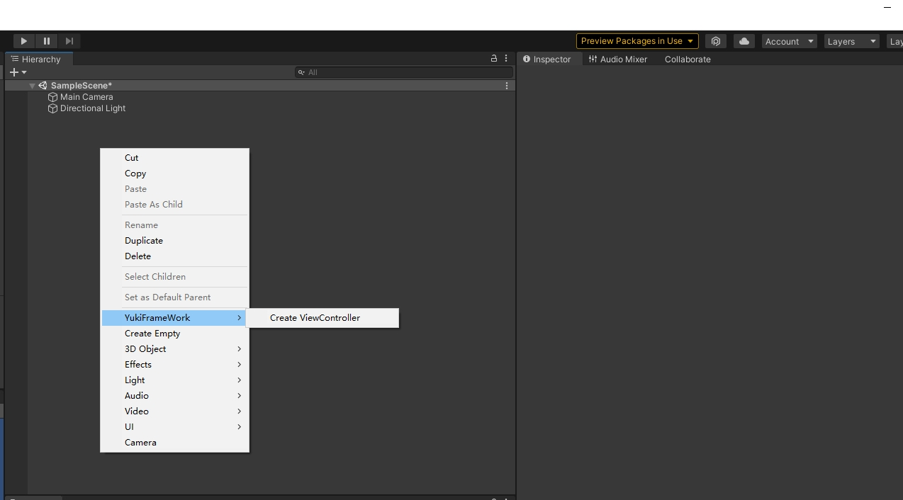
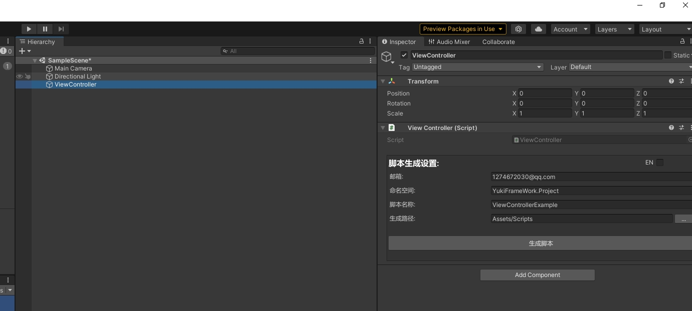
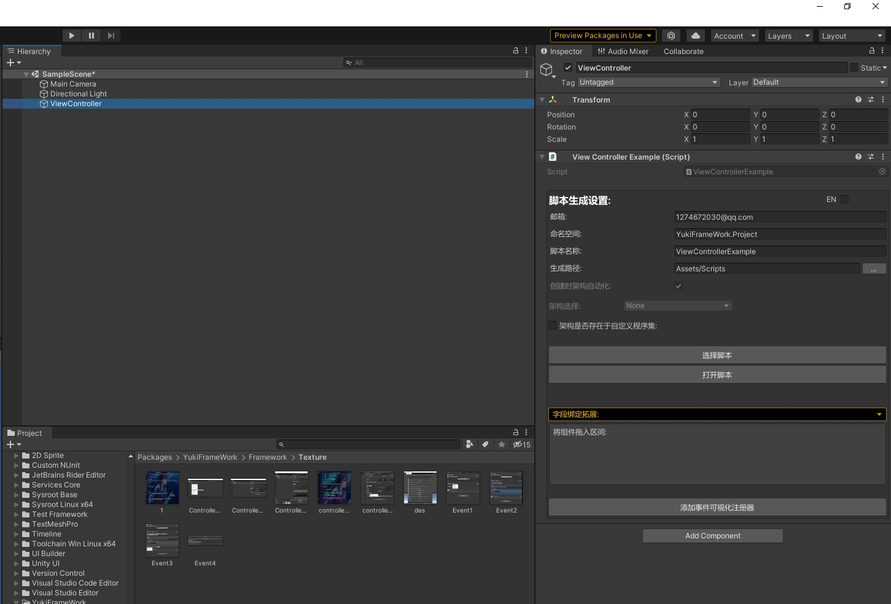
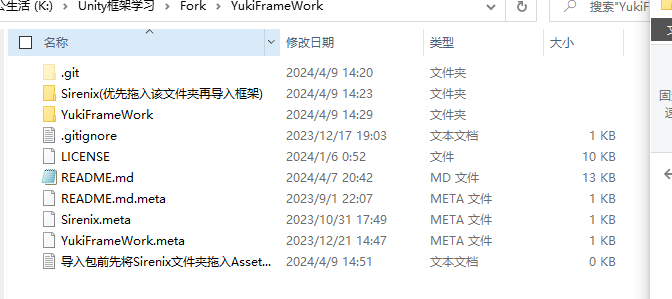
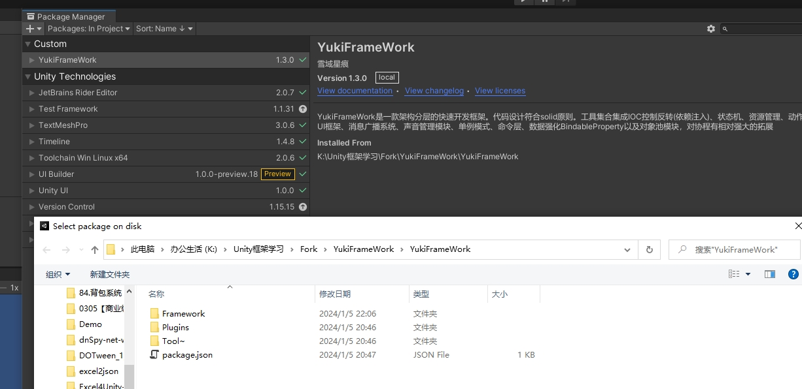

# YukiFrameWork

#### 介绍
"YukiFrameWork是一款架构分层的快速开发框架。代码设计符合solid原则。工具集合集成IOC控制反转(依赖注入)、状态机、资源管理、动作时序管理、UI框架、存档系统、消息广播系统、声音管理模块、单例模式、命令层、数据强化BindableProperty以及对象池模块，对协程有相对强大的拓展，具备场景管理工具以及协程性能工具(对于工具以及拓展的文档在下方框架支持工具内打开框架拓展工具即可)，框架集成Odin、DoTween、UniRx、UniTask作为工具可以自由选择使用"

#### [核心架构](https://gitee.com/NikaidoShinku/YukiFrameWork/blob/master/YukiFrameWork/Framework/2.Architecture.md)

框架控制器添加方式:

[ViewController对架构的自动化具体使用示例](https://gitee.com/NikaidoShinku/YukiFrameWork/blob/master/YukiFrameWork/Framework/ViewController使用说明.md)

[ViewController可视化事件拓展器](https://gitee.com/NikaidoShinku/YukiFrameWork/blob/master/YukiFrameWork/Framework/ViewController拓展事件可视化.md)

[ViewController字段绑定](https://gitee.com/NikaidoShinku/YukiFrameWork/blob/master/YukiFrameWork/Framework/ViewController绑定字段.md)

[Command介绍](https://gitee.com/NikaidoShinku/YukiFrameWork/blob/master/YukiFrameWork/Framework/Abstract/10.Command.md)

#### 框架支持工具

- 框架Debug拓展:[LogKit](https://gitee.com/NikaidoShinku/YukiFrameWork/blob/master/YukiFrameWork/Framework/LogKit/15.控制台日志工具.md)

- 框架序列化工具:SerializationTool[工具介绍](https://gitee.com/NikaidoShinku/YukiFrameWork/blob/master/YukiFrameWork/Framework/Serialization/序列化工具.md)

- 框架存档工具:SaveTool[存档系统介绍](https://gitee.com/NikaidoShinku/YukiFrameWork/blob/master/YukiFrameWork/Tool~/SaveTool/存档系统.md)

- IOC:LifeTimeScope[IOC介绍](https://gitee.com/NikaidoShinku/YukiFrameWork/blob/master/YukiFrameWork/Tool~/IOCContainer/1.LifeTimeScope.md)

- 单例管理套件:SingletonKit[单例介绍](https://gitee.com/NikaidoShinku/YukiFrameWork/blob/master/YukiFrameWork/Framework/Singleton/9.%E5%8D%95%E4%BE%8B.md)

- 事件系统:EventSystem[事件系统介绍](https://gitee.com/NikaidoShinku/YukiFrameWork/blob/master/YukiFrameWork/Framework/Events/7.%E6%B6%88%E6%81%AF%E5%B9%BF%E6%92%AD%E6%A8%A1%E5%9D%97.md)

- UI框架 UIKit[UIKit介绍](https://gitee.com/NikaidoShinku/YukiFrameWork/blob/master/YukiFrameWork/Tool~/UI/6.UI%E6%A8%A1%E5%9D%97.md)

- 资源管理模块:ABManager(模块原作者：弦小风,[模块详细信息](https://gitee.com/xianfengkeji/xfabmanager.git))

- 声音管理模块:AudioKit[声音模块介绍](https://gitee.com/NikaidoShinku/YukiFrameWork/blob/master/YukiFrameWork/Tool~/Audio/8.%E5%A3%B0%E9%9F%B3%E7%AE%A1%E7%90%86%E6%A8%A1%E5%9D%97.md)

- 动作时序模块:ActionKit[ActionKit介绍](https://gitee.com/NikaidoShinku/YukiFrameWork/blob/master/YukiFrameWork/Tool~/ActionKit/5.%E5%8A%A8%E4%BD%9C%E6%97%B6%E5%BA%8F%E7%AE%A1%E7%90%86%E6%A8%A1%E5%9D%97.md)

- 状态机模块:State[状态机介绍](https://gitee.com/NikaidoShinku/YukiFrameWork/blob/master/YukiFrameWork/Tool~/StateMechine/3.%E7%8A%B6%E6%80%81%E6%9C%BA.md)
 
- 框架拓展工具:Extension [拓展介绍](https://gitee.com/NikaidoShinku/YukiFrameWork/blob/master/YukiFrameWork/Framework/Extension/13.%E6%8B%93%E5%B1%95.md)

- 对象池模块:PoolsFectory[对象池模块介绍](https://gitee.com/NikaidoShinku/YukiFrameWork/blob/master/YukiFrameWork/Framework/Pools/12.%E5%AF%B9%E8%B1%A1%E6%B1%A0%E6%A8%A1%E5%9D%97.md)

- 强化数据绑定类:BindablePropery[强化数据模块介绍](https://gitee.com/NikaidoShinku/YukiFrameWork/blob/master/YukiFrameWork/Framework/Abstract/11.BindableProperty.md)

- 贝塞尔曲线拓展模块:BezierUtility[拓展介绍](https://gitee.com/NikaidoShinku/YukiFrameWork/blob/master/YukiFrameWork/Tool~/Bezier/Bezier.md)

- 框架支持插件:[UniRx](https://github.com/neuecc/UniRx.git)

- 框架支持插件:[UniTask](https://github.com/Cysharp/UniTask.git);

- 框架支持插件:[DoTween](https://dotween.demigiant.com/);

- 框架支持插件:[Odin](https://odininspector.com/);

#### 安装教程
下载压缩包或者fork项目

解压后在packagemanager里选择Add package from disk找到下载的包目录层级内找到package.json导入即可

框架工具集合:可在下方打开ImportWindow自行导入需要的模块。

注意：使用本框架Unity版本不能低于2020.3,框架内置NewtonsoftJson插件，导入时如发现异常请删除Unity项目自带的NewtonsoftJson！

#### 框架更新版本速览

V1.12.0 框架全面集成odin插件进行编辑器自定义，优化存档工具窗口的细节，优化贝塞尔曲线模块以及AudioInfo的编辑器显示效果!

V1.11.0,框架新增协程转换，现在可以使用Async/Await的语法来进行对于协程的启动，ActionKit优化，新增部分API，修复场景工具丢失回调的问题，存档工具优化，现在可以自由选择存档路径!优化UIKit的获取面板的流程

V1.10.4 优化UIKit，架构新增程序集依赖初始化

V1.10.3 状态机模块中状态类层级归属改为IController，现在也可以标记RuntimeInitializeOnArchitecture特性，优化细节

V1.10.2 架构新增查询层Query，补充文档 

V1.10.1 框架新增协程性能工具CoroutineTool,场景管理工具SceneTool，UI模块新增对生成的面板自动化管理(超过五分钟没打开则销毁),ActionKit新增部分API

V1.10.0 方法序列化特性Button可以支持预览参数，修复状态机序列化数组导致异常的问题。

V1.9.9 声音管理模块优化，现在音频会被自动托管，使用加载器加载的音频超过五分钟处于未使用的状态会被自动卸载

V1.9.8 拓展全局事件系统，最多支持16个参数!

V1.9.7 对层级架构的使用进行一定的变更，详细看查看官网中的规则架构介绍，优化细节，优化运行时加载框架的性能以及gc问题

V1.9.6 修复编辑器序列化异常的问题，优化框架编辑器性能。

V1.9.5 修复导入框架后部分组件无法进行修改的问题，优化底层细节

V1.9.4 优化AudioKit的细节，新增AudioInfo可视化添加音频，优化框架底层

V1.9.3 状态机支持子状态机的创建，优化框架底层细节，InspectorTool新增DisableGroupIf和DisableGroupEnumValueIf特性，更新ABManager到1.10.8，优化存档系统，优化细节

V1.9.2 优化底层细节，将存档系统移动到模块导入窗口中不内置框架，优化状态机编辑器，优化贝塞尔曲线模块，修复编辑器绘制不及时的问题，补充文档

V1.9.1 优化底层细节，修复贝塞尔曲线丢失命名空间的问题，对编辑器序列化重新排版

V1.9.0 优化反射系统，新增对象以及方法的缓存，优化部分编辑器底层代码适配。

V1.8.9 框架全面新增对于编辑器自定义的样式特性支持,详情查看框架支持工具:框架编辑器工具

V1.8.8 框架新增可序列化字典YDictionary,使用方式与Dictionary相同,可以在编辑器下修改数据

V1.8.7 资源管理模块统一命名空间using XFABManager,支持OpenHarmony平台，修复GameObjectLoader加载物品仍在DonDestroyOnLoad的问题,修复guid重复的问题

V1.8.6 同步更新XFABManager，现在可以支持对WebGL的打包，优化细节

V1.8.5 状态机字段序列化添加对私有字段(加上SerializeField特性)的支持

V1.8.4 同步更新XFABManager

V1.8.3 架构初始化优化，会在运行时提前预存好所有可能的架构全局,线程安全,优化代码生成器

V1.8.2 修复在使用IOC模块时打包报错的问题

V1.8.1 IOC容器优化重构，文档优化

V1.8.0 框架新增存档系统，优化文档细节

V1.7.95 UI模块新增可选缓存,默认为True,编辑器下设置成False面板就为一次性使用

V1.7.94 优化底层,新增FastList极速列表类,可以绑定事件以及速度快过List

V1.7.93 优化背包模块的底层,补充了简介,新增自定义手部物品控制器以及物品UI的动画效果设置。

V1.7.92 IOC模块大幅优化,功能更强了。修复本地代码生成跟背包系统的编辑器无法保存数据的问题,优化反射拓展

V1.7.91 状态机模块底层优化，修复初始化事件时如果不存在架构会内存溢出的问题,优化细节

V1.7.9 状态机模块底层优化，现在可以序列化所有的基本数据类型，包含数组列表。补充状态机模块的文档

V1.7.82 UI模块API增加判断面板生命周期的方法,优化文档跟本地代码生成

V1.7.81 框架序列化工具内置,修复ExcelToJson插件无法正常使用的问题,优化细节，文档介绍优化。

V1.7.8 UI模块的生命周期现在不加base也可以正常使用,优化ViewController的编辑器,现在在场景有任何改动都可以进行保存。更新通用的脚本生成器,左上方YukiFrameWork/Local Scripts Generator打开

V1.7.7 BindableProperty拓展,新增列表以及字典的属性绑定,字典可序列化添加，可以绑定事件，对IOC模块的描述进行补充。

V1.7.6 修复绑定工具在游戏对象(GameObject)保存成预制体(Prefab)之后在场景中无法绑定的问题,优化状态机管理器跟跟可视化事件中心的编辑器拓展

V1.7.5 删除状态机默认动画的功能,将状态机默认的Unity API封装弃用,现在推荐使用新的拓展方法

V1.7.4 新增对Unity 部分API的封装拓展。

V1.7.3:修改资源管理模块的命名空间为YukiFrameWork.XFABManager;

V1.7.2:修复ActionKit在编辑器下偶尔会出现不触发回调的问题

V1.7.1:贝塞尔曲线模块API拓展,修复贝塞尔返回值监听事件时不触发的问题

V1.7.0:新增贝塞尔曲线的部分功能拓展支持,曲线移动、可视化路径点以及自定义路径等功能

V1.6.2 优化背包模块,支持配置窗口拓展使用.

V1.6.1 全局事件中心新增统一的拓展API

V1.6.0 移除ViewController添加Prefab模块,新增对UI模块以及ViewController都支持的字段绑定系统,可以做到0代码绑定字段。优化ActionKit的逻辑内核，优化状态机模块的编辑器底层

V1.5.2 修复新建项目时ViewController编辑器对架构选择的程序集选定异常问题，现在可以自定义程序集

V1.5.1 优化导入窗口的底层,同步更新ABManager

V1.5.0 框架新增序列化工具,现在可以直接在工具内将数据类转换成Json、xml、bytes,同时集成ExcelToJson工具，方便Excel配置。该工具Github仓库为:https://github.com/neil3d/excel2json

V1.4.0 添加可视化事件拓展,可以直接在编辑器注册事件,通过ViewController添加

V1.3.8 ViewController编辑器拓展,人性化设置,新增一键式创建Prefab功能,优化LogKit模块，Import Window添加中英文切换介绍。

V1.3.7 新增Unity内置样式拓展工具,修复一定Bug,优化ViewController编辑器拓展(测试)

V1.3.6 修复ABManager的协程迭代问题

V1.3.5 修复ActionKit逻辑丢失的问题,层级优化,修复Bug

V1.3.0 更新框架的导入方式，将模块分布化,现在不能通过git导入，手动下载后导入package.json,框架支持的模块均在ImportWindow，自由导入即可

V1.2.0 重构资源管理套件，集成XFABManager插件(版本暂时为测试版)

V1.1.4 优化LogKit,新增异常事件拓展

V1.1.3 新增LogKit轻量级控制台打印工具，修复细微Bug，优化对象池的初始化预加载

V1.1.1 修复IOC特性注入异常的问题, 优化反射拓展

V1.1.0 框架架构底层优化，优化IOC模块的作用域，优化UI模块，完善简介

V1.0.9 命令模块优化

V1.0.8 修复构造函数参数注入时超过一个参数会异常的问题

V1.0.7 修复Mono单例序列化异常的问题

V1.0.6 优化IOC内核，修复注册单例时DI注入的实例异常的问题

V1.0.5 状态机联立UnityAPI拓展，现在可以支持碰撞器/触发器等部分UnityAPI在状态派生类下重写

V1.0.2 更新通用背包管理模块(测试版)

V1.0.0 框架正式版

其余均为内测不稳定版功能的修正，不以浏览。