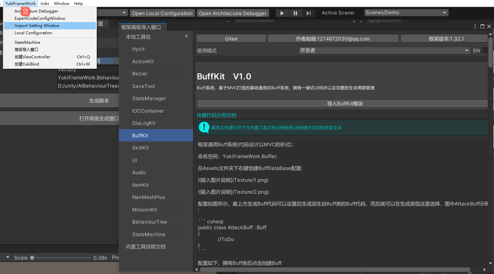

# YukiFrameWork

#### 介绍
"YukiFrameWork是一款基于QFrameWork的思想规则而衍生的架构分层开发框架。代码设计符合solid原则。工具集合集成IOC控制反转(依赖注入)、状态机、资源管理、动作时序管理、UI框架、存档系统、消息广播系统、声音管理模块。本地化配置管理、单例模式、命令层、数据强化BindableProperty以及对象池模块，对协程有相对强大的拓展，具备场景管理工具以及协程性能工具(对于工具以及拓展的文档在下方框架支持工具内打开框架拓展工具即可)

QFramework架构教程：https://www.bilibili.com/video/BV1cG4y1H7uU/?spm_id_from=333.337.search-card.all.click&vd_source=8d59e90cf24f9961527733c56cb61575

本框架YukiFrameWork上手教程：https://www.bilibili.com/video/BV14XVEe4ExG/?spm_id_from=333.788&vd_source=8d59e90cf24f9961527733c56cb61575

#### 安装教程

特殊标记: 

1.下载压缩包或者fork项目(V1.13.0更新后会出现如大量报错，请按照安装教程说明将Sirenix文件夹整个复制到Assets项目中)

2.V1.16.0开始需要删除Assets文件夹下导入的XFABManager模块，已经内置在框架package中。

将Sirenix文件夹整个复制到项目Assets文件夹下，在完成这一步之后再进行导入框架的操作！

在packagemanager里选择Add package from disk找到下载的包目录层级内找到package.json导入即可

框架本地配置窗口:如图打开LocalConfiguration，可以显示框架所有的配置以及示例还有工具导入窗口!

注意：使用本框架Unity版本不能低于2020.3,框架内置NewtonsoftJson插件，导入时如发现异常请删除Unity项目自带的NewtonsoftJson！必须要按照教程说明进行框架安装!

#### [核心架构,请在使用框架前点开我查看文档信息!!!!!!](https://gitee.com/NikaidoShinku/YukiFrameWork/blob/master/YukiFrameWork/Framework/2.Architecture.md)

#### 框架支持工具

- 框架本地化套件:[LocalizationKit](https://gitee.com/NikaidoShinku/YukiFrameWork/blob/master/YukiFrameWork/Framework/Localization/LocalizationInfo.md)

- 框架对话系统:[DiaLogKit](https://gitee.com/NikaidoShinku/YukiFrameWork/blob/master/YukiFrameWork/Tool~/DiaLogKit/DiaLogKit.md);

- 框架Buff系统[BuffKit](https://gitee.com/NikaidoShinku/YukiFrameWork/blob/master/YukiFrameWork/Tool~/BuffKit/BuffKit.md)

- 框架引导系统[PilotKit](https://gitee.com/NikaidoShinku/YukiFrameWork/blob/master/YukiFrameWork/Tool~/PilotKit/PilotKit.md)

- 框架Debug拓展:[LogKit](https://gitee.com/NikaidoShinku/YukiFrameWork/blob/master/YukiFrameWork/Framework/LogKit/15.控制台日志工具.md)

- 框架背包系统:[ItemKit](https://gitee.com/NikaidoShinku/YukiFrameWork/blob/master/YukiFrameWork/Tool~/ItemKit/14.背包系统(通用).md)

- 框架序列化工具:SerializationTool[工具介绍](https://gitee.com/NikaidoShinku/YukiFrameWork/blob/master/YukiFrameWork/Plugins/Serialization/序列化工具.md)

- 框架存档工具:SaveTool[存档系统介绍](https://gitee.com/NikaidoShinku/YukiFrameWork/blob/master/YukiFrameWork/Tool~/SaveTool/存档系统.md)

- IOC:LifeTimeScope[IOC介绍](https://gitee.com/NikaidoShinku/YukiFrameWork/blob/master/YukiFrameWork/Tool~/IOCContainer/1.LifeTimeScope.md)

- 单例管理套件:SingletonKit[单例介绍](https://gitee.com/NikaidoShinku/YukiFrameWork/blob/master/YukiFrameWork/Framework/Singleton/9.%E5%8D%95%E4%BE%8B.md)

- 事件系统:EventSystem[事件系统介绍](https://gitee.com/NikaidoShinku/YukiFrameWork/blob/master/YukiFrameWork/Framework/Events/7.%E6%B6%88%E6%81%AF%E5%B9%BF%E6%92%AD%E6%A8%A1%E5%9D%97.md)

- UI框架 UIKit[UIKit介绍](https://gitee.com/NikaidoShinku/YukiFrameWork/blob/master/YukiFrameWork/Tool~/UI/6.UI%E6%A8%A1%E5%9D%97.md)

- 声音管理模块:AudioKit[声音模块介绍](https://gitee.com/NikaidoShinku/YukiFrameWork/blob/master/YukiFrameWork/Tool~/Audio/8.%E5%A3%B0%E9%9F%B3%E7%AE%A1%E7%90%86%E6%A8%A1%E5%9D%97.md)

- 动作时序模块:ActionKit[ActionKit介绍](https://gitee.com/NikaidoShinku/YukiFrameWork/blob/master/YukiFrameWork/Tool~/ActionKit/5.%E5%8A%A8%E4%BD%9C%E6%97%B6%E5%BA%8F%E7%AE%A1%E7%90%86%E6%A8%A1%E5%9D%97.md)

- (旧版(请查看新版))状态机模块:State[状态机介绍](https://gitee.com/NikaidoShinku/YukiFrameWork/blob/master/YukiFrameWork/Tool~/StateMechine/3.%E7%8A%B6%E6%80%81%E6%9C%BA.md)

- 新动作设计状态机模块:StateManager[全新状态机介绍](https://gitee.com/NikaidoShinku/YukiFrameWork/blob/master/YukiFrameWork/Tool~/StateManager/StateMachine/s.StateManager.md)
 
- 框架拓展工具:Extension [拓展介绍](https://gitee.com/NikaidoShinku/YukiFrameWork/blob/master/YukiFrameWork/Framework/Extension/13.%E6%8B%93%E5%B1%95.md)

- 框架物理拓展工具:Extension [拓展介绍](https://gitee.com/NikaidoShinku/YukiFrameWork/blob/master/YukiFrameWork/Framework/Extension/15.物理拓展.md)

- 对象池模块:PoolsFectory[对象池模块介绍](https://gitee.com/NikaidoShinku/YukiFrameWork/blob/master/YukiFrameWork/Framework/Pools/12.%E5%AF%B9%E8%B1%A1%E6%B1%A0%E6%A8%A1%E5%9D%97.md)

- 强化数据绑定类:BindablePropery[强化数据模块介绍](https://gitee.com/NikaidoShinku/YukiFrameWork/blob/master/YukiFrameWork/Framework/Abstract/11.BindableProperty.md)

- 贝塞尔曲线拓展模块:BezierUtility[拓展介绍](https://gitee.com/NikaidoShinku/YukiFrameWork/blob/master/YukiFrameWork/Tool~/Bezier/Bezier.md)

- 资源管理模块:ABManager(模块原作者：弦小风,[模块详细信息](https://gitee.com/xianfengkeji/xfabmanager.git))

- 框架支持插件:[Odin](https://odininspector.com/);

#### 框架实战项目:

- 2D塔防游戏:[2dTower](https://www.bilibili.com/video/BV1tz421h7Wf/?spm_id_from=333.999.0.0&vd_source=8d59e90cf24f9961527733c56cb61575);