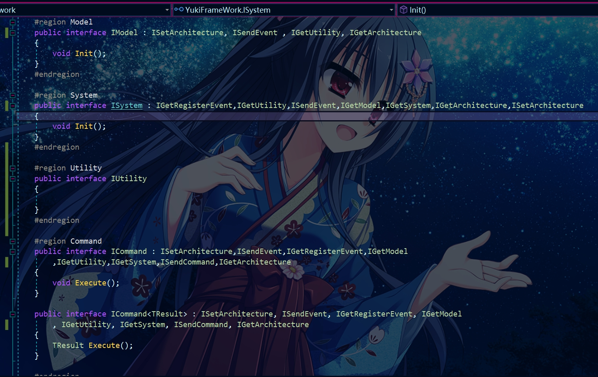

Architecture：框架核心架构,借鉴Qframework的层级思路而设置 架构层级为：IController,ISystem,IUtility,IModel

通常规则：

- ISystem、IModel 状态发生变更后通知 IController 必须用事件或BindableProperty
- IController可以获取ISystem、IModel对象来进行数据查询
- ICommand
- 上层可以直接获取下层，下层不能获取上层对象
- 下层向上层通信用事件
- 上层向下层通信用方法调用（只是做查询，状态变更用 Command），IController 的交互逻辑为特别情况，只能用 Command

   完整API(外部的调用均通过拓展方法)：

        - void RegisterModel<T>(T model) where T : class, IModel;
        - void RegisterUtility<T>(T utility) where T : class, IUtility;
        - void RegisterSystem<T>(T system) where T : class,ISystem;
        - void UnRegisterModel<T>(T model = default) where T : class,IModel;
        - void UnRegisterUtility<T>(T utility = default) where T : class,IUtility;
        - void UnRegisterSystem<T>(T view = default) where T : class,ISystem;
        - T GetModel<T>() where T : class, IModel;
        - T GetUtility<T>() where T : class,IUtility;
        - T GetSystem<T>() where T : class, ISystem;

        - IUnRegister RegisterEvent<T>(string eventName, Action<T> onEvent);
        - IUnRegister RegisterEvent<T>(Enum eventEnum, Action<T> onEvent);
        - IUnRegister RegisterEvent<T>(Action<T> onEvent);
        - void SendEvent<T>(T t = default);
        - void SendEvent<T>(string eventName, T t = default);
        - void SendEvent<T>(Enum eventEnum, T t = default);
        - void UnRegisterEvent<T>(Action<T> onEvent);
        - void UnRegisterEvent<T>(Enum eventEnum, Action<T> onEvent);
        - void UnRegisterEvent<T>(string eventName, Action<T> onEvent);
        - void SendCommand<T>(T command) where T : ICommand;
        - TResult SendCommand<TResult>(ICommand<TResult> command);       

        架构默认包含传递一个参数的三类事件系统
        - IUnRegister RegisterEvent<T>(string eventName, Action<T> onEvent);//注册事件(通过字符串访问)
        - IUnRegister RegisterEvent<T>(Enum eventEnum, Action<T> onEvent);//注册事件(通过枚举类型访问)
        - IUnRegister RegisterEvent<T>(Action<T> onEvent);//注册事件(直接通过Type访问)
        - void SendEvent<T>(T t = default);//发送事件
        - void SendEvent<T>(string eventName, T t = default);//通过字符串发送事件
        - void SendEvent<T>(Enum eventEnum, T t = default);//通过枚举类型发送事件
        - void UnRegisterEvent<T>(Action<T> onEvent);//注销事件
        - void UnRegisterEvent<T>(Enum eventEnum, Action<T> onEvent);//注销事件(通过字符串访问)
        - void UnRegisterEvent<T>(string eventName, Action<T> onEvent);//注销事件(通过枚举类型访问)

    API规则接口如下：每个接口都对应有不同的任务处理
        - IGetModel,
        - IGetViewController,
        - ISendCommand,
        - ISendEvent,
        - IGetRegisterEvent,    
        - IGetSystem,
        - IGetUtility  
        架构通用规则示例如下:



- 一般情况下的使用:
```

Model层:
    public class TestModel : AbstractModel
    {
        //重写的初始化方法
        public override void Init()
        {
            
        }
    }

System层:
    public class TestSystem : AbstractSystem
    {
        //重写的初始化方法
        public override void Init()
        {
            
        }
    }

Utility层:
    public class TestUtility : IUtility
    {
        //工具类什么都不做，一般用于封装API等
    }

    在架构中的使用:
    public class PointGame : Architecture<PointGame>
    {
        public override void OnInit()
        {
            //在初始化方法中对层级进行初始化
            this.RegisterModel(new TestModel());
            this.RegisterUtility(new TestUtility());
            this.RegisterSystem(new TestSystem());
        }       
    }

    ///正常的调用
    public class CustomController : ViewController
    {
        void Start()
        {
            this.GetModel<TestModel>();

            this.RegisterEvent<EventArgs>(_ => { });

            this.GetSystem<TestSystem>();

            this.GetUtility<TestUtility>();
        }
    }

```


[在架构中对Command的具体使用](https://gitee.com/NikaidoShinku/YukiFrameWork/blob/master/YukiFrameWork/Framework/Abstract/10.Command.md)


