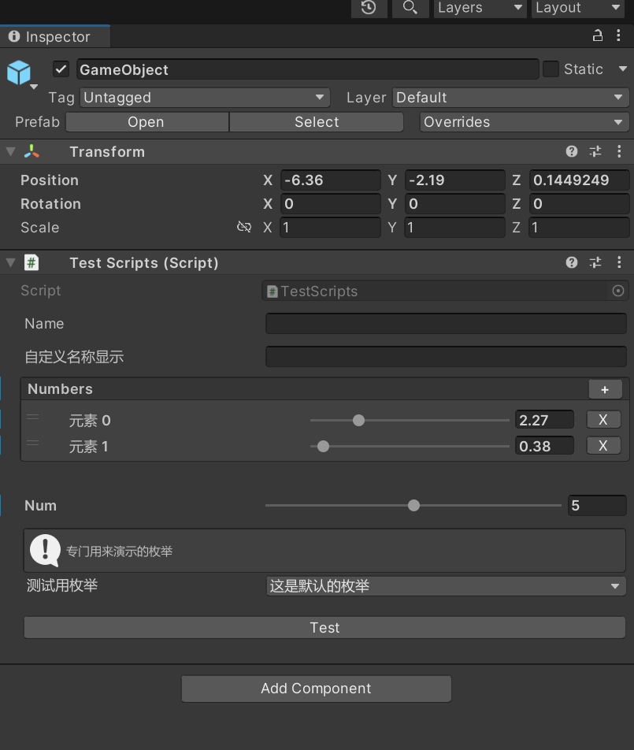
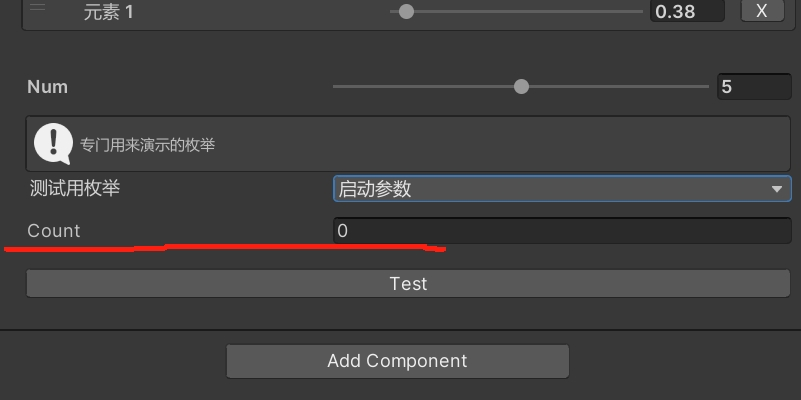

框架编辑器拓展工具:

基本使用如下:

```

	using YukiFrameWork;
	public class TestScripts : MonoBehaviour
	{
		[Label("自定义名称显示")]
		[GUIColor(1,1,1,1)]//输入RGBA对该变量进行改色
		public string name;

		[ListDrawerSetting(IsReadOnly:false)]//传入只读参数判断可否进行外部修改,该特性会将数组(列表)的显示转换为ReorderableList显示 注意:持有数组/列表的类必须派生自UnityEngine.Object这个特性才有效果
		[PropertyRange(0,10)]//对于列表中纯数据的元素,也可以标记滑条
		public List<float> numbers = new List<float>();

		[field:PropertyRange(0,10)]//对于属性可用的滑条特性
		[field:SerializeField]
		public int num{get;set;}

		public enum TestEnum
		{
			[Label("这是默认的枚举")]//Label跟GUIColor可以作用枚举变量
			Default
		}

		[Label("测试用枚举")]
		[HelperBox("专门用来演示的枚举")]//传递提示信息
		public TestEnum e = TestEnum.Default;

		[MethodButton]//给方法标记该特性可以序列化出一个按钮，按下就会调用
		public void Test()
		{

		}
	}
```

上述代码在编辑器中效果如下:



进阶玩法:

```

	using YukiFrameWork;
	public class TestScripts : MonoBehaviour
	{
		[Label("自定义名称显示")]
		[GUIColor(1,1,1,1)]//输入RGBA对该变量进行改色
		public string name;

		[ListDrawerSetting(IsReadOnly:false)]//传入只读参数判断可否进行外部修改,该特性会将数组(列表)的显示转换为ReorderableList显示 注意:持有数组/列表的类必须派生自UnityEngine.Object这个特性才有效果
		[ArrayLabel("元素")]//被转换后的列表的每个元素不会带有标签，标记ArrayLabel特性可以让它自定义标签
		[PropertyRange(0,10)]//对于列表中纯数据的元素,也可以标记滑条
		public List<float> numbers = new List<float>();

		[field:PropertyRange(0,10)]//对于属性可用的滑条特性
		[field:SerializeField]	
		public int num{get;set;}

		public enum TestEnum
		{
			[Label("这是默认的枚举")]//Label可以作用枚举变量
			Default,
			[Label("启动参数")]
			Start
		}

		[Label("测试用枚举")]
		[HelperBox("专门用来演示的枚举")]//传递提示信息
		public TestEnum e = TestEnum.Default;

		[MethodButton]//给方法标记该特性可以序列化出一个按钮，按下就会调用
		public void Test()
		{

		}

		[EnableEnumValueIf("e",TestEnum.Start)]
		//[EnableEnumValueIf("e","Start")]//可以传递字符串或者枚举，这个特性判断当这个变量e跟设置的枚举相同时才可以序列化这个变量
		public int count;

		//对于条件判断，还有与之相反的DisableEnumValueIf，操作方式同理
	}
```

效果如图:



图中的Count变量只有枚举设置成Start才显示。

全样式特性API:

	- [Label(label:"")]//传递名称，该特性可以用于枚举变量

	- [GUIColor(ColorType.Red)]//传递ColorType类型判断颜色，或者传递RGBA，该特性可以用于枚举变量
	{
		//GUIColor默认支持的颜色
		public enum ColorType
		{
			Red,
			Green,
			White,
			Black,
			Blue,
			Yellow,
			Cyan,
			Gamma,
			Gray,
			Grey,		
		}
	}

	- [BoolanPopup(mFalseValue:"关闭",mTrueValue:"开启")]//设置在Bool变量上，可以把bool变成在编辑器中枚举列表那样的形式，False跟True的标签自定义

	- [DisplayTextureAttribute(width:64, height:64)]//设置在Sprite/Texture上可以放大图片

	- [EnableIf(boolValueName:"")]//传递该类中bool字段的名称进去，判断当该字段为True时可序列化，除此之外不可以
	- [DisableIf(boolValueName:"")]//传递该类中bool字段的名称进去，判断当该字段为True时不可序列化，除此之外可以
	- [EnableEnumValueIf("e",TestEnum.Start)]//重载:[EnableEnumValueIf("e","Start")]//传递该类中枚举字段的名称，以及结果参数,可以传递枚举以及字符串,当跟结果相同时候可以序列化
	- [DisableEnumValueIf("e",TestEnum.Start)]//重载:[DisableEnumValueIf("e","Start")]//传递该类中枚举字段的名称，以及结果参数,可以传递枚举以及字符串,当跟结果相同时候不可以序列化

	- [GUIGroup(groupName:"")]//为字段/属性设置分组，多个变量中标记了同一个名称的组别，会无视声明顺序，归类到一起
	- [HelerBox(info:"提示的信息",Message message = Message.Info)]//设置该特性可以为变量多绘制一个框型提示
	{
		//信息的级别
		public enum Message
		{             
		    Info,    
		    Warning,
		    Error
		}
	}

	- [PropertyRange(minValue:0,maxValue:10)]//可以用于属性的等效于UnityEngine.Range特性的特性。在数组/列表标记了ListDrawerSetting时该特性可以使用

	- [ListDrawerSetting(IsReadOnly:false)] //将数组/列表的绘制转换为ReorderableList，IsReadOnly判断该数组是否可以被外部修改(只读)
	- [ArrayLabel(label:"")]//只能用于标记了ListDrawerSetting的数组/列表,在该特性下可以为元素指定标签

	- [RuntimeDisableGroup]//运行时不可被修改//该特性无法使用在数组/列表，应该使用ListDrawerSetting设置
	- [EditorDisableGroup]//编辑模式下不可被修改//该特性无法使用在数组/列表，应该使用ListDrawerSetting设置

	- [MethodButton(label:"",width"",height"",params object[] args)]//只能用于方法标记，标记后可以在编辑器中序列化出调用该方法的按钮，可以传入Label自定义标签，以及按钮的长度跟高度，如果方法的参数均为编译时数据类型，可以在特性中直接传入对应的参数进行测试

	- [CustomPropertySettingAttribute(itemName:"")]//这个特性在不继承UnityEngine.Object的类上标记，如果想单独序列化里面的某一个数组/列表，可以使用这个特性进行标记，会进行对指定的序列化，同时该类可以使用ListDrawingSetting

	- [DisableGroupEnumValueIf]//使用方式与DisableEnumVaueIf相同，该特性判断参数是否被禁止修改,对于数组/列表
	- [DisableGroupIf]//使用方式与DisableIf相同，该特性判断参数是否被禁止修改,对于数组/列表

	//注意：对于标记了Serializable特性的普通类的序列化，在其内部只有Label,GUIColor,RuntimeDisableGroup,EditorDisableGroup,PropertyRange可以使用。
	//使用本框架的编辑器样式有一定的限制: 仅声明符protected可以被序列化，private不可，对于Serializable的类，仅可使用Label,GUIColor等基本特性，在该类中如果需要将枚举字段显示的自定义生效，则需要标记EnumSerializeField特性，并且要在Label特性标记之后。


