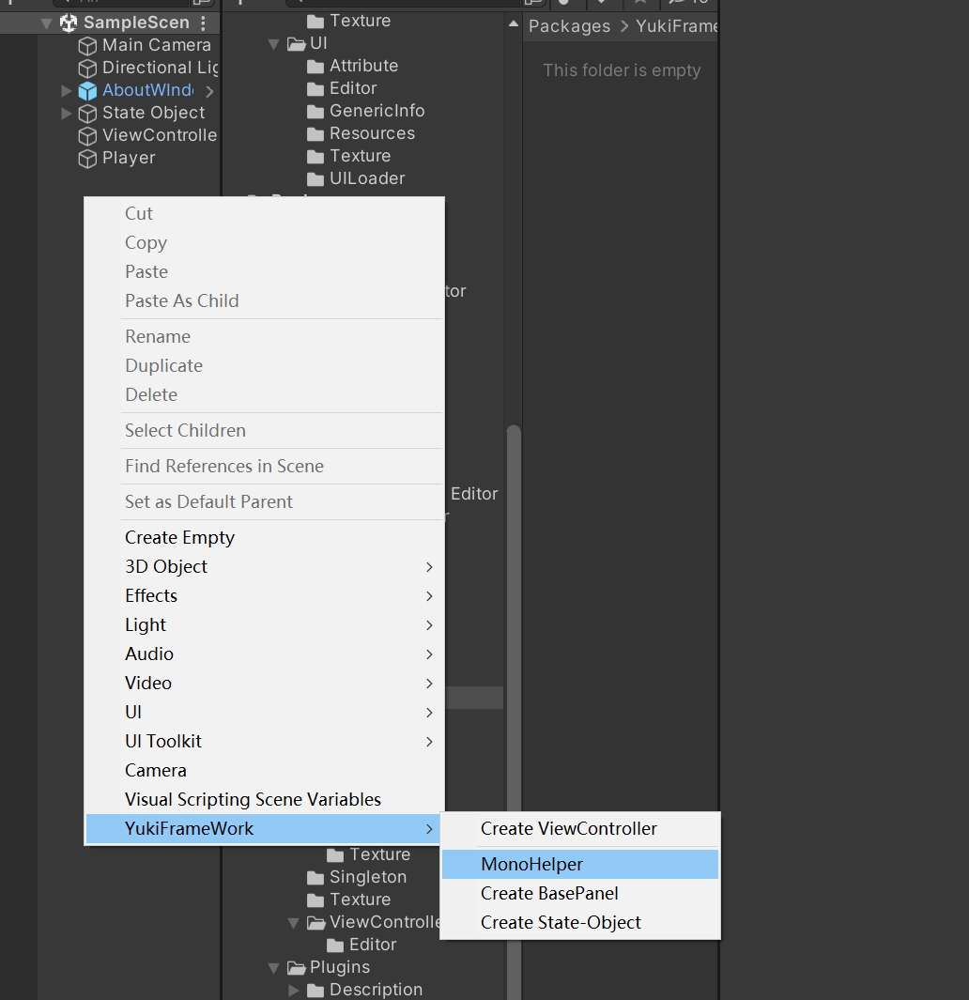
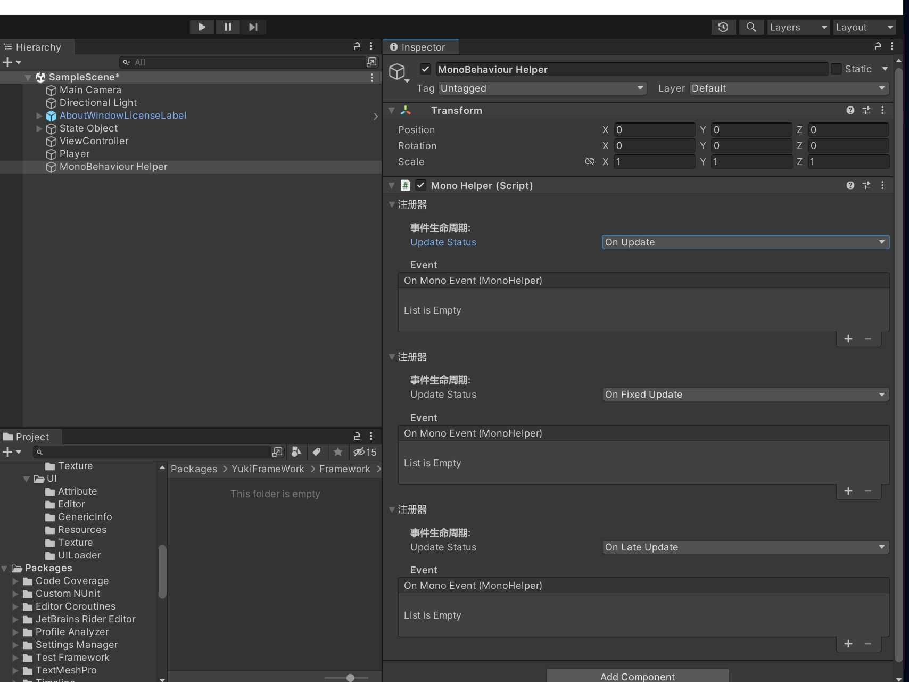

协程拓展支持：IAsyncExtensionCore
```
public class TestScripts : MonoBehaviour
{
    private void Start()
    {
        //对协程的启动(不绑定该Mono的生命周期，即使该脚本销毁依然执行该协程)
        var core = Enumerator().Start();
        //暂停协程
        core.OnPause();
        //该方法的无参版本返回值为迭代器，可以用于在协程中进行yield return该方法,等待当前拓展协程完全执行完毕后执行
        core.OnExecuteAsync();
        //该方法传入事件后即默认异步，无需在外部等待,当该协程执行完毕则会调用该事件
        core.OnExecuteAsync(() => { });
        //绑定生命周期(因拓展协程不受到生命周期影响,所以当需要时应进行绑定)
        core.CancelWaitGameObjectDestory(this);
        //恢复协程(仅暂停后该方法才有效果)
        core.OnResume();           
    }

    public IEnumerator Enumerator()
    {
        yield return new WaitForSeconds(2);
        Debug.Log("定时两秒");
    }

}
```

Unity API拓展支持:

```

public class TestScripts : MonoBehaviour
{
    void Start()
    {                
        /// OnTriggerEnter --- this.BindTriggerEnterEvent(other => { });
        /// OnTriggerStay --- this.BindTriggerStayEvent(other => { });
        /// OnTriggerExit --- this.BindTriggerExitEvent(other => { });
        /// OnTriggerEnter2D --- this.BindTriggerEnter2DEvent(collider2D => { });
        /// OnTriggerExit2D --- this.BindTriggerExit2DEvent(collider2D => { });
        /// OnTriggerStay2D --- this.BindTriggerStay2DEvent(collider2D => { });
        /// OnCollisionEnter ---  this.BindCollisionEnterEvent(collision => { });
        /// OnCollisionStay ---  this.BindCollisionStayEvent(collision => { });
        /// OnCollisionExit ---  this.BindCollisionExitEvent(collision => { });
        /// OnCollisionEnter2D ---  this.BindCollisionEnter2DEvent(collision => { });
        /// OnCollisionStay2D --- this.BindCollisionStay2DEvent(collision2D => { });
        /// OnCollisionExit2D --- this.BindCollisionExit2DEvent(collision2D => { });
        /// OnMouseDown --- this.BindMouseDownEvent(() => { });
        /// OnMouseUp --- this.BindMouseUpEvent(() => { });
        /// OnMouseEnter --- this.BindMouseEnterEvent(() => { });
        /// OnMouseExit --- this.BindMouseExitEvent(() => { });
        /// OnMouseDrag --- this.BindMouseDragEvent(() => { });


        //UI事件拓展支持:
        //示例: 
        Image image = GetComponent<Image>();

        //IBeginDragHandler --- image.BindBeginDragEvent(eventData => { });
        //IDragHandler --- image.BindDragEvent(eventData => { });
        //IEndDragHandler --- image.BindEndDragEvent(eventData => { });
        //IInitializePotentialDragHandler --- image.BindInitializePotentialDragEvent(eventData => { });
        //IPointerClickHandler --- image.BindPointerClickEvent(eventData => { });
        //IPointerDownHandler --- image.BindPointerDownEvent(eventData => { });
        //IPointerEnterHandler --- image.BindPointerEnterEvent(eventData => { });
        //IPointerUpHandler --- image.BindPointerUpEvent(eventData => { });
        //IPointerExitHandler --- image.BindPointerExitEvent(eventData => { });
        //IScrollHandler --- image.BindScrollEvent(eventData => { });
        //ISelectHandler --- image.BindSelectEvent(eventData => { });
        //ISubmitHandler --- image.BindSubmitEvent(eventData => { });
        //IDropHandler --- image.BindDropEvent(eventData => { });
        //IDeselectHandler --- image.BindDeselectEvent(eventData => { });
        //IUpdateSelectedHandler --- image.BindUpdateSelectedEvent(eventData => { });
        //ICancelHandler --- image.BindCancelEvent(eventData => { });
        //IMoveHandler --- image.BindMoveEvent(eventData => { });

       //对GameObject的封装拓展支持:
        GameObject obj = new GameObject();
        //可以更加方便的调用Unity的原本的API，通过链式编程的方式一次性搞定
        obj.SetName("新的obj").Tag("设置标签").Layer(0).SetPosition(Vector3.one).SetLocalScale(Vector3.one).DonDestroyOnLoad().GetOrAddComponent<Image>();
    }
}

///对MonoBehaviour的Update做的拓展处理:(在不使用ActionKit或者没有额外操作例如给Update设置条件参数的情况下建议使用该拓展)

public class TestScripts : MonoBehaviour
{
    void Start()
    {   
         Action<MonoHelper> onEvent = helper => { };
         ///可以在任意脚本下注册事件到MonoHelper的Update拓展中
         MonoHelper.Update_AddListener(onEvent);
         MonoHelper.FixedUpdate_AddListener(onEvent);
         MonoHelper.LateUpdate_AddListener(onEvent);
    }
}


```
在编辑器中添加MonoHelper:



可以在编辑器下添加事件进行update的托管,不需要可视化则不添加,注意在任何情况下，MonoHelper最多只能存在一个!

反射拓展支持：GlobalReflectionSystem(谨慎使用，性能开销过大)

该拓展对所有的类型通用,可以强制反射调用方法(不支持重载，返回第一个方法)，以及反射获取字段并赋值具体示例如下：
```
public class TestScripts : MonoBehaviour
{
    private void Start()
    {
        //获得这个类的对象
        NewClass c = new NewClass();    
        //获得字段value
        float value = c.GetValue("value",ValueType type = ValueType.Field);
        //获得属性Value
        float Value = c.GetValue("Value",ValueType type = ValueType.Property);

        //赋值操作
        c.SetValue("value",10,ValueType type = ValueType.Field)

        //强制调用方法必须要给方法打上动态标记DynamicMethod:
        c.InvokeMethod("Test");
    }

    public class NewClass
    {
        private float value;
        public float Value { get; private set; }

        [DynamicMethod]
        private void Test()
        {
            Debug.Log("Test");
        }
    }
   

}
```