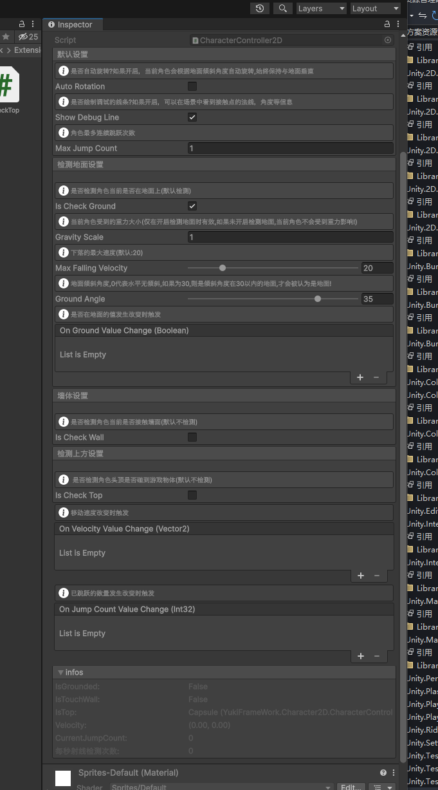
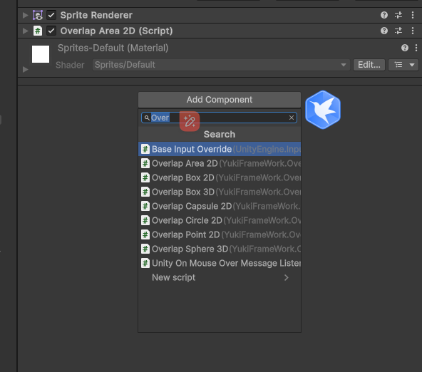
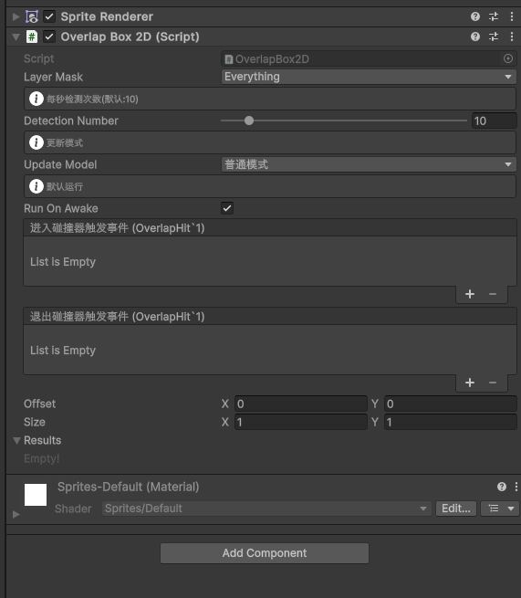
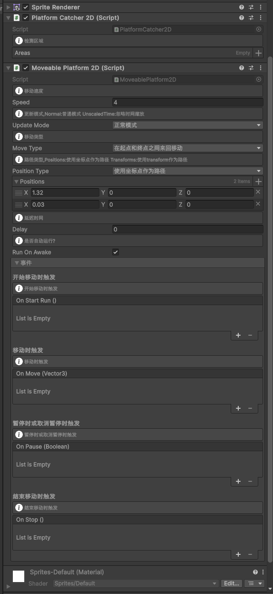

2D物理拓展

### 1. CharacterController2D 2D角色控制器类 YukiFrameWork.Character2D

添加控制器组件到2d的对象上，会自动绑定2d刚体


API说明：


| 名称      | 说明 |
| ----------- | ----------- |
| AutoRotation |是否自动旋转?如果开启，当前角色会根据地面倾斜角度自动旋转,始终保持与地面垂直     |
| showDebugLine |是否绘制调试的线条?如果开启，可以在场景中看到接触点的法线，角度等信息     |
| MaxJumpCount | 角色最多连续跳跃次数     |
| IsCheckGround | 是否检测角色当前是否在地面上(默认检测)     |
| gravityScale | 当前角色受到的重力大小(仅在开启检测地面时有效,如果未开启检测地面,当前角色不会受到重力影响!)     |
| groundAngle | 地面倾斜角度,0代表水平无倾斜,如果为30,则是倾斜角度在30以内的地面,才会被认为是地面!     |
| MaxFallingVelocity | 下落的最大速度 默认:20     |
| onGroundValueChange | 是否在地面的值发生改变时触发    |
| isCheckWall | 是否检测角色当前是否接触墙面(默认不检测)     |
| wallAngle | 墙面倾斜角度,0代表竖直向上,如果为30,则是竖直向上往左或往右偏移30度以内认为是墙面!     |
| onTouchWallValueChange | 是否接触墙面的值发生改变时触发     |
| isCheckTop |  是否检测角色头顶是否碰到游戏物体(默认不检测)     |
| topAngle | 角色头顶碰到的游戏物体的倾斜角度,在该角度范围内，认为碰到游戏物体!     |
| onTopValueChange | 头顶是否接触游戏物体的值发生改变时触发    |
| onVelocityValeuChange | 移动速度改变时触发     |
| onJumpCountValueChange | 已跳跃的数量发生改变时触发   | 

### 移动 

| 名称      | 说明 |
| ----------- | ----------- |
|  Move | 移动(请在FixedUpdate中调用)     |  
|  MoveHorizontal  | 水平方向移动(请在FixedUpdate中调用)     |   

### 跳跃

| 名称      | 说明 |
| ----------- | ----------- | 
|  Jump  | 跳跃     |  
|  JumpStart | 跳跃(可提前中断,中断后跳跃高度会降低,适用于长按跳的更高的情况)     |  
|  JumpEnd  | 中断跳跃(如果使用JumpStart进行跳跃，则在跳跃中断后角色除了重力影响以外，也会受到由JumpStart方法设置的减速度下落)    |   

```
public class TestCharacterController2D : MonoBehaviour
{
    private CharacterController2D Character; 
    void Start()
    {
        Character = GetComponent<CharacterController2D>();

        Character.Jump(5);
    } 
}
```

数据获取 

 ```

public class TestCharacterController2D : MonoBehaviour
{ 
    private CharacterController2D Character; 
    // Start is called before the first frame update
    void Start()
    {
        Character = GetComponent<CharacterController2D>();

        Debug.LogFormat("是否在地面:{0}",Character.IsGrounded); 
        Debug.LogFormat("是否接触墙面:{0}", Character.IsTouchWall);
        Debug.LogFormat("速度:{0}", Character.Velocity);
    } 
}

 ```

事件监听

 ```

public class TestCharacterController2D : MonoBehaviour
{

    private CharacterController2D Character;

    // Start is called before the first frame update
    void Start()
    {
        Character = GetComponent<CharacterController2D>();
        // 监听是否在地面的事件
        Character.onGroundValueChange.AddListener((ground) => {
            Debug.LogFormat("是否在地面的值发生改变:{0}", ground);
        });
    } 
}

 ```

 ### 重叠检测，用于处理当触发器检测失活对象失效时以及拓展使用。YukiFrameWork.Overlap 

 添加对应的组件:

 

 

 API说明: 

| 名称      | 说明 |
| ----------- | ----------- |
| Offset |偏移    |  
| Size |大小    | 
| LayerMask |检测层级     | 
| DetectionNumber |每秒检测次数     |  
| UpdateMode |更新模式     |  
| RunOnAwake |自动开始检测     |  
| onColliderEnter |当碰撞体进入时触发    |
| onColliderExit |当碰撞体退出时触发    | 

通过代码控制检测和暂停:

 ```

public class Test : MonoBehaviour
{
    // Start is called before the first frame update
    void Start()
    {
        OverlapBox2D overlap = GetComponent<OverlapBox2D>();
        // 停止检测
        overlap.Running = false;
        // 开始检测
        overlap.Running = true;
    } 
}


 ```

 ### 可移动平台 YukiFrameWork.Platform2D

 给可移动的平台添加 MoveablePlatform2D 组件。

 

 API:

 | 名称      | 说明 |
| ----------- | ----------- |
| Speed |移动速度     |
| UpdateMode |更新模式,Normal:普通模式 UnscaledTime:忽略时间缩放     |
| MoveType | 移动类型     |
| Delay | 延迟时间   |
| runOnAwake | 是否自动运行?     |
| positionType | 路径类型,Positions:使用坐标点作为路径 Transforms:使用transform作为路径     |
| onStartRun | 开始移动时触发     |
| onMove | 移动时触发     |
| onPause | 暂停时或取消暂停时触发     |
| onStop | 结束移动时触发     | 


可以通过 PlatformCatcher2D 来设置检测区域，平台会带着该区域内的游戏物体一起移动!

如果当前平台使用的碰撞体为BoxCollider2D, 会在碰撞盒上方判定检测区域！

```

public class TestMoveable : MonoBehaviour
{

    private Moveable moveable;

    // Start is called before the first frame update
    void Start()
    {
        moveable = GetComponent<Moveable>();
        // 监听开始移动的事件
        moveable.onStartRun.AddListener(() => 
        {
            Debug.Log("开始移动!");
        });
    } 
```
