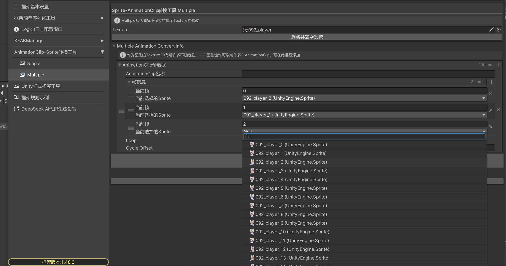

YukiFrameWork AnimationClip-Sprite转换工具使用:

左上角通过YukiFramework-LocalConfigration打开找到AnimationClip-Sprite转换工具如图:

框架提供了对于Single与Multiple的转换，Single的使用方式如下:

在这里输入文件夹路径，也可以通过拖拽文件夹的形式亦或者通过...按钮选择文件夹。完成后，点击窗口下方开始转换即可获取预制信息

示例如下:

拖拽指定的文件夹。点击转换

可以看到在文件夹内的四个动作都已经缓存了预制的信息。可以通过搜索窗口多选也可单选，在这里修改好每一张图片所在的时间帧，
调整基本设置或不做处理，在下方点击构建全部AnimationClip按钮即可将在这里缓存的所有的信息全部转换为AnimationClip，资源文件与文件夹名称同名(约定)

可以看到已经成功构建AnimationClip。

对于SpriteMode为Multiple的Texture2D，框架仅提供默认基础版的可视化窗口进行处理，因为图集在每一个不同的项目不确定性是非常大的，在这里会介绍默认的窗口与如何通过代码自己定义对于图集的动画生成:

注意:
该窗口必须添加SpriteMode类型为Multiple的Texture，否则将没有任何作用！

在这里添加一个图片如下所示:

添加后可在这里进行数据的修改。在这里呢，一个类型为Multiple的Texture可以创建一个或多个Clip，Clip的名称不能为空，在这里填写好参数后设置每一个Clip的帧信息如下:

在这里设置好后点击构建即可创建出指定的多个AnimationClip

|IConvertAnimationClipSetting|AnimationClip转换设置接口|
|--|--|
|bool Condition(Sprite sprite)|对于添加的Sprite，判断是否能够添加进AnimationClip作为关键帧，当Condition返回False则忽略|
|float GetFrameRate(Sprite sprite, int index,int length)|获取该Sprite所在的时间帧|
|bool Loop { get; }|是否循环的设置|
|float CycleOffset { get; }|cycleOffset|

|YukiAnimationClipConvertUtility static API|框架的AnimationClip转换工具类|
|---|---|
|SpriteImportMode GetSpriteImportMode(this Texture2D texture)|获取Texture2D的SpriteImportMode|
|Sprite[] GetSprites(this Texture2D texture)|获取该Texture下所有的Sprite|
|AnimationClip MultipleTextureConvertAnimationClip(this Texture2D texture,IConvertAnimationClipSetting convertAnimationClip)|图集创建AnimationClip|
|void MultipleTextureConvertAnimationClipAndCreateAsset(this Texture2D texture, IConvertAnimationClipSetting convertAnimationClip,string path)|图集创建AnimationClip并创造资源文件|
|void CreateAnimationClipAndCreateAsset(IConvertAnimationClipSetting convertAnimationClip, Sprite[] sprites, string path)|转换AnimationClip并创建资源文件|
|AnimationClip CreateAnimationClip(IConvertAnimationClipSetting convertAnimationClip,Sprite[] sprites)|创建AnimationClip|

