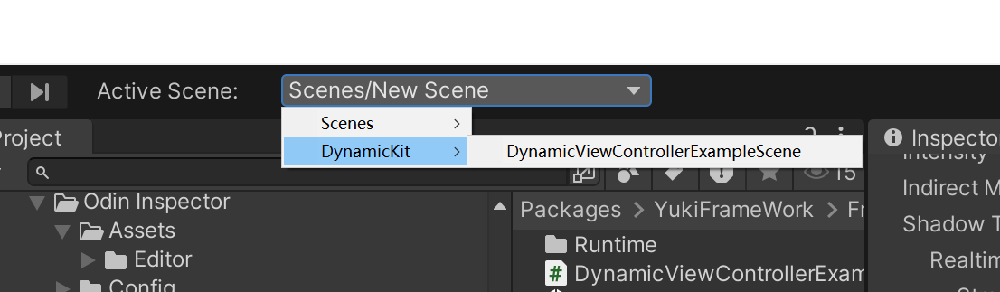

框架自带动态字段赋值拓展：

需要为类型继承IDynamicMonoBehaviour接口

框架自带的YMonoBehaviour已实现该接口。包括ViewController等模块基类。

如需要手动注入，则为自行定义的类型继承该接口，接口参数如下:

|IDynamicMonoBehaviour Interface API|API说明|
|--|--|
|GameObject gameObject { get;}||
|Transform transform { get;}||

上述接口应该实现！

注册后，进行手动的调用如下:


``` csharp

public class TestScripts : MonoBehaviour,IDynamicMonoBehaivour
{
	void Start()
	{
		DynamicValue.Inject(this);//手动注册
	}
}

```


可以通过框架自带的场景跳转进行选择查看示例场景的使用方式：



即可查看完整的使用

字段使用示例如下:

``` csharp

public class TestScripts : ViewController
{
		[DynamicValue()]
		public Transform transform;
		[DynamicValue()]
		public DynamicViewControllerExample example
		[DynamicValue("Cube")]
		public BoxCollider boxCollider;
		[DynamicValue(true,true)]
		public CapsuleCollider capsuleCollider;
		[DynamicValue("Sphere",false)]
		public SphereCollider sphereCollider;
		[DynamicValueFromScene()]
		public Camera mCamera;
		[DynamicValueFromScene("Directional Light")]
		public Light mLight;	
		[DynamicValueFromScene(true)]
		public MeshCollider meshCollider;
}

```

|DynamicValueAttribute API|特性API说明|
|-|--|
|string ChildObjName { get; }|子对象的名称,通过子对象的GetComponent获取组件|
|public bool FindAllChild { get; }|查找所有的子对象|
|bool OnlyMonoEnable { get; }|是否只查找激活的对象|

|DynamicValueFromSceneAttribute API|特性API说明|
|--|--|
|string SceneObjLabel { get; }|位于场景的标签(根据查找模式定义)|
|bool OnlyMonoEnable { get; }|是否查找只激活的对象|
|DynamicValueFromSceneMode DynamicValueFromSceneMode { get; }|查找的模式,模式包含名称、标签、路径|

标记上述特性后标记该动态字段后类型继承IDynamicMonoBehaviour接口即可实现对组件的完全自动赋值，无需手动操作绑定

对于自动注入，框架提供了最多9个参数的IDynamicBuilder接口的泛型版本可使用，而希望有自行定义的版本时，也可以继承自IDynamicBuilder实现自己的泛型版本。

方法示例如下:

``` csharp 

	public class TestScripts : ViewController,IDynamicBuilder<Transform>,IDynamicBuilder<Canvas,Light>
	{
		//该方法在注入后会自动调用。默认情况下参数通过GetComponent的方式进行获取
		public void Builder(Transform transform)
		{
			
		}
	
		//对于上述所使用的DynamicValue与DynamicValueFromScene，也可以通过在Builder中为参数添加，以确定查找对象的形式
		public void Builder([DynamicValue]Canvas canvas,Light light)
		{
			
		}
	}

```

所有的IDynamicBuilder泛型版本均继承自IDynamicBuilder接口(非泛型),包括由用户自定义也应该这样做。对于原生的非泛型版本，可自己实现Builder，框架内部会自动识别名为Builder的方法并自动调用.

``` csharp 

	public class TestScripts : ViewController,IDynamicBuilder
	{
		//对于上述所使用的DynamicValue与DynamicValueFromScene，也可以通过在Builder中为参数添加，以确定查找对象的形式
		public void Builder([DynamicValue]Canvas canvas,Light light)
		{
			
		}
	}

```

对于自动注入，不限于上述仅对组件生效的功能。框架提供了IDynamicRegulation接口。作为动态规则器可自由定义查找如下:


``` csharp 

    public class TestRegulation : IDynamicRegulation
    {
        public object Build(Type parameterType,IDynamicMonoBehaviour monoBehaviour)
        {          
			//可以自由定义如何返回对象。
			
            return parameterType.CreateInstance();
        }
    }

```

完成规则设置后，在字段/参数中标记DynamicRegulation特性，并传递该规则器的类型

|DynamicRegulationAttribute API|特性API说明|
|--|--|
|Type RegulationType { get; }|规则器的类型|


``` csharp 

	public class TestScripts : ViewController,IDynamicBuilder
	{
		
		public void Builder([DynamicRegulation(typeof(TestRegulation))]A a)
		{
			Debug.Log(a);
		}

		public class A 
		{
			
		}
	}

```