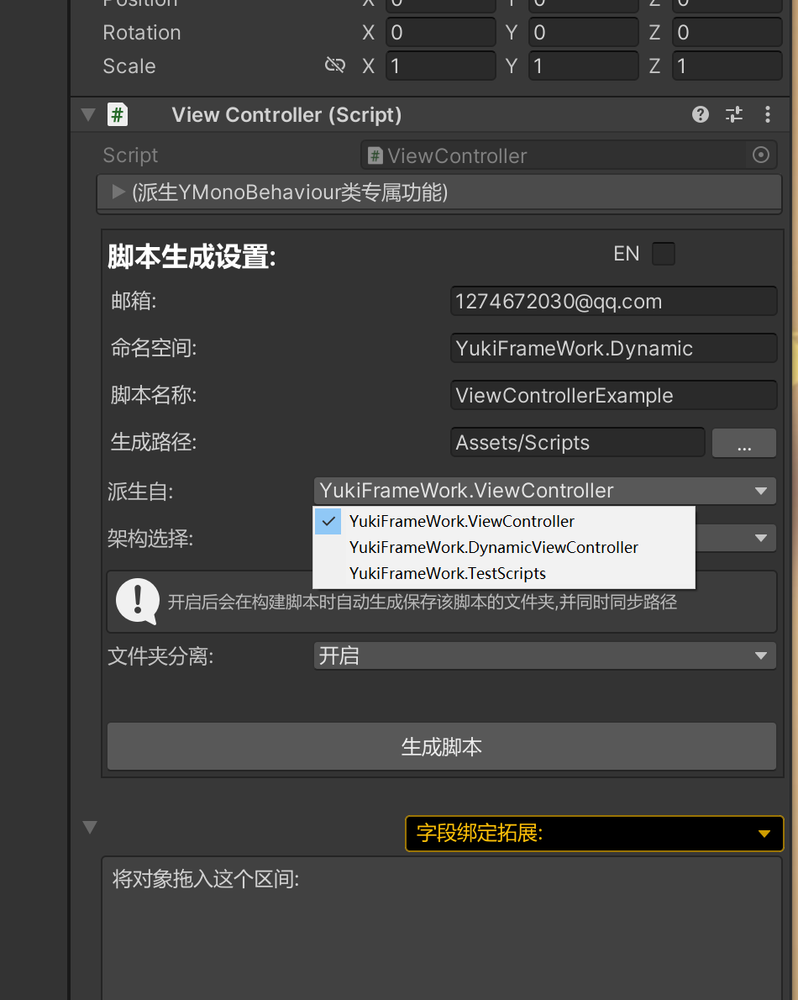
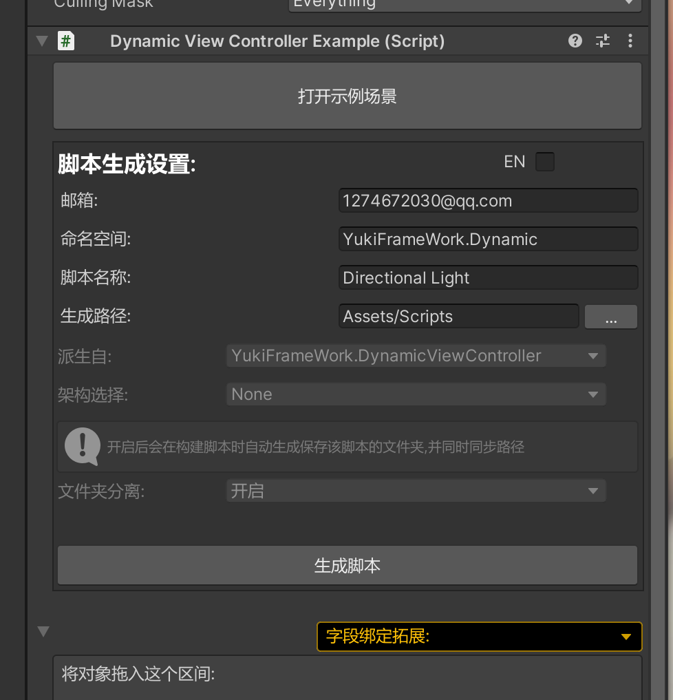

框架自带动态字段赋值拓展：

Ctrl+Q在场景中添加啊ViewController脚本， 将派生改为DynamicViewController:



而后创建脚本，可点击打开示例场景查看基本使用方式如下:



也可以通过框架自带的场景跳转进行选择：


即可查看完整的使用

使用示例如下:

``` csharp

public class TestScripts : DynamicViewController
{
		[DynamicValue()]
		public Transform transform;
		[DynamicValue()]
		public DynamicViewControllerExample example
		[DynamicValue("Cube")]
		public BoxCollider boxCollider;
		[DynamicValue(true,true)]
		public CapsuleCollider capsuleCollider;
		[DynamicValue("Sphere",false)]
		public SphereCollider sphereCollider;
		[DynamicValueFromScene()]
		public Camera mCamera;
		[DynamicValueFromScene("Directional Light")]
		public Light mLight;	
		[DynamicValueFromScene(true)]
		public MeshCollider meshCollider;
}

```

标记上述特性后标记该动态字段后类型继承DynamicViewController即可实现对组件的完全自动赋值，无需手动操作绑定

具体事宜可查看特性注释！