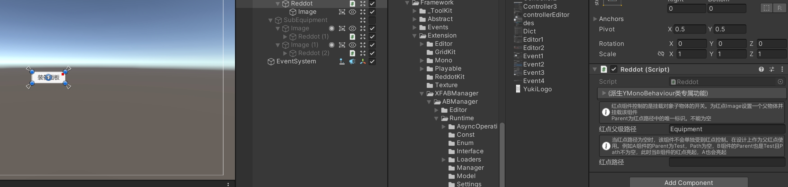

框架红点系统使用:ReddotKit

场景示例：

添加一个新的空对象并挂载Reddot组件，可能是红点的组件Image必须作为该对象的子物体，因为这个组件管理的是这个对象子物体的开关!


|Reddot Property API|API说明|
|--|--|
|string ReddotParent|红点的唯一父级路径,不能为空|
|string ReddotPath|红点路径，当路径为空时，该红点作为父级管理红点使用|

|Reddot Method API|API说明|
|-|-|
|void Remove()|移除红点路径方法|

当红点路径为空时，例如A组件的Parent为Test，Path为空，B组件的Parent也是Test且Path不为空，此时当B组件的红点亮起，A也会亮起

|ReddotKit API|API说明|
|---|--|
|IList< string > GetReddotPaths(string parent)|通过父级节点，获取某一组所有的红点路径|
|IReadOnlyDictionary< string, IList< string > > ReadOnlyReddotPath|获取只读的红点数据|
|void AddReddotPath(string parent, string path)|添加一个新的红点路径|
|void AddReddotPaths(string parent, IList< string > paths)|添加一组新的红点路径|
|void RemoveReddotPath(string parent)|移除某一个父级下所有的红点路径|
|void RemoveReddotPath(string parent,string path)|移除某一个父级下指定的红点路径|
|string ReddotPersistence (Getter)|获取红点路径的持久化数据(Json字符串)|
|void LoadPersistenceReddotPath(string persistence)|传入指定的数据以加载所有的红点路径|
|Action onReddotPathChanged|当红点路径改变(增加/减少)时触发的事件|

新建脚本后挂载在任意对象上

``` csharp
using YukiFrameWork;
using UnityEngine;
using YukiFrameWork.Events;
public class TestScripts : MonoBehaviour
{
    void Awake()
    {
        //添加指定的红点路径
        ReddotKit.AddReddotPath("Parent","1001");

        //对于事件的触发，除了自带的onReddotPathChanged;还有一个自带的结构体ChangeReddotArg，可以通过EventManager进行事件的注册

        EventManager.AddListener<ChangeReddotArg>(arg => 
        {
            //编写你自己的逻辑,与onReddotPathChanged同时触发
        });
    }
}

```