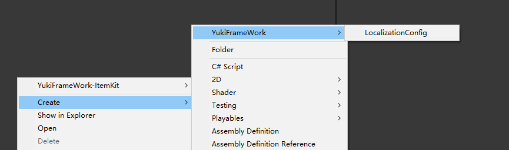
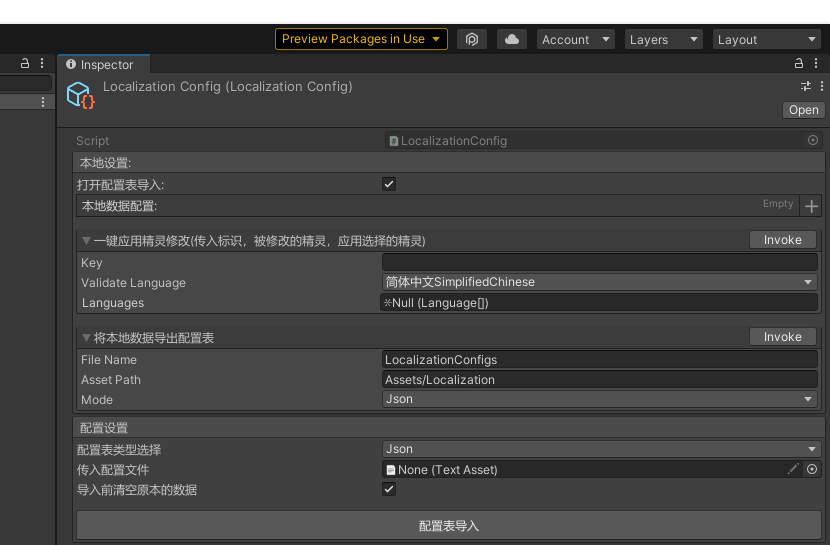
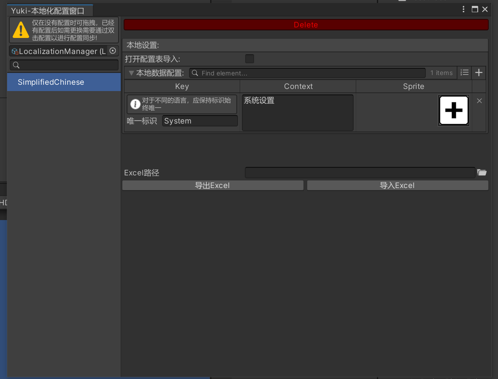
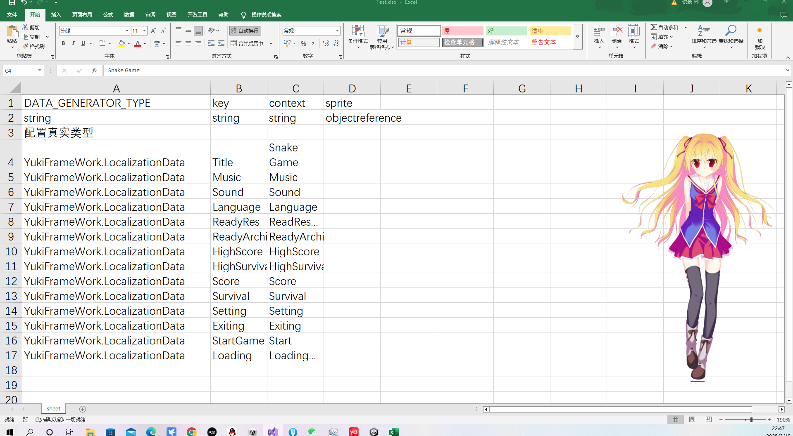
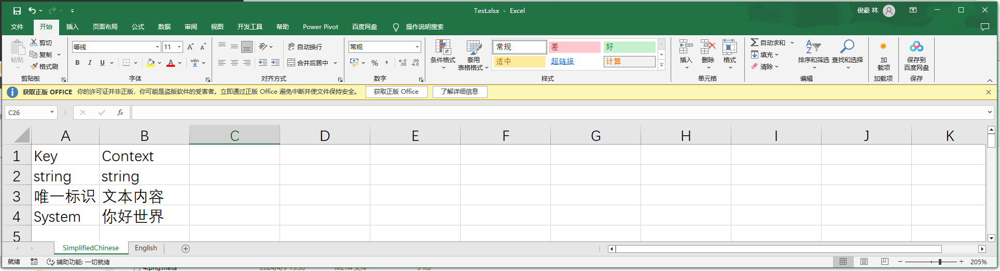
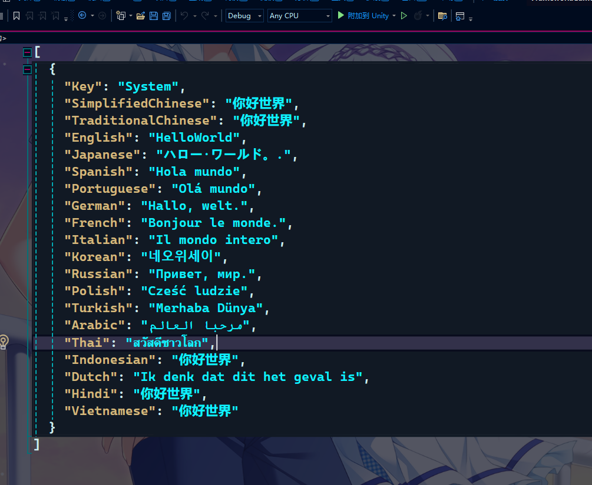
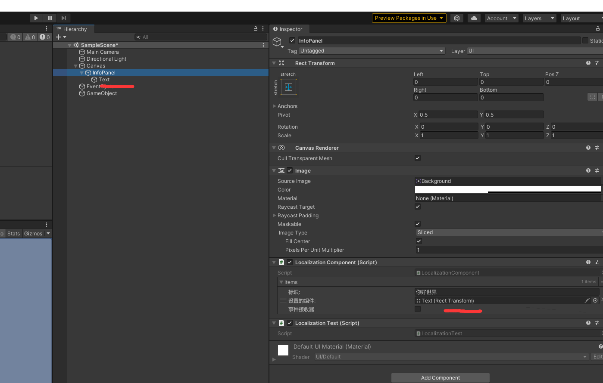
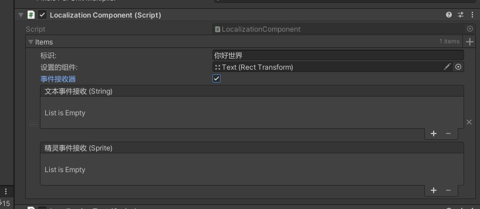

框架本地化套件LocalizationKit

使用如下:

在项目Assets文件夹下右键新建配置表：



配置表预览如下:



在本地数据配置处点击加号添加数据
示例如下：


可以在下方将已经配置好的数据导出Json，也支持拖入Json文件转换为配置

在标识设置好之后，每个语言都可以设置自己的文本跟精灵，对于精灵的设置，如果有多个语言应用同一个精灵，可以在下方一键应用:



图中的参数Key:对应要应用的标识,ValidateLanguage:精灵被应用的语言，Languages数组对应后续同步应用的语言

打开YukiFrameWork/LocalConfiguration选择本地化配置窗口将配置拖入，设置初始时的默认语言,在持有全局配置时，可以继续添加多个配置在子配置项内，如果有需要的话



对于本地化的配置，支持Excel配表的功能，本地化通过另外的逻辑进行Excel转Json的逻辑。所以Excel格式较为特殊，模板如下:



每一个语言都应该设置一个单独的表，如图所示，且表名应与框架提供的语言标识名称(枚举)相同，设置对应文本的标识Key以及文本内容Context，多表不同语言的配置，Key应该始终保持统一

配置好之后，查阅框架SerializationTool文档进行Excel转Json的操作即可

[序列化工具文档跳转](https://gitee.com/NikaidoShinku/YukiFrameWork/blob/master/YukiFrameWork/Plugins/Serialization/序列化工具.md)

示例的Excel模板转换的Json文件如下:



将Json文件拖入这个位置:


直接点击导入，即可同步当前的配置到config的字典中！


运行时使用示例代码：

```
using YukiFrameWork;
using UnityEngine;
using System;
namespace YukiFrameWork.Example
{
	public class LocalizationTest : MonoBehaviour
	{
        /// <summary>
        /// 显示的文本信息
        /// </summary>
        private string info;
        private void Start()
        {
            ///注册切换语言时的事件回调，事件可以在初始化之前与之后注册，没有限制
            LocalizationKit.RegisterLanguageEvent(language =>
            {
                info = LocalizationKit.GetContent("你好世界",language).Context;
            });

            ///启动时可以调用一次语言更新
            LocalizationKit.OnLanguageValueChanged();

            ///如果想直接获得某一个Data的信息(必须执行过一次初始化!):
            ILocalizationData localization = LocalizationKit.GetContent("你好世界",LocalizationKit.LanguageType);

            ///得到文本信息
            Debug.Log(localization.Context);

            ///得到精灵
            Debug.Log(localization.Sprite);
        }
        private void OnGUI()
        {                                 
            if (GUILayout.Button(Language.SimplifiedChinese.ToString()))
            {
                ///切换当前的语言
                LocalizationKit.LanguageType = Language.SimplifiedChinese;
            }

            if (GUILayout.Button(Language.English.ToString()))
            {
                ///切换当前的语言
                LocalizationKit.LanguageType = Language.English;
            }

            if (GUILayout.Button(Language.Japanese.ToString()))
            {
                ///切换当前的语言
                LocalizationKit.LanguageType = Language.Japanese;
            }

            if (GUILayout.Button(Language.Korean.ToString()))
            {
                LocalizationKit.LanguageType = Language.Korean;
            }

            GUILayout.Label(info);

        }
    }
}

```

如果希望在代码中自定义Data的数据，可以自行实现ILocalizationData接口如下

```
[Serializable]
public class LocalizationCustomData : ILocalizationData
{
    //标记序列化特性让其可以在编辑器修改
    [field: SerializeField]
    public string Context { get ; set ; }
    [field: SerializeField]
    public Sprite Sprite { get ; set ; }
}

```

同时进行配置的自定义，派生自LocalizationConfigBase<T>类

```
[CreateAssetMenu(fileName = "LocalizationCustomConfig", menuName = "YukiFrameWork/LocalizationCustomConfig")]
public class LocalizationCustomConfig : LocalizationConfigBase<LocalizationCustomData>//泛型定义为我们实现的自定义Data
{
    
}
```

实现完毕后创建配置拖入LocalConfiguration中的本地化配置即可!

static LocalizationKit API:

    - Language LanguageType //可修改的本地语言属性
    - IUnRegister RegisterLanguageEvent(Action<Language> action) //注册修改语言时触发的回调
    - void UnRegisterLanguageEvent(Action<Language> action) //注销修改语言时触发的回调
    - void OnLanguageValueChanged()//调用回调
    - ILocalizationData GetContent(string key, Language language)//根据语言以及标识得到本地数据
    - ILocalizationData GetContentFromDepend(int id, string key, Language language);//根据id得到子配置项，然后根据语言以及标识得到本地数据


对于UI组件的兼容，应在Panel上挂载LocalizationComponent脚本,并自行进行配置,一个Component只能使用一个配置，如果需要使用的是子配置则打开子配置按钮，输入对应id即可,如图所示:


在同一标识下，如果需要有多个组件，可以打开图中的事件接收器，如下所示：


这样当项目运行时，该组件将会同步，框架默认支持Text与Image，如果使用TextMeshPro等其他组件，可以使用LocalizationComponent的初始化解析器方法

```
public class LocalizationTest : MonoBehaviour
	{
        /// <summary>
        /// 显示的文本信息
        /// </summary>
        private string info;

        public LocalizationComponent localizationComponent
        private void Awake()
        {        
            ///初始化组件解析器
            localizationComponent.InitResolver(CustomResolver);
        }
       
        private void CustomResolver(Component component, ILocalizationData localizationData)
        {
            ///在这里实现具体的逻辑：

            //示例:
            TextMeshProUGUI textMesh = component as TextMeshProUGUI;
            textMesh.text = localizationData.Content;
        }
    }
}
```

Component API:

    ///初始化解析器，可以自行传入解析器来完成同步的回调
    - void InitResolver(Action<MaskableGraphic, ILocalizationData> resolver);


