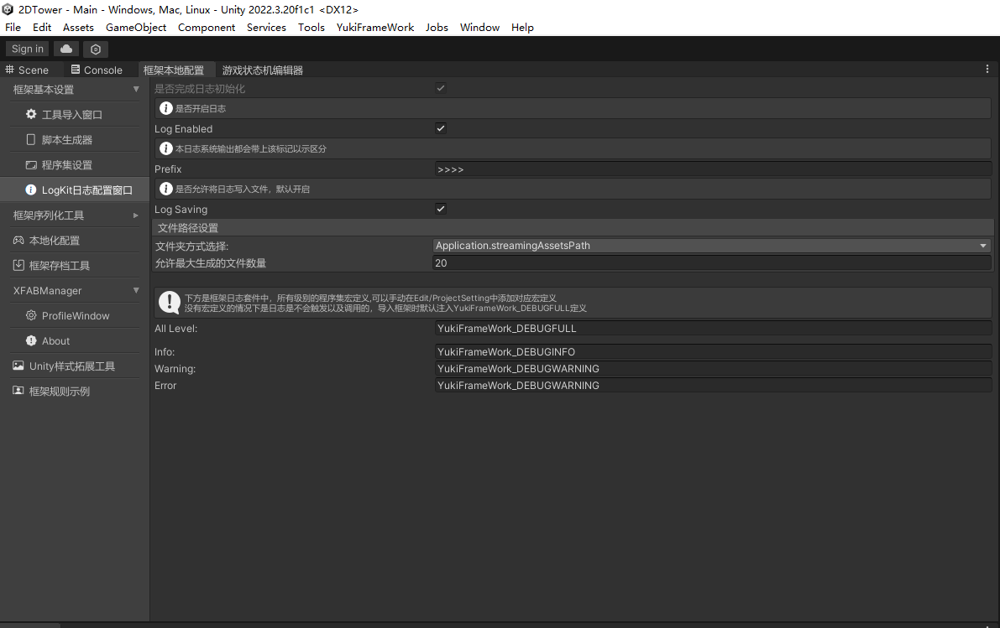
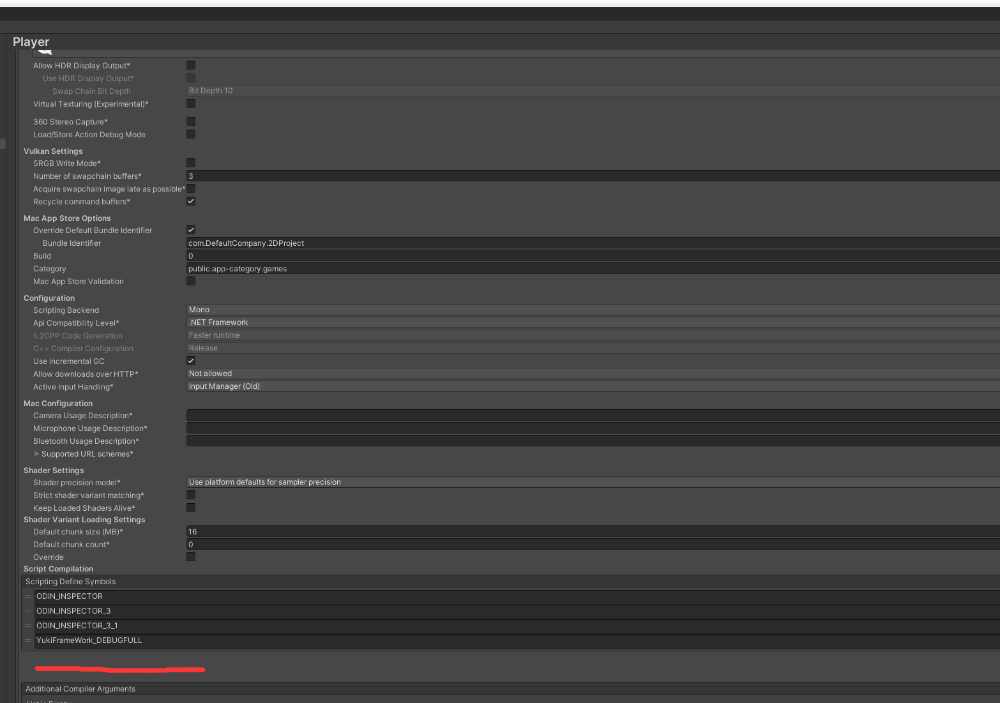

控制台日志工具LogKit：
命名空间：using YukiFrameWork;

该工具可以让控制台输出的逻辑变得更加人性化

打开框架本地配置窗口的LogKit配置如图所示:



可在编辑器自由设置Log日志的开启开启以及关闭，以及选择是否需要输出到文件和自定义文件路径。

图中有四个预设不可修改的宏定义信息:

    - YukiFrameWork_DEBUGFULL //支持Info、Warning、Error的输出
    
    - YukiFrameWork_DEBUGINFO //仅支持Info

    - YukiFrameWork_DEBUGWARNING //仅支持Warning

    - YukiFrameWork_DEBUGERROR //仅支持Error

YukiFrameWork_DEBUGFULL会在导入框架时默认添加，当四个宏定义都没有添加时，LogKit不会执行任何操作。

打开Edit/ProjectSetting/Player进行添加!



```
public class TestScripts : MonoBehaviour
{  
    private void Start()
    {
        //提供一个全局的日志开关,默认为True,当设置为False时使用LogKit的所有日志均不会在控制台打印,也不会进行日志输出
        LogKit.LogEnabled = true;

        //提供一个全局的写入文件开关，默认为True，当设置为False时，不会输出文件。
        LogKit.LogSaving = true;

        LogKit.I("这是一个消息日志");
        LogKit.W("这是一个警告日志");
        LogKit.E("这是一个异常日志");

        LogKit.Exception(new Exception());//该API不受到宏定义影响限制,使用Debug.LogException抛出异常。


        拓展部分：
        GameObject cube = GameObject.CreatePrimitive(PrimitiveType.Cube);

        cube.LogInfo();
        cube.LogError();
        cube.LogWarning();
        cube.LogException();      

#if YukiFrameWork_DEBUGFULL
        LogKit.I("被宏定义包裹的日志,适合用于编辑器调试且打包不同平台时不希望输出日志时操作");
#endif
    } 
}
```


	