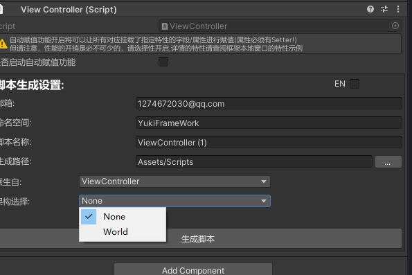

ViewController编辑器使用说明

使用示例：
```

    ///首先创建一个架构类
    using YukiFrameWork;
    public class PointGame : Architecture<PointGame>
    {
        ///需要重写的初始化方法
        public override void OnInit()
        {
            
        }        
    }
```
创建完架构类后在ViewController编辑器下开启架构自动化设置如图所示:



开启后必须设置一个架构(不为None才可以创建脚本),创建后的脚本如图所示:


默认开启,如果选择关闭的话则创建默认的ViewController脚本。

注意:在Hierarchy视图中中右键YukiFrameWork-Create ViewController创建出来的ViewController对象在2021以上才享受Unity的撤销功能!