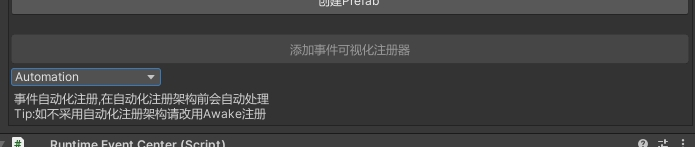
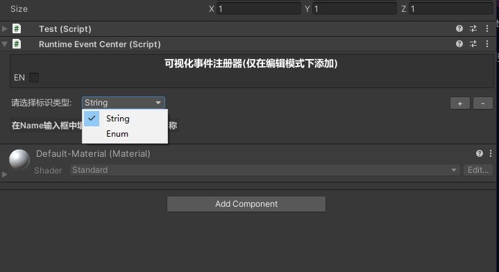
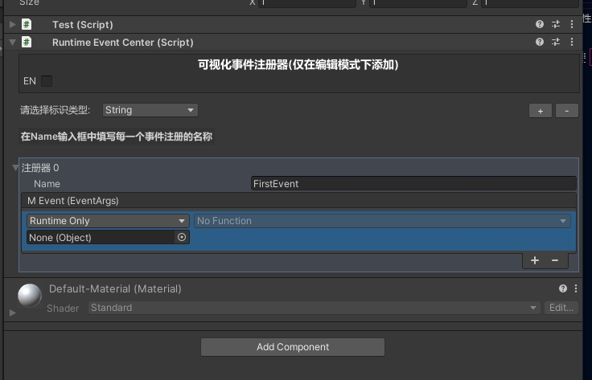
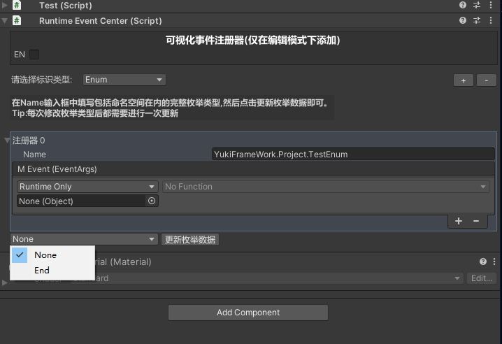

ViewController 可视化事件拓展模块:

添加事件注册器生命周期如图所示:



默认自动化,选择该生命周期时将与架构初始化同时执行(任何情况下一定比使用架构提前注册)

Awake注册,通过Unity 生命周期中Awake方法注册,需要自行注意注册时机,不采用自动化时仅该选项有效。

事件标记类型如图所示:



字符串标记：使用字符串对事件进行标记,在Name输入框中输入该事件的标记名称,如图所示:



枚举标记：较为特殊,在Name输入框中输入枚举的类型(包含命名空间)输入完毕后点击枚举数据更新按钮如图所示,即可弹出对应枚举类型选择。



在该视图中注册的所有UnityEvent均可使用架构的发送事件方法进行发送,该UnityEvent本体持有一个参数为System.EventArgs,自定义方法时跟平时我们在Unity开发时拖入对象选择方法一致.

```	
	//这里方便展示,直接给控制器继承发送事件的规则
	using System;
	using UnityEngine;
	public class Controller : ViewController,ISendEvent
	{
		//当可视化事件注册完毕后

		private void Start()
		{
			//info:传递的标识,字符串传字符串，枚举就传枚举即可,不需要传递这个EventArgs的参数,内部直接Default
			this.SendEvent<EventArgs>(info:);
		}

		///拖拽时直接选择该方法即可
		public void Test(EventArgs e)
		{
			//这是可以被注册的方法
		}
	}

```


