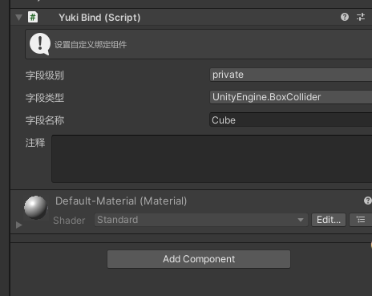

ViewController 字段绑定:

将对象拖入指定位置如图所示:

字段的访问权限可在private protected internal public中选择,可以选择字段的类型(从这里绑定的所有字段默认标记SerializeField特性序列化)

绑定好字段后点击生成代码,对象会自动绑定到脚本中,最终如图所示:

支持为对象添加YukiBind脚本，该脚本在创建后会自动将该对象所有的组件进行绑定，绑定后在ViewController中点击添加即可。

最后会生成该脚本的分写文件

