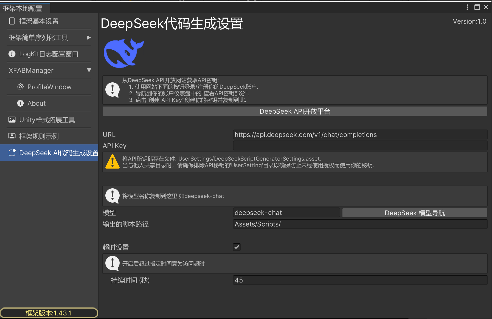
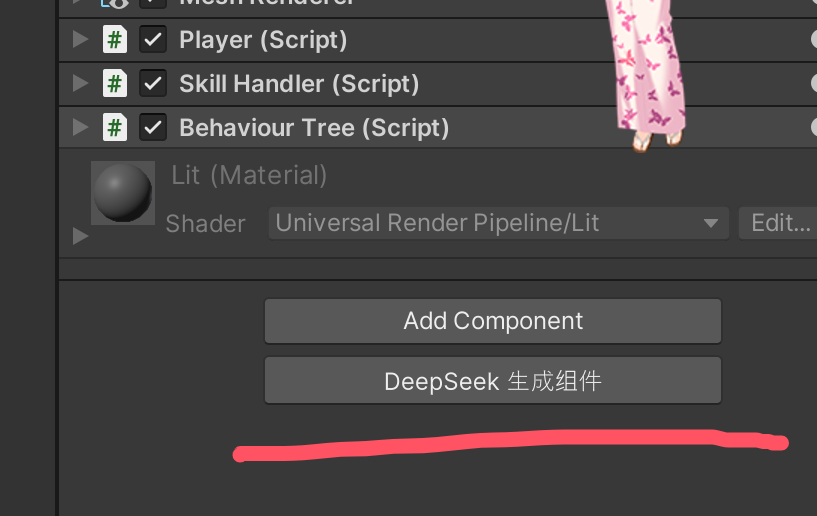
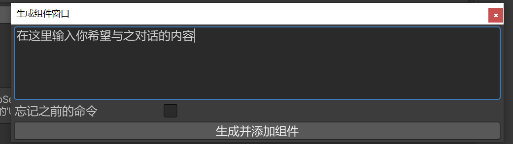

YukiFrameWork DeepSeek AI代码生成使用教程(目前为首发1.0版)

Tips:AI生成仅适合作为辅助开发，请斟酌使用。AI不一定会生成出你心目中完美的代码。

打开YukiFrameWork/LocalConfiguration/DeepSeek AI代码生成设置如下:

设置好自己的API Key

在Inspector中下方点击生成组件:

在窗口处进行对话：

