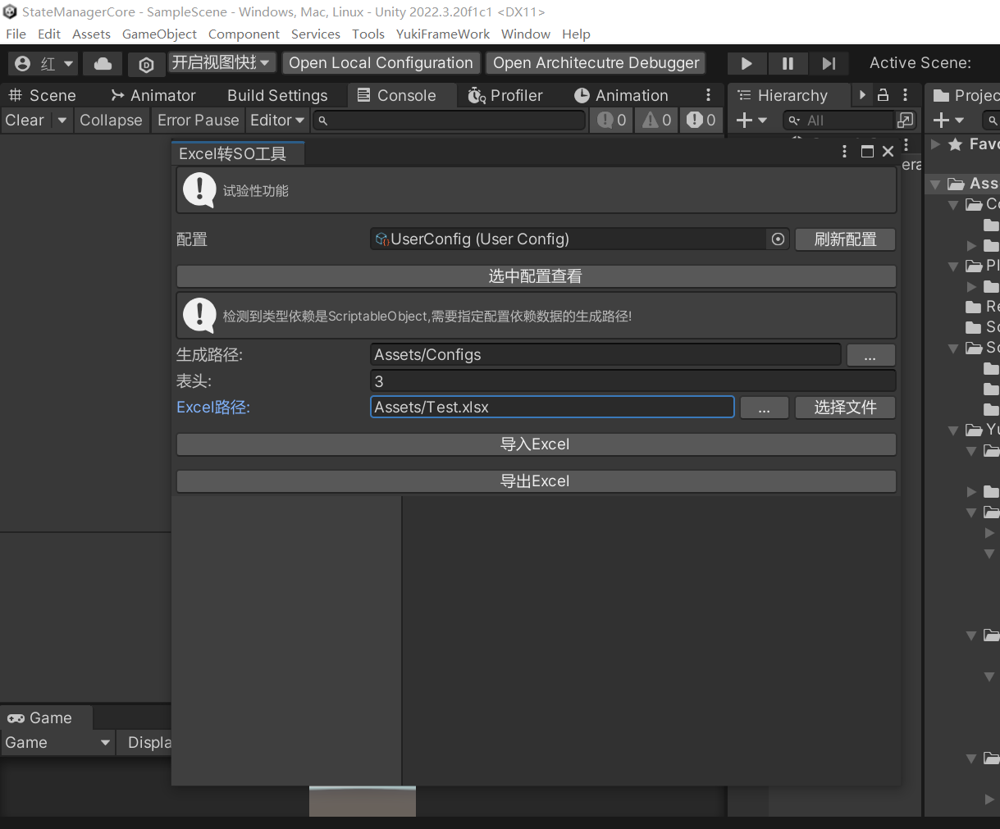

左上角打开框架YukiFrameWork/Excel-So转换工具:

为工具传递一个ScriptableObject的配置。这个配置需要继承接口IExcelSyncScriptableObject 

|IExcelSyncScriptableObject API |API说明|
|---|---|
|IList Array|使用导出Excel时会采用的集合|
|Type ImportType|导入Excel指定集合的类型，例如需要同步的数据是int类型的数组 则该Type应该是typeof(int)|
|void Create(int maxLength)|构建时触发，可以同步集合大小|
|void Import(int index,object userData)|导入的过程中触发(根据不同的配置自由定制)|
|void Completed()|完成导入后触发|
|bool ScriptableObjectConfigImport|当集合的具体类型是ScriptableObject且该属性为True，工具会默认需要用户提供so的配置存放文件夹|

对于转换的适配，可以通过Excel导入数据到SO，也可以通过SO导出数据到Excel。


``` csharp

    [CreateAssetMenu(fileName = "UserConfig",menuName = "UserConfig")]
    public class UserConfig : ScriptableObject, IExcelSyncScriptableObject
    {
        public UserModel[] userModels;
        public IList Array => userModels;

        public Type ImportType => typeof(UserModel);

        public bool ScriptableObjectConfigImport => true;

        public void Completed()
        {
           
        }

        public void Create(int maxLength)
        {
            userModels = new UserModel[maxLength];
        }

        public void Import(int i,object userData)
        {
            userModels[i] = userData as UserModel;
            
        }
    }

    [Serializable]
    public class UserModel : ScriptableObject
    {
         public string Name;
         public int ID;
         public int UID;
         [Tooltip("测试注释是否可以正常被写入")]//为字段标记ToolTip特性，Excel文档会自动同步注释
         public int Level;
         public float EXP;

         [field:SerializeField]
         public string Test { get; set; }

    }
```
