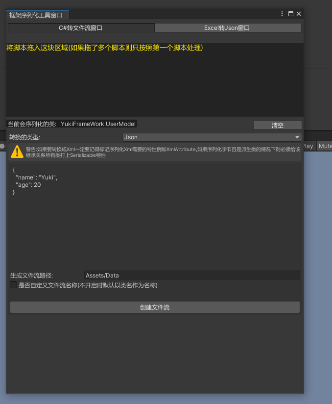
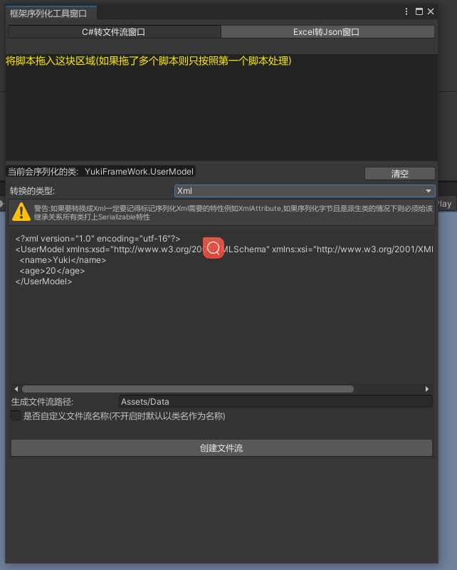
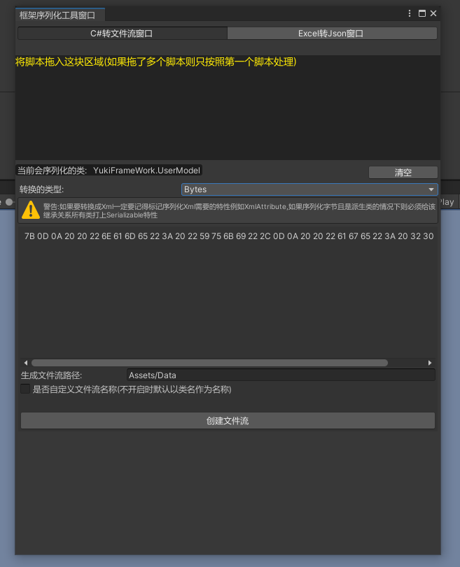
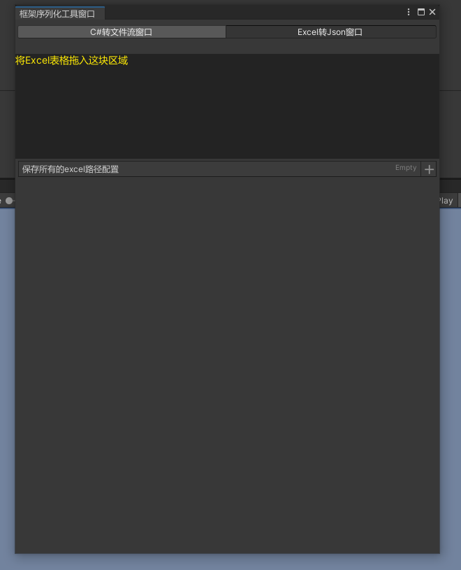
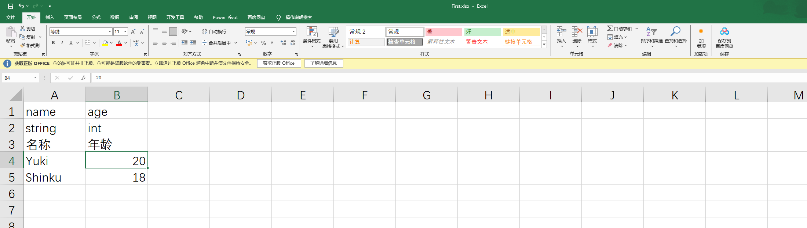
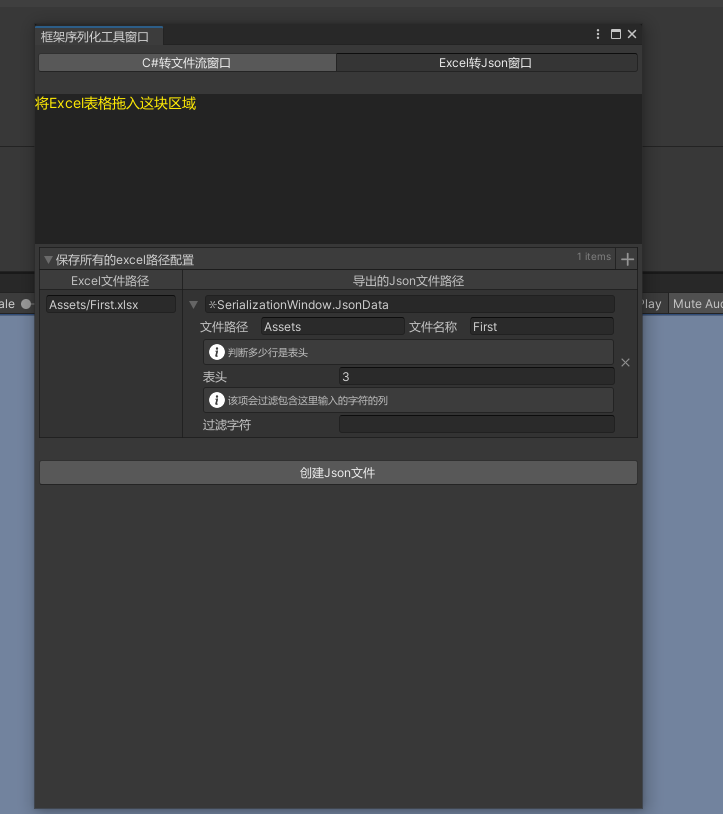

框架序列化工具使用示例:

左上角通过YukiFrameWork/LocalConfiguration打开框架提供的简单序列化工具窗口!

首先看第一个窗口C#转文件流窗口

准备一个UserModel类

```
	///标记上序列化的特性
	[Serializable]
	public class UserModel
	{
		public string name = "Yuki";
		public int age = 20;
	}


```

在显示区域中拖入该脚本文件(注意:类名要与文件一致并且这个类是不派生自UnityEngine.Object的)

可以进行对Json、Xml以及Bytes的序列化预览，如下所示:








其中Bytes经过字符串特殊处理，在这里的预览仅是效果，目前不支持导出二进制文件流，其他两个没有影响。

对于Xml的序列化注意事项：拖入脚本之前确保内部所有的字段或者属性均可被正常序列化，如Dictionary，如抽象类如接口，如果存在类中没有标记上不序列化的特性，是无法正常序列化的，
同时根据情况需要在字段上标记XmlAttribute等Xml专属的序列化特性！

可以在下方设置好路径跟名称后点击创建流生成对应的配置文件。

第二个窗口 Excel转Json窗口：


在指定区域内拖入Excel文件，这里我们使用UserModel的配表示例：


在这里，第一行是我们的字段名称，第二行是我们的数据类型，第三行则是注释(视情况也可以没有，与接下来的设置有关)，从第三行之后的就是我们的数据

将这个Excel拖入项目中，然后拖入到我们的窗口如下：



可以同时选中多个Excel，都会被保存进来(关闭之前都会保存，如果把窗口关闭了下次就要重新拖动)

这里我们可以进行对JsonData的信息配置：设置文件路径跟文件的名称。

表头设置完毕后，从表头标记的行数往下就是我们的数据，结合我们上面图中的配表，这里的表头设置为3

过滤字符：过滤字符可以用于过滤掉某一列之后的数据，判断该列中是否存在过滤字符的字符，如果存在则过滤

设置完后创建Json文件，如下所示:


在这我们可以得到这个UserModel类型的数组，通过框架的序列化工具类进行导入!

``` csharp
	public class TestScripts : MonoBehaviour
    {
		//得到我们的配置文件
        public TextAsset textAsset;
        void Start()
        {
			//通过框架提供的SerializationTool进行反序列化
            UserModel[] models = SerializationTool.DeserializedObject<UserModel[]>(textAsset.text);
        }
    }
```

左上角打开框架YukiFrameWork/Excel-So转换工具:

为工具传递一个ScriptableObject的配置。这个配置需要继承接口IExcelSyncScriptableObject 

|IExcelSyncScriptableObject API |API说明|
|---|---|
|IList Array|使用导出Excel时会采用的集合|
|Type ImportType|导入Excel指定集合的类型，例如需要同步的数据是int类型的数组 则该Type应该是typeof(int)|
|void Create(int maxLength)|构建时触发，可以同步集合大小|
|void Import(int index,object userData)|导入的过程中触发(根据不同的配置自由定制)|
|void Completed()|完成导入后触发|
|bool ScriptableObjectConfigImport|当集合的具体类型是ScriptableObject且该属性为True，工具会默认需要用户提供so的配置存放文件夹|

对于转换的适配，可以通过Excel导入数据到SO，也可以通过SO导出数据到Excel。


``` csharp

    [CreateAssetMenu(fileName = "UserConfig",menuName = "UserConfig")]
    public class UserConfig : ScriptableObject, IExcelSyncScriptableObject
    {
        public UserModel[] userModels;
        public IList Array => userModels;

        public Type ImportType => typeof(UserModel);

        public bool ScriptableObjectConfigImport => true;

        public void Completed()
        {
           
        }

        public void Create(int maxLength)
        {
            userModels = new UserModel[maxLength];
        }

        public void Import(int i,object userData)
        {
            userModels[i] = userData as UserModel;
            
        }
    }

    [Serializable]
    public class UserModel : ScriptableObject
    {
         public string Name;
         public int ID;
         public int UID;
         [Tooltip("测试注释是否可以正常被写入")]//为字段标记ToolTip特性，Excel文档会自动同步注释
         public int Level;
         public float EXP;

         [field:SerializeField]
         public string Test { get; set; }

    }
```

SerializationTool static API:

	/// 对Json的反序列化(泛型)
	- T DeserializedObject<T>(string value);
	/// 对Json的反序列化(非泛型)
	- object DeserializedObject(string value, Type type);
	/// 对Json的序列化
	- string SerializedObject(object value, Newtonsoft.Json.Formatting formatting = Newtonsoft.Json.Formatting.Indented, JsonSerializerSettings settings = null);


	/// 对Xml的反序列化(泛型)
	- T XmlDeserializedObject<T>(string value);
	/// 对Xml的反序列化(非泛型)
	- object XmlDeserializedObject(string value, Type type);
	/// 对Xml的序列化
	- string XmlSerializedObject(object value, XmlWriterSettings settings = default)

	///对Bytes的反序列化(泛型)
	- T ByteDeserializedObject<T>(byte[] value);
	///对Bytes的反序列化(非泛型)
	- object ByteDeserializedObject(byte[] value, Type type);
	///对Bytes的序列化
	- byte[] ByteSerializedObject(object value)；
	
		/// <summary>
        /// Excel表转Json
        /// </summary>
        /// <param name="excelPath">Excel文件的路径</param>     
        /// <param name="header">表中几行表头</param>
        /// <param name="exclude_prefix">导出时，过滤掉包含指定前缀的列</param>
        /// <returns>返回Json的字符串</returns>
	- string ExcelToJson(string excelPath, int header, string exclude_prefix = "")；

		/// <summary>
        /// 把指定路径下所有的Excel转换成Json
        /// </summary>
        /// <param name="folderPath">文件夹名称</param>
        /// <param name="suffix">Excel的后缀(匹配模式)"*.xlsx"||"*.xls"</param>
        /// <param name="header"></param>
        /// <param name="exclude_prefix"></param>
        /// <returns>返回一个保存了所有被转换成Json字符串的字符串数组</returns>
	- List<string> AllExcelToJson(string folderPath,string suffix,int header, string exclude_prefix = "")


     //仅标记了UnityEditor宏定义下才可以使用，Excel转ScriptableObject的API
    - bool ExcelToScriptableObject(string excel_path,int header, IExcelSyncScriptableObject excelSyncScriptableObject,string soDataPath = "")

    //仅标记了UnityEditor宏定义下才可以使用，ScriptableObject转Excel
    - bool ScriptableObjectToExcel(IExcelSyncScriptableObject scriptables, string excel_path, out string error)

	