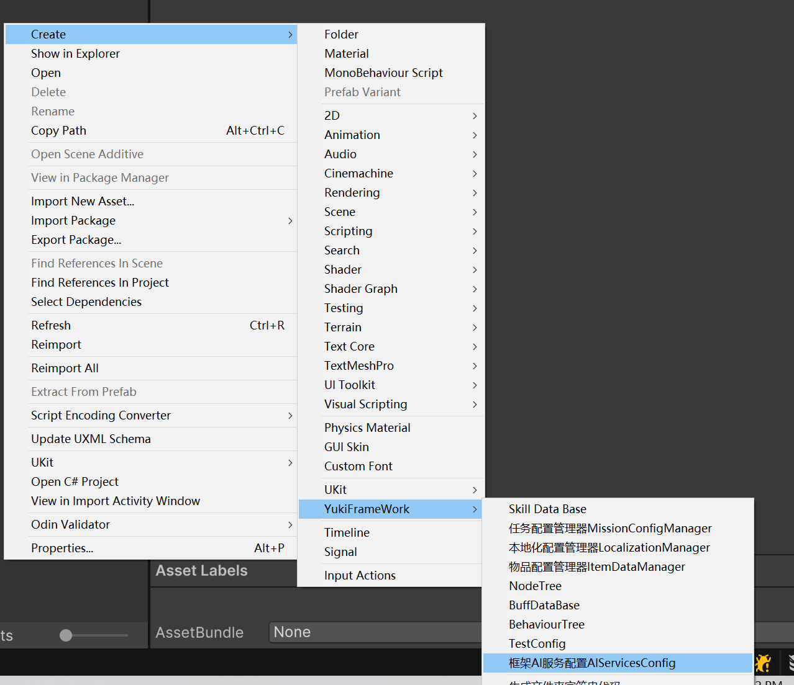
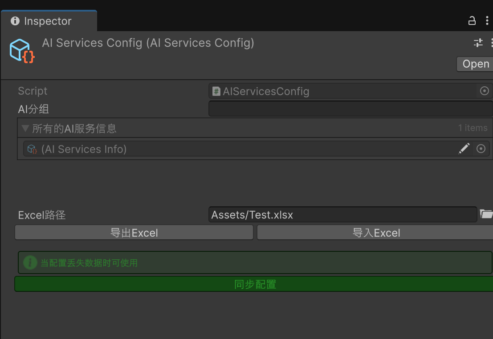
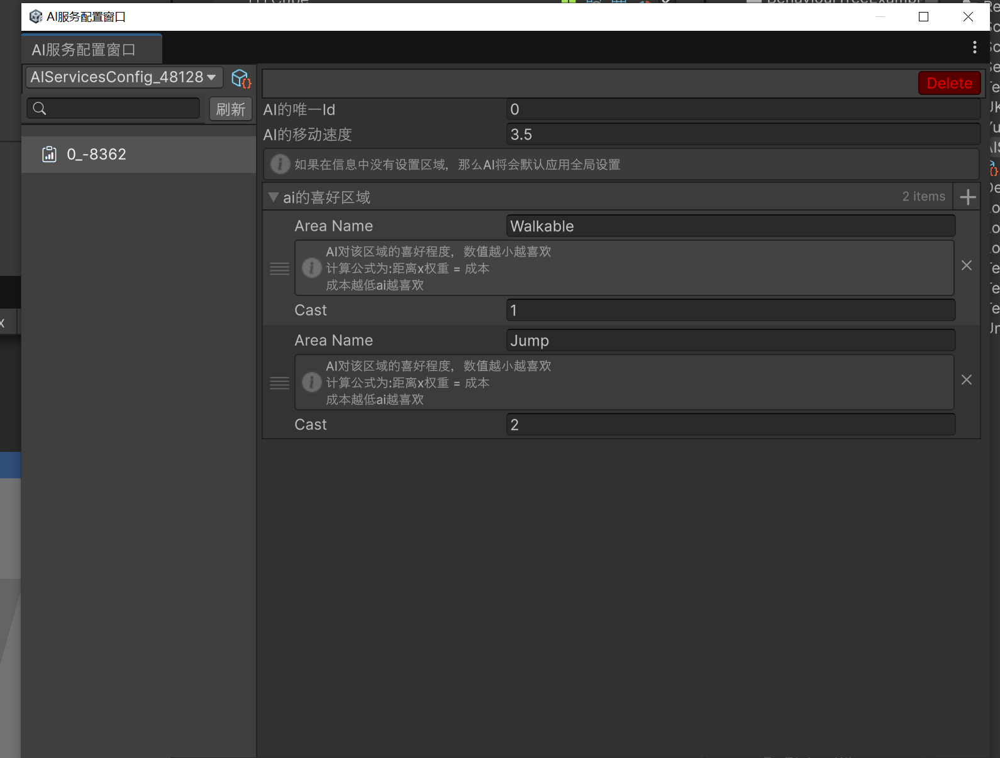

YukiFrameWork AIServicesKit

````
命名空间: using YukiFrameWork.AI;
````

该模块需要依赖Unity NavMesh，需要导入对应的包

在Assets文件夹下新建配置




双击配置打开配置窗口:

通过在左边区域右键配置创建新的AI服务，可以配置AI喜欢的区域以及速度


为指定的GameObject对象添加IAIServices接口如下:
```csharp

using YukiFrameWork.AI;
using YukiFrameWork;

public class TestScripts : MonoBehaviour,IAIServices
{
    void Start()    
    {
       
    }
    
    //下面实现所有的接口方法
}

```

|IAIServices Interface API| API说明      |
|--|------------|
|NavMeshAgent Agent { get; }| 依赖的导航网格    |
|Vector3 EndPos { get; }| 设定的终点位置    |
|void ServicesInit();| 当服务被注册触发   |
|void Enable();| 当开始运行      |
|void Disable();| 当结束运行      |
|void NavMeshClean();| 当手动同步Agent后IsOnNavMesh为False时触发 |
|void NavMeshSync();| 当手动同步Agent后IsOnNavMesh为true时触发 |                          
|void NavMeshUpdate(Vector3 direction);| 当服务启动后更新   |
|void NavMeshFixedUpdate(Vector3 direction);| 当服务启动后间接更新 |
|void NavMeshLateUpdate(Vector3 direction);| 当服务启动后晚于更新 |

在场景以及配置里设置好相对应的NavMesh参数以及NavMeshSurfce等组件实现后需要使用AIServicesKit完成流程


| AIServicesKit static API                             | API说明               |
|------------------------------------------------------|---------------------|
|void Init(string projectName)                         | 内置加载器的初始化方法         |
|void Init(IAIServicesLoader loader)                   | 自定义加载器初始化方法         |
|void LoadAIServicesConfig(string nameOrPath)          | 根据加载器的加载方式同步加载配置    |
|void LoadAIServicesConfig(AIServicesConfig config)直接加载配置 |
|IEnumerator LoadAIServicesConfigAsync(string nameOrPath)| 异步加载配置              |
|void RegisterSurface(int id, NavMeshSurface navMeshSurface)| 注册NavMeshSurface    |
|bool UnregisterSurface(int id)| 注销NavMeshSurface    |
|void RegisterServices(IAIServices services,string groupName,int id)| 注册AI服务，需要传递分组与对应的Id |
|bool UnRegisterServices(IAIServices services)| 注销AI服务              |
|void Warp()| 同步全部AI              |
|void Warp(this IAIServices services, Vector3 position)| 同步自身AI              |
|void AIEnable(this IAIServices services)| 启动AI服务              |
|void AIDisable(this IAIServices services)| 关闭AI服务              |
|void Baker(int id)| 烘焙指定标识的网格           |
|void Clear(int id)| 清空指定标识的网格           |
|bool IsBaker(int id)| 指定的网格是否已经烘焙         |
|AsyncOperation Update(int id, NavMeshData navMeshData)| 异步更新烘焙网格的数据         |
|bool IsRunning(this IAIServices services)| AI是否处于活动状态          |
|RuntimeAIServices AsRuntime(this IAIServices services)| 将服务转换为运行时服务         |

