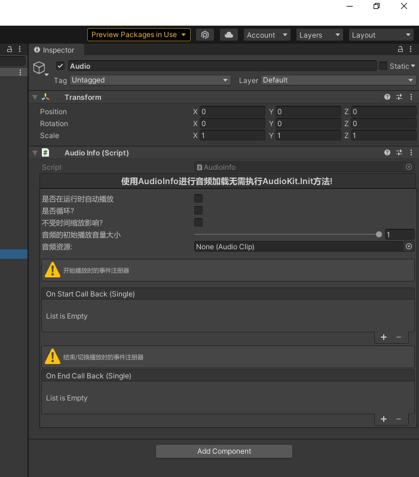
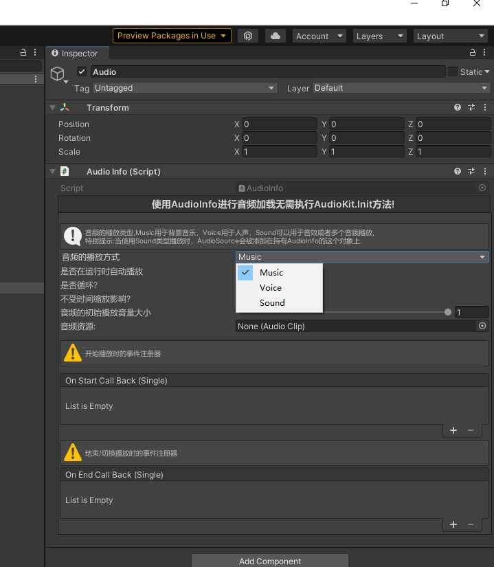

AudioKit:声音管理套件

AudioKit采用分层管理的方式，分为音乐，人声以及音效等多数环境音
音乐以及人声一次只能有一个音频在播放，音效可以同时播放多个音频，适合多人说话，技能音效
使用示例如下：
``` csharp
namespace YukiFrameWork.Example
{
    public class AudioTest : MonoBehaviour
    {           
        private void Awake()
        {
            //音频管理套件初始化，注意：音频管理套件在没有自定义加载器时是由框架的ABManager资源管理模块进行加载，在进行AudioKit的初始化之前必须要对模块资源进行准备,详情查看资源管理套件ABManager文档
            AudioKit.Init(projectName:"Audio");            
            //自定义加载方式:AudioKit.Init(IAudioLoaderPools:new CustomLoaderPools());//自定义加载类在下方示例
            var playMusic = transform.Find("PlayMusic").GetComponent<Button>();
            var pauseMusic = transform.Find("PauseMusic").GetComponent<Button>();
            var resumeMusic = transform.Find("ResumeMusic").GetComponent<Button>();

            var playVoice = transform.Find("PlayVoice").GetComponent<Button>();
            var pauseVoice = transform.Find("PauseVoice").GetComponent<Button>();
            var resumeVoice = transform.Find("ResumeVoice").GetComponent<Button>();

            var playSound1 = transform.Find("PlaySound1").GetComponent<Button>();
            var playSound2 = transform.Find("PlaySound2").GetComponent<Button>();           

            var musicSilder = transform.Find("MusicSlider").GetComponent<Slider>();
            var soundSlider = transform.Find("SoundSlider").GetComponent<Slider>();
            var voiceSlider = transform.Find("VoiceSlider").GetComponent<Slider>();

            var musicToggle = transform.Find("MusicToggle").GetComponent<Toggle>();
            var voiceToggle = transform.Find("VoiceToggle").GetComponent<Toggle>();
            var soundToggle = transform.Find("SoundToggle").GetComponent<Toggle>();

            //(异步)播放音乐
            playMusic.onClick.AddListener(() => AudioKit.PlayMusicAsync("game_bg"));
            //暂停音乐
            pauseMusic.onClick.AddListener(() => AudioKit.PauseMusic());
            //恢复音乐
            resumeMusic.onClick.AddListener(() => AudioKit.ResumeMusic());

            //(异步)播放人声
            playVoice.onClick.AddListener(() => AudioKit.PlayVoiceAsync("home_bg"));
            //暂停人声
            pauseVoice.onClick.AddListener(() => AudioKit.PauseVoice());
            //恢复人声
            resumeVoice.onClick.AddListener(() => AudioKit.ResumeVoice());

            //播放音效
            playSound1.onClick.AddListener(() => AudioKit.PlaySoundAsync("game_bg"));
            //播放音效2
            playSound2.onClick.AddListener(() => AudioKit.PlaySoundAsync("home_bg"));

            ///AudioKit提供一键式音频管理，可以直接在此修改三个层级的音频，绑定事件
            AudioKit.Setting.MusicVolume.RegisterWithInitValue(value => musicSilder.value = value);
            AudioKit.Setting.VoiceVolume.RegisterWithInitValue(value => voiceSlider.value = value);
            AudioKit.Setting.SoundVolume.RegisterWithInitValue(value => soundSlider.value = value);

            musicSilder.onValueChanged.AddListener(value => AudioKit.Setting.MusicVolume.Value = value);
            voiceSlider.onValueChanged.AddListener(value => AudioKit.Setting.VoiceVolume.Value = value);
            soundSlider.onValueChanged.AddListener(value => AudioKit.Setting.SoundVolume.Value = value);

            ///三层级的音频开关，默认全部开启，当关闭时对该层级静音
            AudioKit.Setting.IsMusicOn.RegisterWithInitValue(value => musicToggle.isOn = value);
            AudioKit.Setting.IsVoiceOn.RegisterWithInitValue(value => voiceToggle.isOn = value);
            AudioKit.Setting.IsSoundOn.RegisterWithInitValue(value => soundToggle.isOn = value);

            musicToggle.onValueChanged.AddListener(value => AudioKit.Setting.IsMusicOn.Value = value);
            voiceToggle.onValueChanged.AddListener(value => AudioKit.Setting.IsVoiceOn.Value = value);
            soundToggle.onValueChanged.AddListener(value => AudioKit.Setting.IsSoundOn.Value = value);
        }
    }
}
```
API介绍：

    - void PlayMusic(string name, bool loop = true, Action onStartCallback = null, Action onEndCallback = null,bool isRealTime = false);
    - void PlayMusicAsync(string path, bool loop = true, Action onStartCallback = null, Action onEndCallback = null, bool isRealTime = false);

    - void PlayVoice(string name, bool loop = false, Action onStartCallback = null, Action onEndCallback = null,bool isRealTime = false);
    - void PlayVoiceAsync(string path, bool loop = false, Action onStartCallback = null, Action onEndCallback = null, bool isRealTime = false);

    - void PlaySound(string name,bool loop = false,Action onStartCallback = null,Action onEndCallback = null,bool isRealTime = false);
    - PlaySoundRequest PlaySoundAsync(string path, bool loop = false, Action onStartCallback = null, Action onEndCallback = null, bool isRealTime = false);

    - void PauseMusic();
    - void ResumeMusic();
    - void StopMusic();
    - void PauseVoice();
    - void ResumeVoice();
    - void StopVoice();

    - void StopAllSoundMute();
    - void StopAllSound();

    ///声音层播放的模式，可以选择修改，让声音无法在指定帧数内播放多次。
    - PlaySoundModes PlaySoundMode;

    ///设置限制声音重复播放的帧数范围
    - int SoundFrameCountForIgnoreSameSound 

自定义加载接口: IAudioLoaderPools,IAudioLoader,当需要自定义加载时必须要创建两个类实现这两个接口，示例如下:

```

using UnityEngine;
namespace YukiFrameWork.Project
{
    public class CustomLoader : IAudioLoader
    {
        private AudioClip mClip;
        public AudioClip Clip => mClip;

        public AudioClip LoadClip(string path)
        {
            mClip = Resources.Load<AudioClip>(path);
            return mClip;
        }

        public void LoadClipAsync(string path, Action<AudioClip> completedLoad)
        {
            var result = Resources.LoadAsync<AudioClip>(path);
            result.completed += operation =>
            {
                if (operation.isDone)
                    completedLoad?.Invoke(result.asset as AudioClip);
            };
        }

        public void UnLoad()
        {
            Resources.UnloadAsset(mClip);
        }
    }

    public class CustomLoaderPools : IAudioLoaderPools
    {
        public IAudioLoader CreateAudioLoader()
        {
            return new CustomLoader();
        }
    }
    

}
```

实现自定义加载器或者使用框架默认加载，所加载的音频都会进行自动托管，超过五分钟没有使用一个音频它会自动进行资源的卸载！

在没有进行AudioKit.Init的情况下如何0代码播放音频：

在场景中给对象添加AudioInfo组件如下:



在这里可以添加对应的音频资源，在AudioInfo添加的音频长期依赖，不会自动进行卸载释放。

勾选运行时自动播放如下所示:



勾选后会出现音频的播放方式选择，在这里可以选择播放在哪一个层级，如果播放在Sound层级，会在这个对象上添加AudioSource组件托管播放而不在AudioManager组件上托管

手动对AudioInfo进行播放示例如下:

```

using YukiFrameWork.Audio;
using UnityEngine;

public class TestScripts : MonoBehaviour
{
    void Start()
    {
        var info = GetComponent<AudioInfo>();

        //播放Music
        AudioKit.PlayMusic(info);

        //播放Voice
        AudioKit.PlayVoice(info);

        //播放Sound
        AudioKit.PlaySound(info);
    }
}

```

