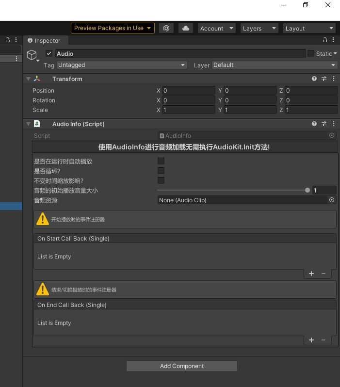
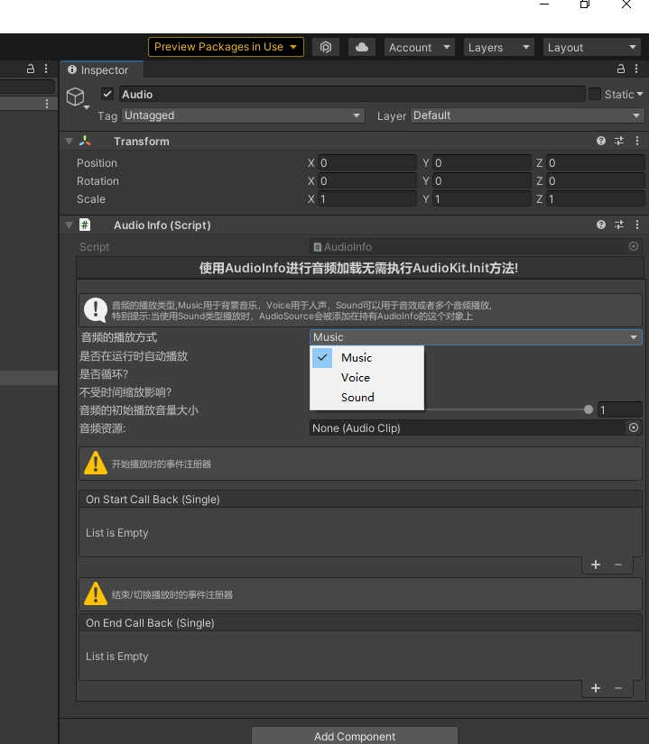
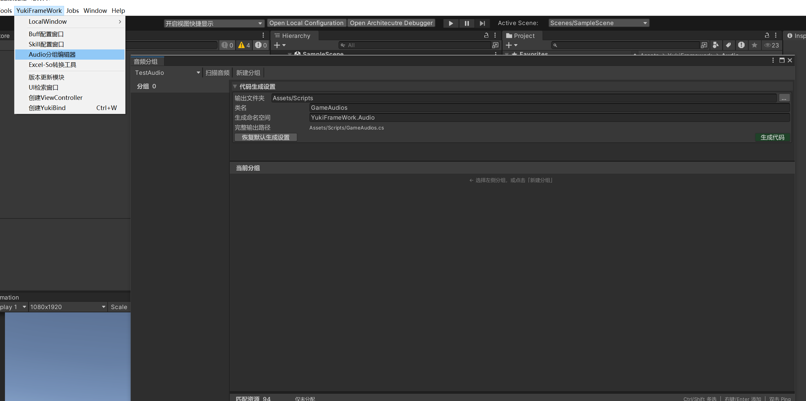

YukiFrameWork 声音管理套件（AudioKit）：按 Music / Voice / Sound 三层分组管理音频，支持链式播放、音量持久化、资源自动卸载，以及可视化配置与代码生成。

命名空间：

```csharp
using YukiFrameWork.Audio;
```

---

## 概念简述

AudioKit 采用**分层 + 分组**的方式组织音频：

| 层级 | 典型用途 | 并发特性 |
|---|---|---|
| **Music** | 背景音乐 | 同一分组同时只播放一条 |
| **Voice** | 人声、旁白 | 同一分组同时只播放一条 |
| **Sound** | 技能音效、UI 点击、多人语音 | 同一分组可同时播放多条 |

- **Music / Voice**：每个 `AudioGroup` 内部持有一个 `AudioPlayer`，新播放会替换当前音频。
- **Sound**：按音频名称维护 `AudioPlayer` 池，同名 clip 可复用空闲播放器，适合高频叠加播放。

典型调用流程：

```
AudioKit.Init() → AudioKit.Music()/Voice()/Sound() → Build() → 链式配置 → Play()
```

---

## 核心类型

| 类型 | 说明 |
|---|---|
| `AudioKit` | 静态入口：初始化、获取分组、全局音量、批量停止 |
| `AudioGroup` | 某一「层级 + 组名」下的播放单元，负责 Build / Play / 生命周期控制 |
| `AudioPlayer` | 单次播放实例，链式 API（循环、3D、回调等）挂载于此 |
| `AudioManager` | 单例 Mono，托管 `AudioSource` 池与加载器缓存卸载 |
| `AudioInfo` | 场景组件，零代码 / 少代码播放，**无需** 调用 `AudioKit.Init` |
| `AudioGroupDatabase` | ScriptableObject，可视化分组配置 + 自动生成调用代码 |
| `IAudioLoader` / `IAudioLoaderPools` | 自定义音频加载接口 |

---

## 快速上手

### 第一步：初始化

使用 XFABManager 默认加载器（需传入项目名）：

```csharp
void Awake()
{
    AudioKit.Init("YourProjectName");
}
```

或注入自定义加载器池：

```csharp
AudioKit.Init(new CustomLoaderPools());
```

> 使用场景中的 `AudioInfo` 组件时，可跳过此步骤（见下文「零代码播放」）。

### 第二步：播放音频

**简单播放**（无额外链式配置）：

```csharp
AudioKit.Music().Play("game_bg");
AudioKit.Voice().PlayAsync("dialog_01");
AudioKit.Sound().Play("click");
```

**链式播放**（循环、回调、3D 等配置在 `AudioPlayer` 上）：

```csharp
AudioKit.Music()
    .Build("game_bg")
    .Loop()
    .OnStartCallBack(t => Debug.Log($"开始: {t}"))
    .OnEndCallBack(t => Debug.Log($"结束: {t}"))
    .Play();

AudioKit.Sound()
    .Build("explosion")
    .Interval()          // 同名 clip 正在播放时跳过
    .IsRealTime()        // 不受 Time.timeScale 影响
    .Parent(transform)   // 3D 音效挂在指定 Transform
    .Play();
```

**异步构建后播放**：

```csharp
AudioKit.Sound().BuildAsync("heavy_sfx", player =>
{
    player.Loop().Play();
});

// Unity 2021.1+ 也支持 await
var player = await AudioKit.Music().BuildAsync("game_bg");
player.Loop().Play();
```

### 第三步：控制生命周期

```csharp
var music = AudioKit.Music();

music.Pause();
music.Resume();
music.Stop();

// Sound 层支持按名称精确控制
var sfx = AudioKit.Sound();
sfx.Pause("click");
sfx.Resume("click");
sfx.Stop("click");
```

### 第四步：绑定 UI 音量与开关

```csharp
var setting = AudioKit.Music().Setting;

setting.Volume.RegisterWithInitValue(v => musicSlider.value = v);
musicSlider.onValueChanged.AddListener(v => setting.Volume.Value = v);

setting.IsOn.RegisterWithInitValue(on => musicToggle.isOn = on);
musicToggle.onValueChanged.AddListener(on => setting.IsOn.Value = on);
```

---

## 播放 API 对照

### 推荐写法：`Build` + 链式 + `Play`

链式修饰方法（`Loop`、`Interval`、`IsRealTime` 等）均在 **`AudioPlayer`** 上调用，且应在 `Play()` 之前完成：

| AudioPlayer 链式 API | 说明 |
|---|---|
| `Loop()` | 循环播放 |
| `Interval()` | 间隔播放；仅 Sound 层生效，同名 clip 正在播放则跳过 |
| `IsRealTime()` | 使用真实时间，不受 `Time.timeScale` 影响 |
| `Parent(Transform)` | 指定 `AudioSource` 挂载节点；默认挂在 `AudioManager` |
| `OnStartCallBack(Action<float>)` | 开始播放回调，参数为当前时间 |
| `OnEndCallBack(Action<float>)` | 结束 / 切换回调 |
| `AudioSourceSoundSetting(...)` | 设置 3D 音效参数 |
| `Play()` | 开始播放，返回自身 |

`AudioGroup` 负责构建与分组级控制：

| AudioGroup API | 说明 |
|---|---|
| `Play(string name)` | 同步播放，等价于 `Build(name).Play()` |
| `Play(AudioClip clip)` | 直接传入 `AudioClip` 播放 |
| `PlayAsync(string name)` | 异步加载并播放 |
| `Build(string name)` | 同步构建 `AudioPlayer` |
| `BuildAsync(string name, Action<AudioPlayer>)` | 异步构建 |
| `Build(AudioInfo info)` | 从 `AudioInfo` 组件构建 |
| `Pause()` / `Resume()` / `Stop()` | 分组级控制；Sound 层作用于全部实例 |
| `Pause/Resume/Stop(string name)` | Sound 层按 clip 名称精确控制 |
| `Dispose()` | 释放分组内所有播放器 |

---

## AudioKit 静态 API

| API | 说明 |
|---|---|
| `Init(string projectName)` | 使用 XFABManager 加载器初始化（使用前必须调用一次） |
| `Init(IAudioLoaderPools loaderPools)` | 使用自定义加载器池初始化 |
| `Music()` / `Voice()` / `Sound()` | 获取默认分组 |
| `Music(string groupName)` 等 | 获取或创建命名分组 |
| `GetOrCreateAudioGroup(AudioPlayType, string)` | 按层级与组名获取 / 创建分组 |
| `FindGroups(AudioPlayType)` | 枚举某层级下所有已创建分组 |
| `ForEachGroup(AudioPlayType, Action<AudioGroup>)` | 遍历某层级下所有分组 |
| `StopAllMusic()` / `StopAllVoice()` / `StopAllSound()` | 停止对应层级全部播放 |
| `PlaySoundMode` | Sound 层去重模式（见下文） |
| `SoundFrameCountForIgnoreSameSound` | 去重窗口帧数，默认 10 |
| `AudioVolumeScale` | 全层级共享音量缩放（PlayerPrefs 持久化） |
| `MusicVolumeScale` / `VoiceVolumeScale` / `SoundVolumeScale` | 各层级共享缩放 |
| `GetAudioLoader(string name)` | 按名称获取已创建的加载器 |
| `Release()` | 释放所有分组与加载器，重置初始化状态 |

### AudioGroup 属性

| 属性 | 说明 |
|---|---|
| `GroupName` | 组名 |
| `AudioPlayType` | 所属层级（Music / Voice / Sound） |
| `Setting` | 分组设置（音量、开关），可替换为自定义实现 |
| `IsAudioGroupFree` | 分组是否空闲（无正在播放的音频） |
| `AudioGroupVolumeScale` | 当前分组的独立音量缩放 |
| `BindAudioGroupVolumeScale` | 当前层级共享的音量缩放（来自 `AudioKit`） |

---

## 音量计算

最终播放音量由多层缩放叠加：

```
最终音量 = Setting.Volume × AudioVolumeScale × 层级VolumeScale × 分组VolumeScale
```

- `Setting.Volume` / `Setting.IsOn`：每个分组独立，默认通过 `DefaultAudioGroupSetting` 写入 PlayerPrefs。
- 适合在设置界面分别绑定 Music / Voice / Sound 滑块，并用 `AudioVolumeScale` 作为「主音量」。

---

## Sound 层去重模式

`AudioKit.PlaySoundMode` 控制 Sound 层短时间内的重复播放行为：

| 模式 | 行为 |
|---|---|
| `EveryOne`（默认） | 每次都播放 |
| `IgnoreSameSoundInSoundFrames` | 在 `SoundFrameCountForIgnoreSameSound` 帧窗口内，同名 clip 只播放一次 |

此外，`AudioPlayer.Interval()` 会在**同名 clip 仍在播放中**时跳过本次播放，与帧窗口去重互补。

---

## 资源自动卸载

通过 `AudioKit.Init` 加载的音频由 `AudioManager` 托管：

- 某 clip **超过 5 分钟**（`UNLOAD_CACHESECOUND`）未被使用，自动卸载。
- 检测间隔为 **60 秒**（`DETECTION_INTERVAL`）。
- 可通过 `AudioKit.GetAudioLoader(name)` 获取加载器并手动 `UnLoad()`。

`AudioInfo` 在 Awake 中直接加载的 clip 为**长期引用**，不参与上述自动卸载。

---

## 零代码播放：AudioInfo 组件

在场景对象上添加 `AudioInfo` 组件，可在**不调用 `AudioKit.Init`** 的情况下播放音频。组件会在 Awake 中按配置自行加载资源（XFABManager / Resources / 直接引用 Clip）。

组件顶部会提示：**「使用 AudioInfo 进行音频加载无需执行 AudioKit.Init 方法！」** —— 适合场景装饰音、触发器音效等无需全局初始化的场景。

### 图 1：基础 Inspector 配置



**操作步骤：**

1. 在 Hierarchy 中选中目标 GameObject（或新建空对象）。
2. 点击 **Add Component**，搜索并添加 `AudioInfo`。
3. 按上图配置各项参数，将 `AudioClip` 拖入「音频资源」槽位（或选择 XFABManager / Resources 加载方式）。

**图中字段说明：**

| 字段 | 对应属性 | 说明 |
|---|---|---|
| 是否在运行时自动播放 | `PlayOnAwake` | 勾选后，对象 Awake 时自动调用 `Play()` |
| 是否循环? | `Loop` | 勾选后循环播放；随机音频模式下不可用 |
| 不受时间缩放影响? | `IsRealTime` | 勾选后使用真实时间，暂停游戏（`timeScale = 0`）时仍可播放 |
| 音频资源 | `clip` / 加载路径 | 直接引用 Clip，或通过 XFABManager、Resources 路径加载 |
| 开始播放时的事件注册器 | `onStartCallBack` | `UnityEvent<float>`，播放开始时触发，参数为当前时间 |
| 结束/切换播放时的事件注册器 | `onEndCallBack` | `UnityEvent<float>`，播放结束或被切换时触发 |

> 当前版本还支持「分组名称」「PlayOnEnable」「随机音频」「3D Sound Setting」等扩展字段，展开 Inspector 即可看到。

### 图 2：播放层级选择



**操作步骤：**

1. 点击 **音频的播放方式** 下拉框。
2. 根据用途选择 **Music**、**Voice** 或 **Sound**。
3. 若选择 Sound，Inspector 会出现 **音频管理的节点**，决定 `AudioSource` 挂载位置。

**三种层级对照：**

| 层级 | 适用场景 | 并发行为 | 特殊说明 |
|---|---|---|---|
| **Music** | 背景音乐、场景 BGM | 同分组同时只播一条 | `AudioSource` 默认由 `AudioManager` 托管 |
| **Voice** | 角色对话、旁白 | 同分组同时只播一条 | 新播放会替换当前人声 |
| **Sound** | UI 点击、技能音效、环境音 | 同分组可同时播放多条 | `AudioSource` 会添加到**持有 AudioInfo 的对象**上，便于 3D 定位 |

图中蓝色 Info 框内容与上表一致，是选择层级时的快速参考。

### 代码调用

```csharp
using YukiFrameWork.Audio;
using UnityEngine;

public class TriggerAudio : MonoBehaviour
{
    void Start()
    {
        var info = GetComponent<AudioInfo>();
        info.Play();
        // info.Pause(); info.Resume(); info.Stop();
    }
}
```

---

## 可视化配置：AudioGroupDatabase

AudioGroupDatabase 提供**可视化分组 + 代码生成**工作流，适合中大型项目统一管理全部音频资源。

### 打开方式

两种方式均可进入编辑器：

| 方式 | 路径 |
|---|---|
| 菜单 | **YukiFrameWork → Audio分组编辑器** |
| 资产 | **Create → YukiFrameWork → Audio Group Database** 创建 `.asset`，双击打开 |

### 图 3：音频分组编辑器界面



**界面分区说明：**

| 区域 | 位置 | 功能 |
|---|---|---|
| 顶部工具栏 | 窗口最上方 | 切换当前 `AudioGroupDatabase` 配置；**扫描音频** 刷新资源池；**新建分组** 创建空分组 |
| 左侧分组列表 | 窗口左侧 | 显示所有分组卡片，含层级颜色标识（Music 蓝 / Voice 橙 / Sound 绿）、组名、条目数量、代码访问表达式 |
| 代码生成设置 | 右上方折叠面板 | 配置输出文件夹、类名、命名空间，点击 **生成代码** 输出 C# 脚本 |
| 当前分组 | 右上方主区域 | 编辑选中分组的层级、组名、条目列表与播放规则 |
| 匹配资源 | 右下方表格 | 展示项目中扫描到的 `AudioClip`，支持搜索、筛选「仅未分配」、多选后添加到分组 |

**推荐工作流：**

1. **YukiFrameWork → Audio分组编辑器** 打开窗口，选择或创建 `AudioGroupDatabase` 配置。
2. 点击 **扫描音频**，底部「匹配资源」列表会列出项目内所有 `AudioClip`（示例图中匹配 94 条）。
3. 点击 **新建分组**，在左侧创建分组；选中分组后，在「当前分组」区域设置 **层级** 与 **组名**。
4. 从底部资源表 **Ctrl/Shift 多选** 音频，**右键或 Enter** 添加到当前分组；也可直接 **拖入 AudioClip** 到「当前分组」拖放区。
5. 展开条目左侧 **▼**，在「播放规则」中配置循环、间隔播放、异步、3D 参数等。
6. 在「代码生成设置」中填写输出路径（默认 `Assets/Scripts/GameAudios.cs`），点击 **生成代码**。

**底部快捷操作提示（见图中右下角）：**

- `Ctrl/Shift` 多选资源
- `右键 / Enter` 添加到当前分组
- `双击` Ping 定位资源

**代码生成设置字段：**

| 字段 | 默认值 | 说明 |
|---|---|---|
| 输出文件夹 | `Assets/Scripts` | 生成 `.cs` 文件的目录 |
| 类名 | `GameAudios` | 生成的静态类名 |
| 生成命名空间 | `YukiFrameWork.Audio` | 命名空间 |
| 完整输出路径 | 自动拼接 | 如 `Assets/Scripts/GameAudios.cs` |

生成结果示例：

```csharp
// 自动生成示例（GameAudios.cs）
public static class GameAudios
{
    public static AudioGroup Sound => AudioKit.Sound();

    public const string Click = "click";

    public static AudioPlayer Play_Click() =>
        Sound.Build(Click).Interval().Play();
}
```

生成代码中的播放表达式与 `AudioEntryPlayChain` 规则一致：`Build().Loop().Play()`、`Play()` 简写、`PlayAsync()` 等均可按条目配置选择。

---

## 配图索引

| 图片 | 路径 | 内容 |
|---|---|---|
| 图 1 | [Texture/1.png](Texture/1.png) | `AudioInfo` 组件基础 Inspector：自动播放、循环、真实时间、音频资源、事件回调 |
| 图 2 | [Texture/2.png](Texture/2.png) | `AudioInfo` 播放层级下拉：Music / Voice / Sound 及层级说明 Info 框 |
| 图 3 | [Texture/3.png](Texture/3.png) | **Audio分组编辑器** 完整界面：分组列表、代码生成、资源匹配与分配 |

---

## 自定义分组设置

实现 `IAudioGroupSetting` 可替换默认的音量 / 开关逻辑：

```csharp
public class DefaultAudioGroupSetting : IAudioGroupSetting
{
    public BindableProperty<float> Volume { get; private set; }
    public BindableProperty<bool> IsOn { get; private set; }

    public void Create(AudioGroup audioGroup)
    {
        Volume = new BindablePropertyPlayerPrefsByFloat(
            $"{audioGroup.GroupName}_{audioGroup.AudioPlayType}_VOLUME", 1);
        IsOn = new BindablePropertyPlayerPrefsByBoolan(
            $"{audioGroup.GroupName}_{audioGroup.AudioPlayType}_ON", true);
    }
}

// 使用
AudioKit.Music().Setting = new DefaultAudioGroupSetting();
```

---

## 自定义加载器

实现 `IAudioLoader` 与 `IAudioLoaderPools`，并在初始化时注入：

```csharp
public class CustomLoader : IAudioLoader
{
    private AudioClip mClip;
    public AudioClip Clip => mClip;

    public AudioClip LoadClip(string path) =>
        mClip = Resources.Load<AudioClip>(path);

    public void LoadClipAsync(string path, Action<AudioClip> completedLoad)
    {
        var req = Resources.LoadAsync<AudioClip>(path);
        req.completed += _ =>
        {
            if (req.isDone)
                completedLoad?.Invoke(req.asset as AudioClip);
        };
    }

    public void UnLoad() => Resources.UnloadAsset(mClip);
}

public class CustomLoaderPools : IAudioLoaderPools
{
    public IAudioLoader CreateAudioLoader() => new CustomLoader();
}
```

---

## 完整示例：UI 绑定三层音量

```csharp
namespace YukiFrameWork.Example
{
    public class AudioTest : MonoBehaviour
    {
        private void Awake()
        {
            AudioKit.Init("YourProjectName");

            transform.Find("PlayMusic").GetComponent<Button>()
                .onClick.AddListener(() =>
                    AudioKit.Music().Build("game_bg").Loop().Play());

            transform.Find("PlaySound1").GetComponent<Button>()
                .onClick.AddListener(() => AudioKit.Sound().Play("click"));

            transform.Find("PlaySound2").GetComponent<Button>()
                .onClick.AddListener(() => AudioKit.Sound().PlayAsync("explosion"));

            transform.Find("PlayVoice").GetComponent<Button>()
                .onClick.AddListener(() => AudioKit.Voice().PlayAsync("dialog_01"));

            BindVolumeSlider("MusicSlider", AudioKit.Music().Setting);
            BindVolumeSlider("VoiceSlider", AudioKit.Voice().Setting);
            BindVolumeSlider("SoundSlider", AudioKit.Sound().Setting);

            BindToggle("MusicToggle", AudioKit.Music().Setting);
            BindToggle("VoiceToggle", AudioKit.Voice().Setting);
            BindToggle("SoundToggle", AudioKit.Sound().Setting);
        }

        void BindVolumeSlider(string path, IAudioGroupSetting setting)
        {
            var slider = transform.Find(path).GetComponent<Slider>();
            setting.Volume.RegisterWithInitValue(v => slider.value = v);
            slider.onValueChanged.AddListener(v => setting.Volume.Value = v);
        }

        void BindToggle(string path, IAudioGroupSetting setting)
        {
            var toggle = transform.Find(path).GetComponent<Toggle>();
            setting.IsOn.RegisterWithInitValue(on => toggle.isOn = on);
            toggle.onValueChanged.AddListener(on => setting.IsOn.Value = on);
        }
    }
}
```

---

## 注意事项

1. **初始化**：除 `AudioInfo` 外，代码播放前须调用 `AudioKit.Init`；重复调用会打印提示并返回 `false`。
2. **链式 API 位置**：`Loop()`、`Parent()` 等已移至 `AudioPlayer`；请使用 `Build(...).Loop().Play()`，而非在 `AudioGroup` 上链式调用。
3. **Sound 与 3D**：Sound 层且未指定 `Parent` 时，默认挂在 `AudioManager`；3D 音效建议 `.Parent(transform)` 或使用 `AudioInfo` 并选择对象本地托管。
4. **过时 API**：`AudioKit.PlayMusic` / `PlayVoice` / `PlaySound` 及其 Async 重载已废弃并抛异常，请改用 `Music()` / `Voice()` / `Sound()` 分组 API。
5. **释放**：场景切换或模块卸载时可调用 `AudioKit.Release()` 清理分组与加载器缓存。
