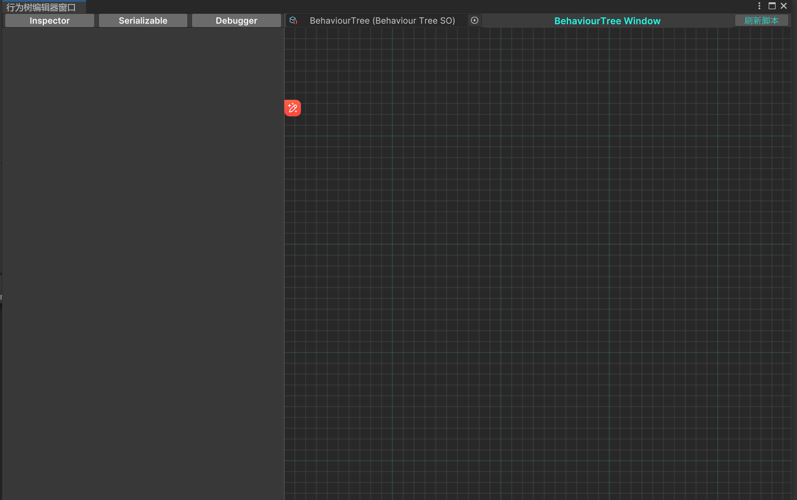
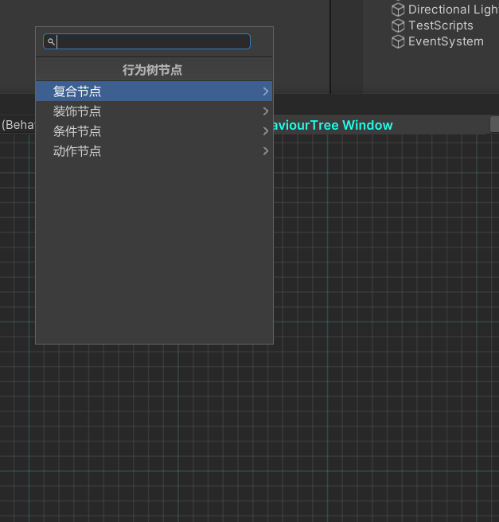
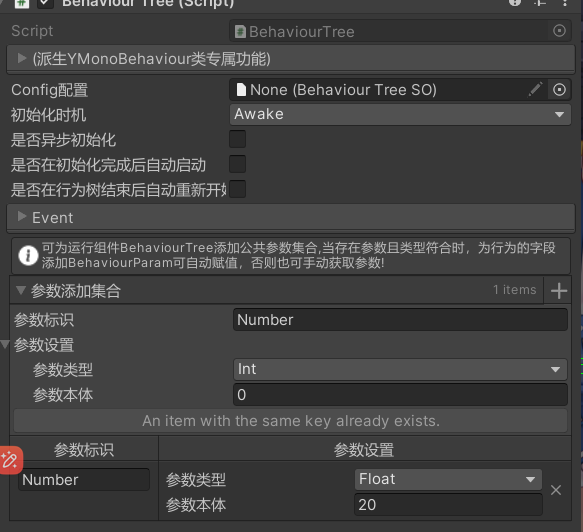

YukiFrameWork 行为树模块 ---> BehaviourTree

在Assets文件夹下右键Create/YukiFrameWork/BehaviourTree创建一个新的行为树配置如图所示:




在网格背景窗口中右键新建构造行为树:

可以为树添加对应的节点。

|Behaviour Tree Behaviour|行为树节点|
|--|--|
|Action|动作节点|
|Composite|复合节点|
|Decorator|装饰节点|
|Condition|条件节点(该节点与Action是一样的，诞生意义仅希望在逻辑中，判断与实现分离)|

当有自定义的节点类时，需继承上述节点基类



框架内置提供节点如下:

|Local Node|内置节点|
|WaitAction|等待节点，等待一定时间后返回成功|
|LogAction|日志节点，只返回成功，会输出指定的日志|
|Sequence|顺序节点|
|Parallel|并行节点|
|Selector|选择节点|
|RandomSelector|随机选择节点|

节点的周期:BehaviourStatus： InActive,Runing,Success,Failed

|BehaviourTree Property API|节点属性API|
|--|--|
|BehaviourStatus Status|节点当前的状态|
|AIBehaviour Parent|节点的父节点|
|bool IsRoot|节点是否是根|
|int ID|节点的唯一ID|
|string Description|节点的介绍|
|Transform transform|行为树运行时所绑定的节点|
|BehaviourTree BehaviourTree|行为树的执行本体|

|BehaviourTree Method API|节点属性API|
|--|--|
|void OnInit()|初始化方法|
|void OnStart()|当进入节点|
|BehaviourStatus OnUpdate()|节点的生命周期轮询方法|
|void OnFixedUpdate()|仅当节点在Running状态下执行|
|void OnLateUpdate()|仅当节点在Running状态下执行|
|void OnSucess()|当节点成功|
|void OnFailed()|当节点失败|
|void OnCancel()|当行为树重置节点/关闭时触发|
|void OnInterruption()|当节点被打断(当被复合节点操控时有效)|
|void DrawGizmos(Transform transform)| 当配置已经添加到运行对象BehaviourTree组件中，可重写该方法进行场景的绘制，但仅限于UnityEditor|

配置完成后为对象添加BehaviourTree组件如下:



BehaviourTree支持为行为树添加节点共通参数。如图所示，示例参考如下:

``` csharp

public class CustomAction : Action
{
    public override void OnStart()
    {
        //通过访问行为树的Params属性，获得对应的参数。
        float number = BehaviourTree.Params["Number"].FloatValue;
    }
}

```

|BehaviourTree API|行为树组件API|
|--|--|
|UnityEvent onStarted|当行为树启动时触发的事件|
|UnityEvent onCanceled|当行为树关闭时触发的事件|
|void StartTree()|开始行为树|
|void CancelTree()|关闭行为树|
|void ResetTree()|重新启动行为树|
|IReadOnlyDictionary<string, BehaviourParam> Params|行为树可用参数集合|