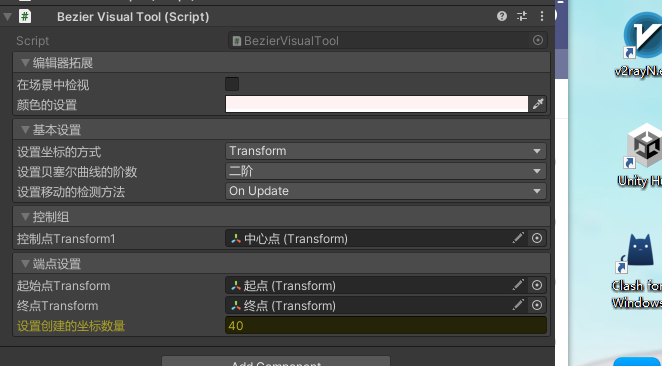

贝塞尔曲线拓展功能介绍:

框架集成了对贝塞尔曲线的一些封装:

BezierUtility:贝塞尔曲线公式集成(目前最高支持三阶)

API:

	//对贝塞尔曲线公式封装的API
	- Vector3 BezierIntepolate(Vector3 p0, Vector3 p1, float t);// B(t) = (1-t)P0 +tP1 Mathf.Clamp(t,0,1)
	- Vector3 BezierIntepolate(Vector3 p0, Vector3 p1,Vecor3 p2, float t)// B(t) = (1-t)(1-t)p0 + 2t(1-t)P1 + t*t*P2 Mathf.Clamp(t,0,1)
	- Vector3 BezierIntepolate(Vector3 p0, Vector3 p1,Vecor3 p2,Vector3 p3, float t)// B(t) = (1-t)(1-t)(1-t)P0 + 3P1 * t *(1-t)*(1-t) + 3P2 * t * t * (1-t)+P3* t * t * t Mathf.Clamp(t,0,1)

	//使用Unity提供的Vector3.Lerp对公式进行封装
	- Vector3 BezierLerp(Vector3 p0, Vector3 p1, float t);
	- Vector3 BezierLerp(Vector3 p0, Vector3 p1,Vecor3 p2, float t)
	- Vector3 BezierLerp(Vector3 p0, Vector3 p1,Vecor3 p2,Vector3 p3, float t)

	//获得设置下贝塞尔曲线路径所有的路径点,t为路径的数量
	- List<Vector3> GetBezierList(Vector3 p0, Vector3 p1, float t);//这里的t为坐标数量
	- List<Vector3> GetBezierList(Vector3 p0, Vector3 p1, Vector3 p2, float t);
	- List<Vector3> GetBezierList(Vector3 p0, Vector3 p1, Vector3 p2, Vector3 p3, float t);

使用示例：
```

using YukiFrameWork;
public class TestScripts : MonoBehaviour
{
	public Transform p1;
	public Transform p2;
	public Transform p3;
	public List<Vector3> paths = new List();
	void Start()
	{
		//这里展示二阶的使用方式:

		List<Vector3> list = BezierUtility.GetBezierList(p1.position,p2.position,p3.position,50);

		paths = list;
		for(int i = 0;i<paths.Count;i++)
		{
			float t = i / (float)paths.Count;

			//遍历出路径上的点
			Vector3 points = BezierIntepolate(p1.position,p2.position,p3.position,t);
		}

		
	}
}
```

代码拓展: 沿着创建的贝塞尔曲线移动:
API: //transform拓展方法,下列API默认初始位置就是transform的位置。BezierRuntimeMode可以选择移动所在的函数 --- Update/FixedUpdate/LateUpdate,默认50个坐标数量。返回IBezier对象

	- IBezier BezierTowards(this Transform transform, Vector3 end, float currentSpeed, BezierRuntimeMode mode = BezierRuntimeMode.OnFixedUpdate, float pointCount = 50);
	- IBezier BezierTowards(this Transform transform, Vector3 secondOrderControl, Vector3 end, float currentSpeed, BezierRuntimeMode mode = BezierRuntimeMode.OnFixedUpdate, float pointCount = 50)
	- IBezier BezierTowards(this Transform transform, Vector3 secondOrderControl, Vector3 thirdOrderControl, Vector3 end, float currentSpeed, BezierRuntimeMode mode = BezierRuntimeMode.OnFixedUpdate, float pointCount = 50)
		
	- IBezier BezierAndRotateTowards(this Transform transform, Vector3 secondOrderControl, Vector3 thirdOrderControl, Vector3 end, float currentSpeed, BezierRuntimeMode mode = BezierRuntimeMode.OnFixedUpdate, float pointCount = 50);
	- IBezier BezierAndRotateTowards(this Transform transform, Vector3 secondOrderControl, Vector3 end, float currentSpeed, BezierRuntimeMode mode = BezierRuntimeMode.OnFixedUpdate, float pointCount = 50);
	- IBezier BezierAndRotateTowards(this Transform transform, Vector3 end, float currentSpeed, BezierRuntimeMode mode = BezierRuntimeMode.OnFixedUpdate, float pointCount = 50);

```

using YukiFrameWork;
public class TestScripts : MonoBehaviour
{	
	public Transform control;
	public Transform target;
	
	void Start()
	{
		//这里使用二阶的移动方法
		var bezier = transform.BezierTowards(control.position,target.position,10);

		//如果想在移动过程中做每帧更新的操作可以添加更新事件:这里的OnUpdate事件的更新周期取决于该IBezier的BezierRuntimeMode;
		bezier.OnUpdate += () => { };

		//如果想在完成移动后执行逻辑://参数是移动经过了多少秒
		bezier.OnCompleted += time => { };
			
	}
}
```

编辑器拓展使用:为对象添加BezierVisualTool脚本如图:



在图中可自行在这里设置最高三阶的贝塞尔曲线,可以切换模式，选择使用Vector还是用Transform,支持在Scene视图中的可视化(游戏窗口不可见)

设置后拓展API如下:

	- IBezier BezierTowards(this Transform transform,BezierVisualTool tool,float currentSpeed);	
	- IBezier BezierAndRotateTowards(this Transform transform, BezierVisualTool tool, float currentSpeed);	

```
using YukiFrameWork;
public class TestScripts : MonoBehaviour
{	
	public BezierVisualTool tool;	
	
	void Start()
	{
		//根据可视化脚本配置而定,只需要传入tool以及速度即可
		transform.BezierTowards(tool,10);
			
	}
}
```

支持代码内部自定义的贝塞尔曲线设置(配合BezierVisualTool类使用):

	- 一阶接口: IFirstOrderBezierCurve
	- 二阶接口: ISecondOrderBezierCurve
	- 三阶接口: IThirdOrderBezierCurve

使用示例:

```
using YukiFrameWork;
public class CustomBezierConfig : ISecondOrderBezierCurve
{	
	 [SerializeField]
     private Transform control;
     public Vector3 GetControlPointAtSecondOrder()
     {
		return control.position;
     }

     public Vector3 GetEndPoint()
     {
        return Vector3.one;
     }

     public int GetPathLangth()
     {
        return 30;
     }

     public Vector3 GetStartPoint()
     {
		return new Vector3(10, 15, 35);
     }     
}

public class TestScripts : MonoBehaviour
{	
	public BezierVisualTool tool;	
	
	void Start()
	{
		//设置自定义的配置
		tool.SetSecondOrderBezier(new CustomBezierConfig());
		transform.BezierTowards(tool,10);
			
	}
}
```


	