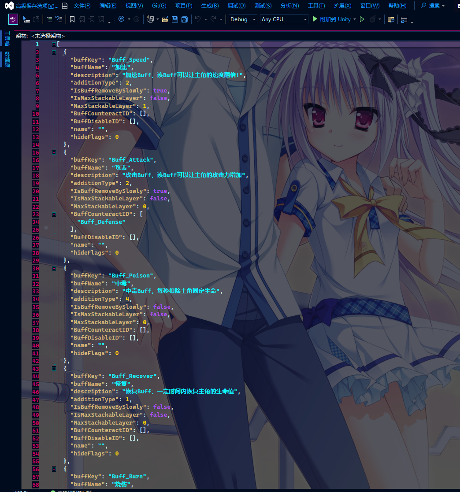
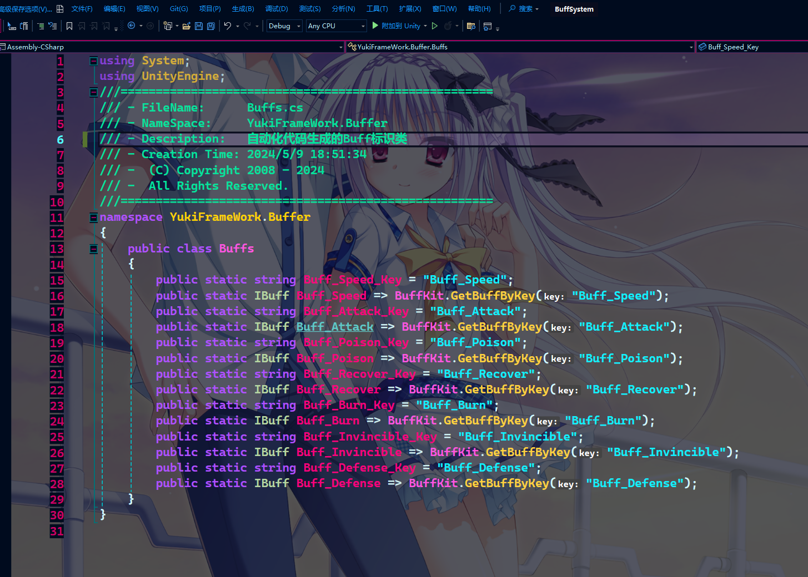
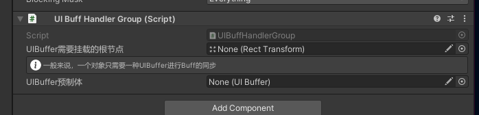

框架通用Buff系统(代码设计以MVC的形式)：

命名空间：YukiFrameWork.Buffer;

在Assets文件夹下右键创建BuffDataBase配置:


配置如图所示，最上方生成Buff代码可以设置后生成派生自Buff类的Buff代码，而后就可以在生成类型这里选择，图中AttackBuff示例为:

```
public class AttackBuff : Buff
{
	//ToDo
}
```

在生成类型处选择相应的类型后，点击下方的配置数组右边的加号即可创建新的Buff配置。


在这里可以完成对Buff数据的配置,当配置大于1时，就可以将这里的配置导出Json配表作为参考，在后续如果希望自定义Buff而继承IBuff接口时即可参照配表。

在配置完成后，即可点击编辑器这里提供的生成标识代码，这里提供一个已经配置好后生成的Json配置以及代码配置：、





这里注意：标识类固定类名为Buffs，生成的路径与命名空间与上方生成Buff代码一致。

基本使用示例，首先为对象挂载BuffHandler组件，或是代码添加:

```
	void Start()
	{
		BuffHandler handler = gameObject.AddComponent<BuffHandler>();
	}
```

BuffHandler为该对象的Buff控制中枢，Buff的添加，UI同步绑定，移除都在这里执行。

BuffHandler API:

	//Buff添加时触发的回调，只要调用AddBuffer没有添加失败而改变了Buff的状态，则统一会调用该方法。并且可以拿到Controller
	- EasyEvent<BuffController> onBuffAddCallBack; //handler.onBuffAddCallBack.RegisterEvent(controller =>{ });

	//Buff移除时触发的回调，并且可以拿到Controller   
    - EasyEvent<BuffController> onBuffRemoveCallBack;handler.onBuffRemoveCallBack.RegisterEvent(controller =>{ });

	//设置UIBuffHandlerGroup组件，该API对应下方介绍使用UI同步时采用
	- void SetUIBuffHandlerGroup(UIBuffHandlerGroup handlerGroup)

	//添加Buff，传递一个Buff以及玩家对象Player
	- void AddBuffer<T>(IBuff buff,GameObject player) where T : BuffController,new()

	//传递Buff的标识以及玩家对象Player
	- void AddBuffer<T>(string BuffKey, GameObject player) where T : BuffController, new()
	
	//根据标识删除某一个正在运行的Buff
	- bool RemoveBuffer(string BuffKey)

	//Buff匹配删除，重载
	- bool RemoveBuffer(IBuff buff);

	//得到正在运行的指定标识的Buff数量
	- int GetBufferCount(string BuffKey);

	//得到正在运行的Buff类型数量
	- int GetAllBufferCount()

	//终止运行中的所有Buff，该方法不会触发BuffController的OnBuffRemove方法
	- void StopAllBuffController()

创建Buff生命周期控制器BuffController的派生基类

示例如下:

```

	public class CustomBuffController : BuffController
	{
		public override void OnBuffAwake()
        {
            Debug.Log("准备添加Buff:" + Buffer.BuffName);
        }

        public override void OnBuffStart()
        {

        }

        public override void OnBuffUpdate()
        {
            Debug.Log("当前有Buff:" + Buffer.BuffName + "层数:" + BuffLayer);
        }

        public override void OnBuffFixedUpdate()
        {

        }

        public override void OnBuffRemove()
        {
            Debug.Log("移除Buff");
        }

        public override void OnBuffDestroy()
        {
            Debug.Log("Buff完全销毁");
        }     

        public override bool OnRemoveBuffCondition()
        {
            return base.OnRemoveBuffCondition();
        }

        public override bool OnAddBuffCondition()
        {
            return base.OnAddBuffCondition();
        }      
	}

```

BuffController专门处理Buff逻辑以及生命周期。

BuffController API:

    //BuffController的静态创建实例方法，如自定义控制器时，推荐使用该方法创建控制器，会有专门的对象池进行性能优化
    - static T CreateInstance<T>(IBuff buffer, GameObject Player) where T : BuffController, new();

    //Controller执行期间的Buff
    - IBuff Buffer { get; }

    //BuffKey属性定义。
    - string BuffKey => Buffer.BuffKey;

    //UI同步时的组件，该Buffer在BuffHandler绑定UIBuffHandlerGroup时，会自动为Controller添加。
    - UIBuffer UIBuffer { get; }

    //当前Buff的层数
    - int BuffLayer { get; }

    //在BuffHandler创建Buff时绑定的玩家/主角
    - GameObject Player { get; }

    //Buff设置的最大时间的属性定义
    - float MaxTime => Buffer.BuffTimer;
    
    //当前Buff剩余时间
    - float RemainingTime { get; }

    ///------- 生命周期API：

    /// <summary>
    /// 内部的Buff添加条件，默认为True，当需要内部处理添加Buff的逻辑或者比如希望自己手动限制叠加的层数时可以使用
    /// </summary>
    /// <returns></returns>
    - public virtual bool OnAddBuffCondition() => true;
    
    /// <summary>
    /// 内部的Buff移除条件，默认为False，如需在内部处理移除Buff的逻辑可以使用，当该方法内返回True时，该Buff会被移除
    /// </summary>
    /// <returns></returns>
    - public virtual bool OnRemoveBuffCondition() => false;
    
    /// <summary>
    /// 除了可同时存在的Buff之外，同一Buff下，无论添加多少层，只要Buff存在，该Awake也仅只有第一次创建的时候调用。
    /// </summary>
    - public abstract void OnBuffAwake();
    
    /// <summary>
    /// 每一次Buff启动或者叠加的时候都会调用
    /// </summary>
    - public abstract void OnBuffStart();	
    
    - public virtual void OnBuffUpdate() { }
    
    - public virtual void OnBuffFixedUpdate() { }	
    
    /// <summary>
    /// 每一次Buff移除的时候执行，如果Buff是叠加了多层的且开启了缓慢减少，则每次减少一层都会调用一次该方法
    /// </summary>
    - public abstract void OnBuffRemove();
    
    /// <summary>
    /// 只有当该Buff完全销毁时才执行该方法。
    /// </summary>
    - public virtual void OnBuffDestroy(){ }		

UI同步，为设置好的面板挂载UIBuffHandlerGroup类，如图所示:



创建自定义的UIBuffer类，示例如下:

```
    public class CustomUIBuffer : UIBuffer
    {
     
        public override void OnBuffDestroy()
        {
            
        }

        public override void OnBuffRemove(int buffLayer)
        {
            
        }

        public override void OnBuffStart(IBuff buff, string buffKey, int buffLayer)
        {

        }

        public override void OnBuffUpdate(float remainingTime)
        {
            
        }

        public override void OnDispose()
        {
            
        }
    }
```

创建好并挂到某一个设定好的UI之后，则将其制作成预制体拖入UIBuffHandlerGroup中，并设置根节点。

UIBuffer API：

    //每次Buff的状态被成功改变或者添加成功时，该方法也会跟随调用。
    - void OnBuffStart(IBuff buff, string buffKey, int buffLayer)；

    //同步执行的Update更新方法作用于UIBuffer。
    - void OnBuffUpdate(float remainingTime)；

    //当Buff被移除时也会同步调用。
    - void OnBuffRemove(int buffLayer);

    //当Buff被完全销毁时同步调用
    - void OnBuffDestroy();

    //在UIBuffHandlerGroup中有一套对象池进行对该组件的管理,OnDispose则为回收时会执行的方法。
    - void OnDispose()

Buff管理套件：BuffKit类，使用如下:

```
    public class TestScripts : MonoBehaviour
    {
        public BuffDataBase dataBase;

        void Start()
        {
            BuffKit有多种方式进行对Buff配置的初始化：

             //当需要加载时，BuffKit依赖框架XFABManager模块，传入模块名：

            BuffKit.InitLoader(projectName:"");

            也可以自定义加载器如下:
            BuffKit.InitLoader(new BuffResourcesLoader());

            //当已经持有dataBase时候可以调用该方法直接使用
            BuffKit.LoadBuffDataBase(dataBase);         
        }
    }

    ///自定义加载器
    public class BuffResourcesLoader : IBuffLoader
    {
        public BuffDataBase Load(string path)
        {
            return Resources.Load<BuffDataBase>(path);
        }

        public async void LoadAsync(string path, Action<BuffDataBase> callBack)
        {
            //异步加载出值：框架有一套完整的异步流协程工具，使用标准的异步语法糖进行异步的编写，详情请查阅框架拓展工具中的协程拓展。
            BuffDataBase dataBase = await Resources.LoadAsync<BuffDataBase>(path) as BuffDataBase;
            callBack?.Invoke(dataBase);
        }
    }
```

简单完整示例如下:

```
    public class TestScripts : MonoBehaviour
    {
        public BuffDataBase dataBase;

        private BuffHandler handler;
        void Start()
        {
            BuffKit.LoadBuffDataBase(dataBase);
            handler = this.GetOrAddComponent<BuffHandler>();
            handler.SetUIBuffHandlerGroup(FindObjectOfType<UIBuffHandlerGroup>());


        }

        void Update()
        {
            if(Input.GetMouseButtonDown(0))
            {
                handler.AddBuff(BuffKit.GetBuffByKey("Buff_Attack"),gameObject);
            }
        }
    }
```

BuffKit static API:

    //使用XFABManager加载时，传入配置名。
    - void InitBuffLoader(string projectName);

    //传入自定义的加载器
    - void InitBuffLoader(IBuffLoader loader)；

    //根据路径获得DataBase
    - void LoadBuffDataBase(string dataBasePath);

    //异步获取
    - IEnumerator LoadBuffDataBaseAsync(string dataBasePath)；

    //直接传递配置
    - void LoadBuffDataBase(BuffDataBase buffDataBase)；

    //根据标识获取Buff
    - IBuff GetBuffByKey(string key)；


