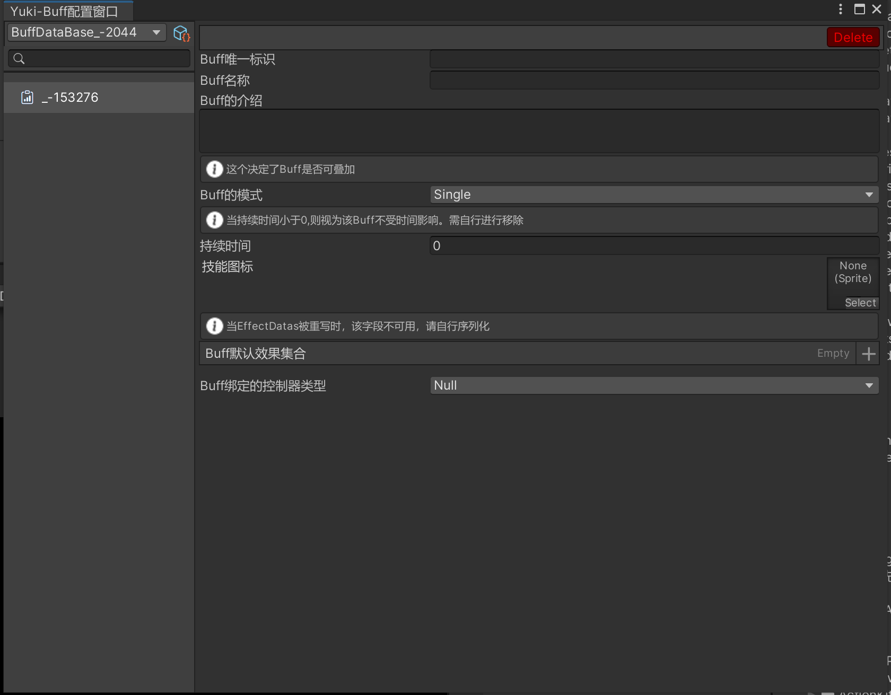

框架通用Buff系统(代码设计以MVC的形式)：

命名空间：YukiFrameWork.Buffer;

在Assets文件夹下右键创建BuffDataBase配置:


配置如图所示，最上方生成Buff代码可以设置后生成派生自Buff类的Buff代码，而后就可以在生成类型这里选择，图中AttackBuff示例为:

``` csharp
public class AttackBuff : Buff
{
	//ToDo
}
```
双击配置打开配置窗口如下:

在左侧新建配置即可。

基本使用示例，首先为对象挂载BuffHandler组件，或是代码添加:

``` csharp
	void Start()
	{
		BuffHandler handler = gameObject.AddComponent<BuffHandler>();
	}
```

IBuffExecutor:

    - BuffHandler Handler{ get; }

    - bool OnAddBuffCondition();// 外部Buff添加条件，默认为True，与Controller的添加条件区别在于，该方法控制所有的buff添加判断，如果外部添加条件设置为False,则无法添加任何Buff

BuffHandler为该对象的Buff控制中枢，Buff的添加，UI同步绑定，移除都在这里执行。

为对象继承IBuffExecutor接口，代表该对象可以拥有Buff。

``` csharp
public class TestScripts : MonoBehaviour,IBuffExecutor
{
    public BuffHandler Handler { get;}

    public bool OnAddBuffCondition() => true;
}
```

BuffHandler API:

	- /// <summary>
    - /// Buff添加时触发的回调,该回调与BuffAwake同属周期，仅首次添加调用，如果是添加多个且不可叠加的buff，则每一个新Buff都触发
    - /// </summary>
    - public readonly UnityEngine.Events.UnityEvent<BuffController> onBuffAddCallBack;

	- // <summary>
	- // Buff移除时触发的回调，并且可以拿到Controller
	- // </summary>	
    - public readonly UnityEngine.Events.UnityEvent<BuffController> onBuffDestroyCallBack ;		

	//添加Buff，传递一个Buff以及玩家对象Player
	- void AddBuffer(IBuff buff,IBufferExecutor player)

	//传递Buff的标识以及玩家对象Player
	- void AddBuffer(string BuffKey, IBufferExecutor player)
	
	//根据标识删除某一个正在运行的Buff
	- bool RemoveBuffer(string BuffKey)

	//Buff匹配删除，重载
	- bool RemoveBuffer(IBuff buff);

	//得到正在运行的指定标识的Buff数量
	- int GetBufferCount(string BuffKey);

	//得到正在运行的Buff类型数量
	- int GetAllBufferCount()

	//终止运行中的所有Buff，该方法不会触发BuffController的OnBuffRemove方法
	- void StopAllBuffController()

创建Buff生命周期控制器BuffController的派生基类

示例如下:

``` csharp

	public class CustomBuffController : BuffController
	{
		public override void OnBuffAwake()
        {
            Debug.Log("准备添加Buff:" + Buffer.GetBuffName);
        }

        public override void OnBuffStart()
        {

        }

        public override void OnBuffUpdate()
        {
            Debug.Log("当前有Buff:" + Buffer.BuffName + "层数:" + BuffLayer);
        }

        public override void OnBuffFixedUpdate()
        {

        }

        public override void OnBuffRemove()
        {
            Debug.Log("移除Buff");
        }

        public override void OnBuffDestroy()
        {
            Debug.Log("Buff完全销毁");
        }     

        public override bool OnRemoveBuffCondition()
        {
            return base.OnRemoveBuffCondition();
        }

        public override bool OnAddBuffCondition()
        {
            return base.OnAddBuffCondition();
        }      
	}

```

BuffController专门处理Buff逻辑以及生命周期。

BuffController API: 希望BuffController完全自定义可以继承BuffController接口，正常情况下使用框架提供的BuffController足够。


      //每一次Buff启动或者叠加的时候都会调用的回调,同时会得到层级
    - Action<int> onBuffStart { get; set; } 

	
	  //Buff正在执行时会持续触发的回调,参数是Buff的剩余进度(1-0)
	- Acion<float> onBuffReleasing { get; set; }

      
      //每一次Buff移除的时候执行，如果Buff是叠加了多层的且开启了缓慢减少，则每次减少一层都会调用一次该回调,同时会得到移除Buff后的层级
    - Action<int> onBuffRemove { get; set; }
   
    //Controller执行期间的Buff
    - IBuff Buffer { get; }

    //BuffKey属性定义。
    - string BuffKey => Buffer.GetBuffKey;

    //当前Buff的层数
    - int BuffLayer { get; }

    //在BuffHandler创建Buff时绑定的玩家/主角(必须继承IBuffExecutor的)
    - IBuffExecutor Player { get; }

    - BuffHandler Handler{ get; }//控制器可以获取到与对象绑定的控制中枢。

    //Buff设置的最大时间的属性定义
    - float MaxTime => Buffer.BuffTimer;
    
    //当前Buff剩余时间
    - float RemainingTime { get; }

    //当前Buff的剩余进度(1-0);
    - float RemainProgress{ get; }

    ///------- 生命周期API：

    /// <summary>
    /// 内部的Buff添加条件，默认为True，当需要内部处理添加Buff的逻辑或者比如希望自己手动限制叠加的层数时可以使用
    /// </summary>
    /// <returns></returns>
    - public virtual bool OnAddBuffCondition() => true;
    
    /// <summary>
    /// 内部的Buff移除条件，默认为False，如需在内部处理移除Buff的逻辑可以使用，当该方法内返回True时，该Buff会被移除
    /// </summary>
    /// <returns></returns>
    - public virtual bool OnRemoveBuffCondition() => false;
    
    /// <summary>
    /// 除了可同时存在的Buff之外，同一Buff下，无论添加多少层，只要Buff存在，该Awake也仅只有第一次创建的时候调用。
    /// </summary>
    - public abstract void OnBuffAwake();
    
    /// <summary>
    /// 每一次Buff启动或者叠加的时候都会调用
    /// </summary>
    - public abstract void OnBuffStart();	
    
    - public virtual void OnBuffUpdate() { }
    
    - public virtual void OnBuffFixedUpdate() { }	
    
    /// <summary>
    /// 每一次Buff移除的时候执行，如果Buff是叠加了多层的且开启了缓慢减少，则每次减少一层都会调用一次该方法
    /// </summary>
    - public abstract void OnBuffRemove();
    
    /// <summary>
    /// 只有当该Buff完全销毁时才执行该方法。
    /// </summary>
    - public virtual void OnBuffDestroy(){ }		

回到刚才的AttackBuff
``` csharp
    [BindBuffController(typeof(CustomBuffController))]//添加绑定控制器特性，让这个Buff识别控制器
    public class AttackBuff : Buff
    {
    	//ToDo
    }
```

Buff管理套件：BuffKit类，使用如下:

``` csharp
    public class TestScripts : MonoBehaviour,IBuffExecutor
    {
        public BuffDataBase dataBase;

        private BuffHandler handler;
        public BuffHandler Handler => handler;
        void Start()
        {
            handler = GetComponent<BuffHandler>();
            BuffKit有多种方式进行对Buff配置的初始化：

             //当需要加载时，BuffKit依赖框架XFABManager模块，传入模块名：

            BuffKit.InitLoader(projectName:"");

            也可以自定义加载器如下:
            BuffKit.InitLoader(new BuffResourcesLoader());

            //当已经持有dataBase时候可以调用该方法直接使用
            BuffKit.LoadBuffDataBase(dataBase);         
        }

        //外部的添加条件方法
        bool IBuffExecutor.OnAddBuffCondition() => true;
    }

    ///自定义加载器
    public class BuffResourcesLoader : IBuffLoader
    {
        public TItem Load<TItem>(string path) where TItem : BuffDataBase
        {
            return Resources.Load<TItem>(path);
        }

        public async void LoadAsync<TItem>(string path, Action<TItem> callBack) where TItem : BuffDataBase
        {
            //异步加载出值：框架有一套完整的异步流协程工具，使用标准的异步语法糖进行异步的编写，详情请查阅框架拓展工具中的协程拓展。
            TItem dataBase = await Resources.LoadAsync<TItem>(path) as TItem;
            callBack?.Invoke(dataBase);
        }
    }
```

简单完整示例如下:

``` csharp
    public class TestScripts : MonoBehaviour,IBuffExecutor
    {
        public BuffDataBase dataBase;
        public BuffHandler Handler => handler;
        private BuffHandler handler;
        void Start()
        {
            BuffKit.LoadBuffDataBase(dataBase);
            handler = this.GetOrAddComponent<BuffHandler>();
            handler.SetUIBuffHandlerGroup(FindObjectOfType<UIBuffHandlerGroup>());


        }

        void Update()
        {
            if(Input.GetMouseButtonDown(0))
            {
                handler.AddBuff(BuffKit.GetBuffByKey("Buff_Attack"),gameObject);
            }
        }

        //外部的添加条件方法
        bool IBuffExecutor.OnAddBuffCondition() => true;
    }
```

BuffKit static API:

    //使用XFABManager加载时，传入配置名。
    - void InitBuffLoader(string projectName);

    //传入自定义的加载器
    - void InitBuffLoader(IBuffLoader loader)；

    //根据路径获得DataBase
    - void LoadBuffDataBase(string dataBasePath);

    //异步获取
    - IEnumerator LoadBuffDataBaseAsync(string dataBasePath)；

    //直接传递配置
    - void LoadBuffDataBase(BuffDataBase buffDataBase)；

    //根据标识获取Buff
    - IBuff GetBuffByKey(string key)；

    //绑定控制器，当没有给Buff标记特性时，使用该方法进行控制器绑定
    - void BindController<T>(string buffKey) where T : BuffController

    //手动添加Buff
    - void AddBuff(IBuff buff);

    //绑定本地化配置
    - void DependLocalizationConfig(string configKey,char spilt = ':')


