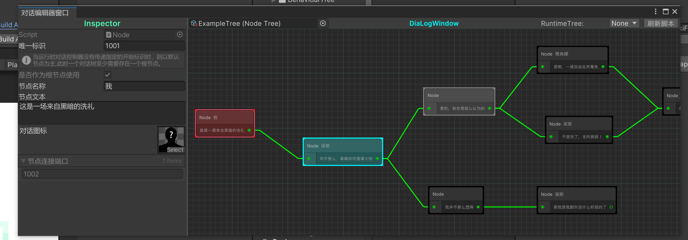

对话系套件:DiaLogKit

命名空间: using YukiFrameWork.DiaLog;

在Assets文件夹下创建NodeTree，一个对话树的根节点文件：


双击配置文件打开编辑器窗口，在网格中右键创建根节点，展开配置文件，将根节点配置拖入Inspector中,如图中标记的部分:


在编辑器窗口中右键自由选择创建普通节点或者是分支节点，然后在连接点上长按鼠标将其连线如下：




如图可以在编辑器中配置不同语言下的文本以及名称还有精灵。

分支节点的配置如下:


在分支节点中，除了跟默认节点一样可以配置多语言文本以外，还可以设置不同语言下的分支条件文本，要注意：每个语言的条件配置中，条件数量应该与子节点数量一致。

自由配置好后且连线完毕后，新建脚本并派生自框架DiaLogController类，代码示例如下:

```
using YukiFrameWork.DiaLog;
using YukiFrameWork;
public class CustomDiaLogController : DiaLogController
{
    
}
```

然后将脚本拖拽到对象上如下所示:


该类最终派生自ViewController，所以他可以标记RuntimeInitializeOnArchitecture特性以标记架构。

对于对话树的获取，可以通过编辑器拖拽或者事件注入的方式，通过事件注入会需要填写事件的标识名且实现RuntimeInitializeOnArchitecture特性，并自身手动在自己的代码逻辑中去发送事件。

可以勾选语言同步，会自动将语言与框架的本地化中的默认语言保持一致。

拖入对应的Image组件，Text组件作为该控制器中，输出文本/名称以及精灵到UI。

对于条件组件集合，有三个参数，设置条件触发的按钮，成功判断的下标，以及输出文本的MaskableGraphic组件(可适配Text、TextMeshProUGUI)

如果树中具备分支节点，可以在条件集合中添加对应数量的组件。而后代码实现如下:

```
using YukiFrameWork.DiaLog;
using YukiFrameWork;
public class CustomDiaLogController : DiaLogController
{
    ///如果需要使用条件组件集合，这个是必须重写的方法，他会在推进过程中得到类型为分支节点的节点，以及所有的条件组件集合
    protected override void CompositeSetting(BranchDialogue branch, CompositeItem[] composites)
    {
        ///自行对逻辑的需求实现
    }
}
```

BranchDialogue API:

    ///设置分支节点应该成功推进的节点下标
    - void SetOptionSuccessed(int index);

    ///得到对应下标条件的文本(与控制器标记的当前的语言匹配)
    - string GetOptionText(int index)；


DiaLogController API:

    ///可重写的设置条件分支的方法
    - virtual void CompositeSetting(BranchDialogue branch, CompositeItem[] composites);
    
    ///可重写的分支推进方法，调用一次则在对话树中向下推进(如果目前正在运行的是分支节点，且分支节点没有实现判断成功的逻辑，则推进会直接失败，保持不变)
    - virtual void MoveToNext()

    ///每次推进到新的分支时都会调用一次该方法，可以重写这个方法实现额外的逻辑
    - virtual void NodeStart(Node node)

    ///对组件的更新方法，可以直接调用
    - void UpdateDiaLogComponent(string dialog,Sprite sprite,string name)；

    ///设置树在运行时进行复位初始化的操作，可用于直接回档或跳转到哪一个节点，从该处继续
    - void OnTreeRunningInitialization(Language language,int nodeIndex, System.Action<string, Sprite, string> callBack);


