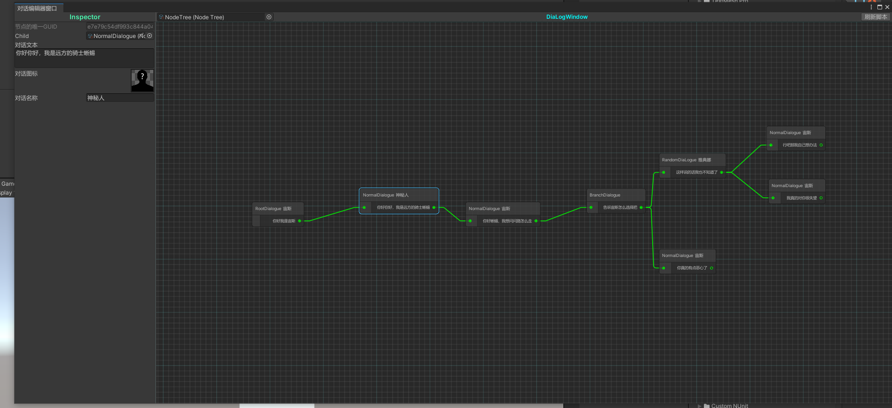
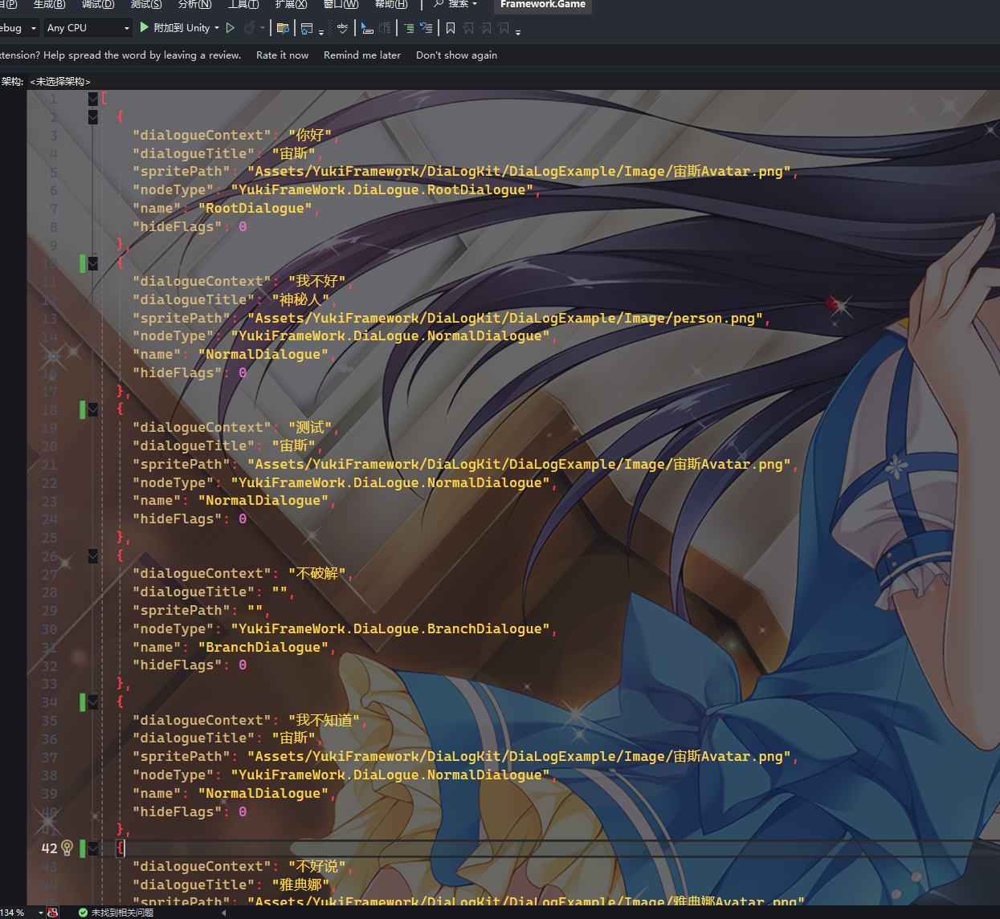
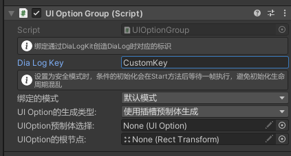
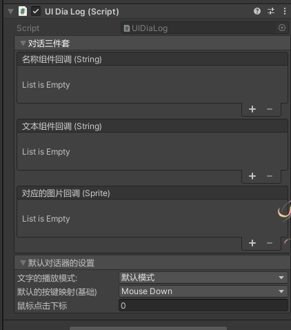

对话系套件:DiaLogKit

命名空间: using YukiFrameWork.DiaLogue;

在Assets文件夹下创建NodeTree，一个对话树的根节点文件：


在根节点中，可以设置启动对话树时对应的语言，也可以使其同步本地化配置的语言，达到多语言随时切换的效果

每次在退出运行时，需要保持节点的状态是Waiting，框架内部有UIDiaLog类进行自动管理，下面会提及。

双击配置文件打开编辑器窗口，在网格中右键创建根节点，展开配置文件，将根节点配置拖入Inspector中,如图中标记的部分,并设置对应配置的nodekey:


在编辑器窗口中右键自由选择创建普通节点或者是分支节点，然后在连接点上长按鼠标将其连线如下：


如图可以在编辑器中配置不同语言下的文本以及名称还有精灵。

分支节点的配置如下:



在分支节点中，通过编辑器窗口右键的形式创建过渡线连线，即可在这里的Inspector中显示对应的参数，这里的参数分别是对应连接的节点下标，以及设置条件下的文本(支持多语言)

自由配置好后且连线完毕后，有两种方式进行对该系统的逻辑处理：

手动定义示例如下：

``` csharp
using YukiFrameWork.DiaLog;
using YukiFrameWork;
public class CustomDiaLogController : MonoBehaviour
{
    //设置运行时绑定的对话控制器的标识
    public string diaLogKey;

    //对话配置
    public NodeTree nodeTree;
    void Start()
    {
        //与其他模块一致，使用框架默认loader加载则传入projectName
        DiaLogKit.Init(projectName:"");

        //可填写自定义的loader
        ///public class CustomLoader : IDiaLogLoader
        ///{  }
        ///
        ///
        ///

        //通过DiaLogKit得到对话控制器
        DiaLog diaLog = DiaLogKit.CreateDiaLog(nodeTree);

        //设置控制器当前的文本语言
        diaLog.NodeCurrentLanguage = Language.English;

        //控制器进行对对话配置的推进，该推进仅对默认节点有效，对于分支节点必须要进行回调式绑定，返回推进的结果
        MoveNodeState state = diaLog.MoveNext();

        ///MoveNodeState 
        ///{
        ///    Idle,//没有推进
        ///    Succeed,//成功推进
        ///    Failed,//推进失败
        ///}

        diaLog.GetNodeByIndex(index:0);//根据对话节点下标查找指定的配置。

        diaLog.MoveByNodeIndex(index:0);//强制进行对对话节点的移动，无视顺序，只根据传入的下标判断。

        diaLog.RegisterWithNodeEnterEvent(node => { });//注册每一次进入下一个节点时的回调

        diaLog.RegisterWithNodeExitEvent(node => { });//注册每一次退出下一个节点时的回调

        //通过对应下标寻找到指定的分支节点，注册条件下通过的逻辑，并且注册结束时会触发的逻辑，这里注册的两个回调与上面这两个退出与进入的回调不同，仅作为指定分支节点的逻辑处理
        diaLog.OnOptionsCompleted(0, (CompositeNode node, Option[] options) => 
        { 
            //使用示例：
            foreach(var option in options)
            {
                //条件类下提供的改变节点触发方法，需要传入对话控制器
                option.OnChangeClick(diaLog);
            }
        }, onFinish:() => { })

        //注册节点内所有的分支节点条件下通过的逻辑，效果与上述相同，并且注册结束时会触发的逻辑，这里注册的两个回调与上面这两个退出与进入的回调不同，仅作为指定分支节点的逻辑处理
        diaLog.OnOptionsCompleted((CompositeNode node, Option[] options) => 
        { 
            //使用示例：
            foreach(var option in options)
            {
                //条件类下提供的改变节点触发方法，需要传入对话控制器
                option.OnChangeClick(diaLog);
            }
        }, onFinish:() => { })

        //启动对话控制器
        diaLog.Start();

        //关闭控制器，关闭控制器后仍可重新触发Start方法
        //diaLog.End();

        //diaLog.GlobalRelease();//回收控制器，该控制器回收后会注销一切的逻辑跟操作，该对象如果还想继续使用必须重新进行初始化，请注意释放时机。

    }
}
```

DiaLogKit static API:

    - DiaLog GetDiaLogueByKey(string key);;//根据名称得到控制器

    - DiaLog CreateDiaLogue(NodeTree nodeTree);//创建控制器，并传入标识以及配置

    - DiaLog CreateDiaLogue(string name);//根据loader加载数据并配置创建控制器

    - bool CheckDiaLogIsActive(string key);//查找DiaLogKit是否缓存的指定标识的DiaLog控制器

    - EasyEvent<string,Node> onGlobalNodeChanged；//全局的事件，当节点更新的时候就会触发，场景中如果有多个对话器，该事件注册在任意一个对话更新时就会触发
    ///DiaLogKit.onGlobalNodeChanged.RegisterEvent(node => { });

DiaLog API:

    - Language NodeCurrentLanguage;//可修改的语言属性
    
    - void Init(string key, NodeTree nodeTree);//DiaLog的初始化，当不通过DiaLogKit获取对话控制器时，可以自行调用

    - void Start();//启动对话器

    - void End();//关闭对话器
    
    - bool GlobalRelease();//对话器回收

    - MoveNodeState MoveNext()；//向前推进对话

    - void MoveByNodeIndex(int index);//推进到指定的节点

    - void MoveByNode(Node node);//若在外部存在节点类，则可以传入进行匹配推进。

    - IUnRegister RegisterWithNodeEnterEvent(Action<Node> startEvent)；//注册每次更新对话时进入的事件

    - IUnRegister RegisterWithNodeExitEvent(Action<Node> exitEvent)；//注册每次对话结束时的事件

    - IUnRegister RegisterTreeEndEvent(Action endEvent); // 注册当对话树结束或者推进返回Failed时触发的回调

    //设置对应分支节点的完成逻辑。以及可以自定义结束的逻辑
    - void OnOptionsCompleted(int nodeIndex, Action<CompositeNode, Option[]> action,Action onFinish);

    //如上，但应用全部的分支节点
    - void OnOptionsCompleted(Action<CompositeNode, Option[]> action,Action onFinish)


对于节点，框架提供了默认的两种基类和一个根类：RootNode(根节点),CompositeNode(分支节点基类),SingleNode(单一节点基类)

对于根节点，可以自定义：

``` csharp
//根节点应该直接派生节点基类Node，然后自行完成逻辑，一般默认情况下使用框架提供的即可
[RootNode]//标记该特性使系统知道该类为根节点
public class CustomRootNode : Node
{
    
}

public class CustomCompositeNode : CompositeNode
{
    
}

public class CustomSingleNode : SingleNode
{
    
}
```

Node生命周期:

        - public virtual void OnEnter() {  }
        - public virtual void OnExit() {  }
        - public virtual void OnUpdate() { }
        - public virtual void OnFixedUpdate() { }
        - public virtual void OnLateUpdate() { }

框架提供了默认的分支节点BranchDialogue以及默认单一节点NormalDialogue可以直接使用

分支节点对UI的同步:

//添加分支分组组件UIOptionGroup


新建自定义UIOption类：

``` csharp
public class UICustomOption : UIOption
{
    //可以访问Option类

    public override void InitUIOption(DiaLog diaLog, CompositeNode node)
    {
        //重写初始化Option方法

        //可以在适当的时机调用Option的OnChangeClick方法：
        Option.OnChangeClick(diaLog);
    }
}
```

完成后挂载到场景的对象。

在UIOptionGroup中输入创建DiaLog所绑定的标识，可以选择绑定模式，有安全模式以及默认模式，安全模式会在Start方法后等待一帧更新，防止生命周期颠倒导致的报错。

设置对应的UIOption组件，UIOption组件中设置好对应按钮以及文本组件即可自动同步。

对话系统的全自动化示例(第二种使用方式):



添加UIDiaLog组件，设置组件，以及添加NodeTree配置，框架提供了默认的自动推进方式 KeyDown以及MouseDown，可以自行选择，提供了两种文本显示方式：打字机以及默认显示。

设置好后该脚本会自动运行整个对话。

如需在此基础之上自定义或者说外部初始化UIDiaLog，示例如下：

``` csharp
public class TestScripts : MonoBehaviour
{   
    //设置运行时绑定的对话控制器的标识
    public string diaLogKey;
   
    void Start()
    {
        UIDiaLog uiDiaLog = GetComponent<UIDiaLog>();

        //初始化(默认已经完成DiaLogKit.Init以及对DiaLog的创建后)
        DiaLogKit.Bind(diaLogKey,uiDiaLog);

        //自定义是否触发成功推进的回调
        uiDiaLog.MoveNextCondition += () => Input.GetMouseButtonDown(0);

        //代码中绑定事件如下:

        //绑定名称的推进更新
        uiDiaLog.onNameValueChanged.AddListener(name =>{ });
        //绑定文本的推进更新
        uiDiaLog.onContextValueChanged.AddListener(context => { });
        //绑定精灵的推进更新
        uiDiaLog.onSpriteValueChanged.AddListener(icon =>{ });
           

        //自动推进没有选择None的情况下，自动条件与MoveNextCondition同时可生效。

    }
}
```

可以将数据导出Json配置：

导出后的示例：




