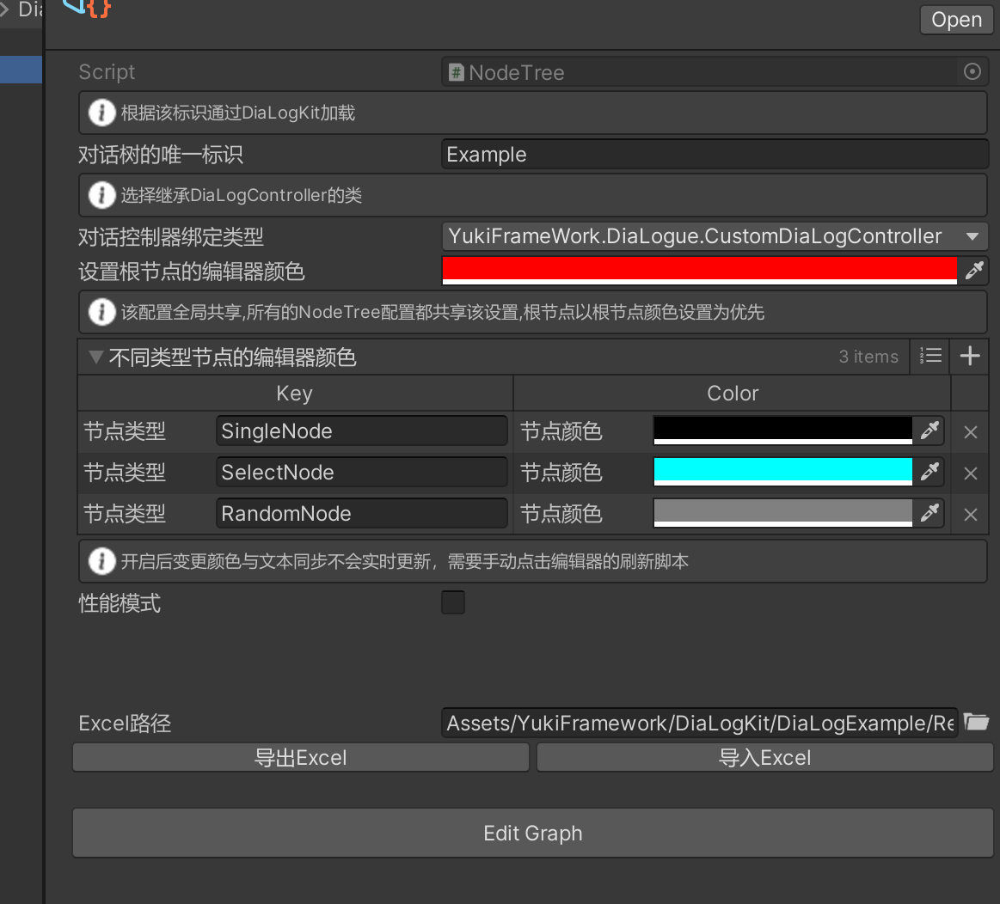

对话系套件:DiaLogKit

命名空间: using YukiFrameWork.DiaLogue;

在Assets文件夹下右键YukiFrameWork/NodeTree下创建一个对话树的根节点文件：


编辑器如图所示,设置对应的标识，用于启动对话树时使用，可以将配置导出Json配表，以及导入



点击Edit Graph打开编辑器窗口如下:


|API|说明|
|----|----|
|RootNodeAttribute|将派生的Node类作为根节点标记的特性|
|CompositeNodeAttribute|将派生的Node类作为分支节点标记的特性|
|RandomNodeAttribute|将派生的Node类作为随机节点标记的特性|
|SingleNode|将派生的Node类作为单一的默认对话节点标记的特性|

在使用之前，先准备好对应的对话节点派生类 示例：

``` csharp
using YukiFrameWork.DiaLogue;

[SingleNode]//标记该特性代表该类为默认的单一节点
public class NormalDiaLogue : Node
{
    
}

[RootNode]//作为对话的根节点使用,所有的对话树都必须首先添加根节点
public class RootDiaLogue : Node
{

}

[CompositeNode]//标记该特性代表该类为分支节点
public class BranchDiaLogue : Node
{

}

[RandomNode]//标记该特性代表该类为随机节点
public class RandomDiaLogue : Node
{

}

```

如图所示，没有根节点时，禁止添加其他节点。


完成配置后示例如图所示


使用部分:

``` csharp
using YukiFrameWork.DiaLogue;
using YukiFrameWork;
public class CustomDiaLogController : MonoBehaviour
{
  
    //对话配置
    public NodeTree nodeTree;
    void Start()
    {
        //与其他模块一致，使用框架默认loader(XFABManager)加载则传入projectName,否则需要自定义加载NodeTree的loader加载器
        DiaLogKit.Init(projectName:"");

        //可填写自定义的loader
        ///public class CustomLoader : IDiaLogLoader
        ///{  }
        ///
        ///
        ///

        //通过DiaLogKit与资源加载路径(与Loader同步)得到对话控制器
        DiaLog dialog = DiaLogKit.CreateDiaLogue(path:"");

        //DiaLog diaLog = DiaLogKit.CreateDiaLogue(nodeTree);//也可以直接传入资源

        //默认推进节点/除分支节点外都适用
        /// dialog.MoveNext();
        //根据条件选择进行推进，仅用于分支节点,传入Option参数
        /// dialog.MoveNextByOption(Option:);
        //节点的强制位移
        /// dialog.MoveNode(Node:);

        //返回推进结果
        MoveNodeState state = diaLog.MoveNext();

        ///MoveNodeState 
        ///{
        ///    Idle,//没有推进
        ///    Succeed,//成功推进
        ///    Failed,//推进失败
        ///}

        diaLog.RegisterWithNodeEnterEvent(node => { });//注册每一次进入下一个节点时的回调

        dialog.RegisterWithNodeCompleteEvent(node =>{ bool completed = node.IsCompleted; });//注册当节点完成时触发的回调

        diaLog.RegisterWithNodeExitEvent(node => { });//注册每一次退出下一个节点时的回调      

        //对于节点的完成，所有的节点在推进后，其节点下的IsCompleted为False.
        //成功的推进前置要求为，IsCompleted必须为True，所以需要手动进行设置，这点可以在回调的Enter事件中使用，也可以在生命周期内调用。         

        //启动对话控制器
        diaLog.Start();

        //关闭控制器，关闭控制器后仍可重新触发Start方法
        //diaLog.End();

        //diaLog.GlobalRelease();//回收控制器，该控制器回收后会注销一切的逻辑跟操作，该对象如果还想继续使用必须重新进行初始化，请注意释放时机。

    }
}
```

节点生命周期:

OnEnter();
OnExit();
OnUpdate();
OnFixedUpdate();
OnLateUpdate();

|Node|节点生命周期|
|---|---|
|OnEnter()|可重写的进入方法|
|OnExit()|可重写的退出方法|
|OnUpdate()|可重写的Update方法|
|OnFixedUpdate()|如上|
|OnLateUpdate()|如上|

DiaLogKit static API:

    - DiaLog GetDiaLogueByKey(string key);;//根据标识得到控制器

    - DiaLog CreateDiaLogue(NodeTree nodeTree);//创建控制器，并传入标识以及配置

    - DiaLog CreateDiaLogue(string name);//根据loader加载数据并配置创建控制器

    - bool CheckDiaLogIsActive(string key);//查找DiaLogKit是否缓存的指定标识的DiaLog控制器

    - Bind(DiaLog dialog,UIDiaLog uiDiaLog);//绑定对话自动组件与控制器

    - EasyEvent<string,Node> onGlobalNodeChanged；//全局的事件，当节点更新的时候就会触发，场景中如果有多个对话器，该事件注册在任意一个对话更新时就会触发
    ///DiaLogKit.onGlobalNodeChanged.RegisterEvent(node => { });

DiaLog API:

    - Language NodeCurrentLanguage;//可修改的语言属性
    
    - void Init(string key, NodeTree nodeTree);//DiaLog的初始化，当不通过DiaLogKit获取对话控制器时，可以自行调用

    - void Start();//启动对话器

    - void End();//关闭对话器
    
    - bool GlobalRelease();//对话器回收

    - MoveNodeState MoveNext()；//向前推进对话

    - MoveNodeState MoveNextByOption(Option option);//推进到指定的节点

    - MoveNodeState MoveNode(Node node);//若在外部存在节点类，则可以传入进行匹配推进。

    - IUnRegister RegisterWithNodeEnterEvent(Action<Node> startEvent)；//注册每次更新对话时进入的事件

    - IUnRegister RegisterWithCompleteEvent(Action<Node> startEvent)；//注册每次完成对话时的事件

    - IUnRegister RegisterWithNodeExitEvent(Action<Node> exitEvent)；//注册每次对话结束时的事件

    - IUnRegister RegisterTreeEndEvent(Action endEvent); // 注册当对话树结束或者推进返回Failed时触发的回调
    

分支节点基本使用以及对UI的同步:

为分支添加分组集合UIOptionGroup


新建自定义UIOption类：该类继承MonoBehaviour，用于分支UI同步使用(例如选择按钮)

``` csharp
public class UICustomOption : UIOption
{
    //可以访问Option属性 base:public Option Option{ get; }

    public override void InitUIOption(DiaLog diaLog, Node node);
    {
        //方式一:
        diaLog.MoveNode(node);

        //方式二:
        diaLog.MoveNextByOption(Option);
    }
}
```

完成后挂载到场景的对象。


在UIOptionGroup中输入创建DiaLog所绑定的标识，可以选择绑定模式，有安全模式以及默认模式，安全模式会在Start方法后等待一帧更新，防止生命周期颠倒导致的报错。


设置对应的UIOption组件，UIOption组件中设置好对应按钮以及文本组件即可自动同步。

对话系统的全自动化示例(第二种使用方式):

添加UIDiaLog组件，设置组件，框架提供了默认的自动推进方式 KeyDown以及MouseDown，可以自行选择，提供了两种文本显示方式：打字机以及默认显示。


设置好后该脚本后进行绑定

``` csharp
using YukiFrameWork.DiaLogue;
using YukiFrameWork;
public class CustomDiaLogController : MonoBehaviour
{
  
    //对话配置
    public NodeTree nodeTree;
    void Start()
    {
        //与其他模块一致，使用框架默认loader(XFABManager)加载则传入projectName,否则需要自定义加载NodeTree的loader加载器
        DiaLogKit.Init(projectName:"");

        //可填写自定义的loader
        ///public class CustomLoader : IDiaLogLoader
        ///{  }
        ///
        ///
        ///

        //通过DiaLogKit与资源加载路径(与Loader同步)得到对话控制器
        DiaLog dialog = DiaLogKit.CreateDiaLogue(path:"");

        //......

        //绑定自动组件到控制器上，就会自动运行跑通
        DiaLogKit.Bind(dialog,GetComponent<UIDiaLog>());
    }
}
```


