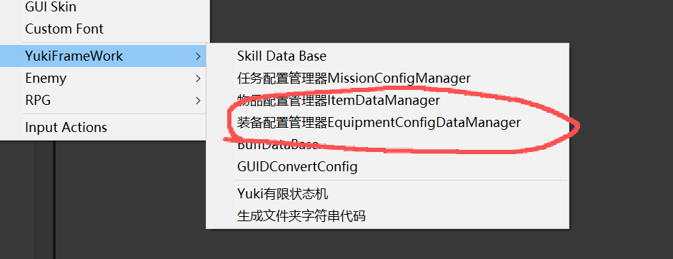
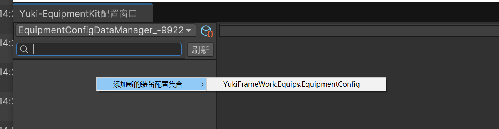
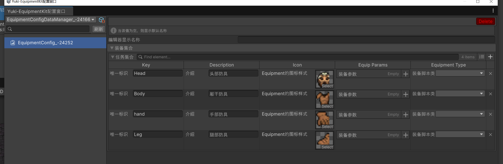

EquipmentKit 文档

在Assets文件夹下右键YukiFrameWork创建一个装备配置管理器


右键添加新的装备配置集合


效果如图所示：



添加指定的配置


使用示例如下:

``` csharp

using YukiFrameWork.Equips

public class TestScript : MonoBehaviour,IEquipExecutor
{
    void Start()
    {
        //初始化装备系统套件 也可以通过自己实现的IEquipmentLoader接口进行初始化
        EquipmentKit.Init("框架加载资源插件XFABManager模块名(自行定义)");
      
        //加载配置管理器
        EquipmentKit.LoadEquipmentConfigDataManager("填写资源的名称(路径)");
        
        //创建装备
        IEquipment equipment = EquipmentKit.CreateEquipment("装备配置的标识");

        //装备给执行者
        EquipState state = EquipmentKit.Equip(this,equipment);

        //state 返回值如下:

        //Success成功装备
        //CannotEquipByExecutor执行者条件不满足无法装备
        //CannotEquip装备本身无法被装备
        //AlreadyEquipped已经装备了这个装备
    }

    //装备执行者接口实现的方法，判断该执行者是否能装备
    public bool IsCanEquip()
    {
        return true;
    }
}

```

|IEquipExecutor interface API|装备执行者接口|
|--|--|
|bool IsCanEquip();|能否装备|


|IEquipment interface API|装备接口|
|---|--|
|IEquipExecutor EquipExecutor { get; set; }|装备执行者|
|IEquipmentData EquipmentData { get; set; }|装备配置|
|bool IsCanEquip()|该装备是否可以被装备|
|void OnEquip(params object[] param)|装备时触发|
|void OnUnEquip()|卸下时触发|
|---|---|
|IGlobalSign interface API|该接口继承自IGlobalSign通过框架全局对象池管理|
|bool IsMarkIdle { get; set; }|此对象是否闲置()|
|void Init()|创建初始化|
|void Release()|回收时使用，在本架构为执行者卸下装备时晚于OnUnEquip触发|

|IEquipmentData interface API|装备信息接口|
|--|--|
|string Key { get; set; }|唯一标识|
|string Name { get; set; }|装备名称|
|string Description { get; set; }|装备介绍|
|Sprite Icon { get; set; }|装备精灵|
|IReadOnlyList(EquipParam) EquipParams { get;}|装备参数|
|string EquipmentType { get; set; }|装备类型|


|EquipmentKit static API|装备系统套件API|
|--|--|
|void Init(string projectName)|使用框架资源插件XFABManager初始化|
|void Init(IEquipmentLoader equipmentLoader)|自定义加载器初始化|
|void LoadEquipmentConfigDataManager(EquipmentConfigDataManager equipmentConfigDataManager)|加载装备管理器(无需初始化)|
|void LoadEquipmentConfigDataManager(string path)|加载装备管理器|
|IEnumerator LoadMissionConfigManagerAsync(string path)|异步加载装备管理器|
|void AddEquipmentData(IEquipmentData equipmentData)|手动添加装备信息|
|bool RemoveEquipmentData(string key)|根据标识移除装备信息|
|IEquipmentData GetEquipmentData(string key)|获取装备信息|
|IEquipment CreateEquipment(string key)|根据标识创建装备|
|IEquipment CreateEquipment(string key, GameObject gameObject)|根据标识在指定的游戏对象上查找装备(需要已经挂载)|
|IEquipment CreateEquipment(IEquipmentData equipmentData, GameObject gameObject)|根据装备信息在指定的游戏对象上查找装备(需要已经挂载)|
|IEquipment CreateEquipment(IEquipmentData equipmentData)|根据装备信息创建装备|
|IEquipment CreateEquipmentAndEquip(this IEquipExecutor player,string key, out EquipState equipState,params object[] param)|创建装备并装备给执行者|
|IEquipment CreateEquipmentAndEquip(this IEquipExecutor player, string key,GameObject gameObject, out EquipState equipState, params object[] param)|创建装备(来自组件)并装备给执行者|
|EquipState Equip(this IEquipExecutor player, IEquipment equipment, params object[] param)|为执行者装备|
|void UnEquip(this IEquipExecutor player, IEquipment equipment)|为执行者卸下装备|
|void UnEquipAll(this IEquipExecutor player)|为执行者卸下所有的装备|