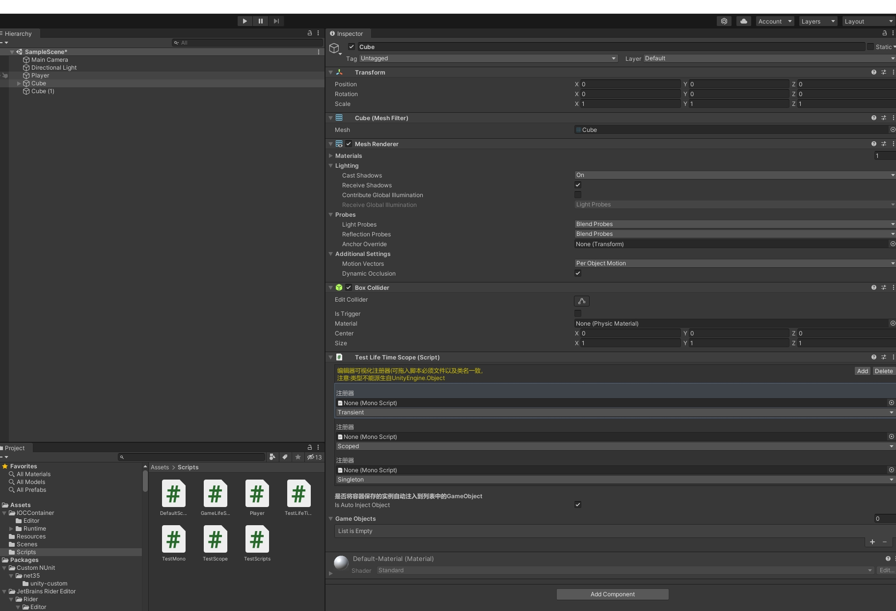

LifeTImeScope：框架核心全局容器类，容器类的最高级别。
在Unity中新建类继承即可实现指定分支的限制作用域，使用方法如下：

```
using YukiFrameWork;

//在项目中一般不会直接使用LifeTimeScope,创建一个项目用于自身的最高级容器
public class BaseLifeTimeScope : LifeTimeScope
{
    //可重写的Awake以及初始化容器方法
    protected override void Awake()
    {
        //这个不能去掉，否则无法执行容器的相关逻辑
        base.Awake();
    }
    
    //该方法在运行时自动执行
    protected override void InitBuilder(IContainerBuilder builder)
    {

    }
}

public class GameLifeTimeScope : BaseLifeTimeScope
{
    //设置我们的Game容器
}

public class UILifeTimeScope : BaseLifeTimeScope
{
    //设置我们的UI容器
}

```

```
public class TestLifeTimeScope : GameLifeTimeScope
{
    //设置我们游戏对象的容器
}
```

编辑器下的设置如图:


设定作用域级别必须是自己继承的分支,TestLifeTimeScope继承自GameLifeScope,所以这个容器是访问不到UILifeTimeScope的,而根据继承关系，不同作用域分支等级中,UILifeTimeScope与GameLifeScope的等级相同。默认为None,当为None时代表该容器不被任何级别限制,直接隶属于LifeTimeScope。

注册类型：Transient(瞬时),Scope(容器限制实例),Singleton(作用域下全局实例);

瞬时实例(每次取出都是一个新对象)。

限制实例(在设定好的作用域下该分支内唯一实例，同一个作用域内不同的派生容器(分支)类能得到的实例都不相同)

全域实例: 可称为限制单例 补充:在设定好的作用域下唯一的实例。单例的访问权限与作用域的设定有关,注册该单例的容器作用域级别越低,对单例的访问限制越大,在同一条分支下的其他容器隶属作用域级别大于等于注册该实例的容器作用域级别则可以正常对该单例进行访问,若设定作用域分支不同则无法跨域对单例进行访问。

1.全域实例如果通过父类注册同时响应给多个派生类时，以Unity生命周期为准，先执行的类所注册的实例为该单例的访问级别,本情况下建议各个派生容器的级别都设置一致。

2.当级别设置为None时即为不指定作用域，此时默认容器级别为最高级LifeTimeScope

(注：实例注册可采用接口隔离的方式)
注册api如下：

        //简单注册
        - void Register(Type type, LifeTime lifeTime = LifeTime.Transient,params object[] args);
        - void Register(string name, Type type, LifeTime lifeTime = LifeTime.Transient, params object[] args);
        - void Register<TInstance>(LifeTime lifeTime,params object[] args) where TInstance : class;
        - void Register<TInterface, TInstance>(LifeTime lifeTime = LifeTime.Transient, params object[] args) where TInterface : class where TInstance : class;

        - void RegisterScopeInstance<TInterface, TInstance>(params object[] args) where TInterface : class where TInstance : class;
        - void RegisterScopeInstance<TInstance>(TInstance instance) where TInstance : class;       
        - void RegisterInstance<TInstance>(params object[] args) where TInstance : class;
        - void RegisterInstance<TInterface,TInstance>(params object[] args) where TInterface : class where TInstance : class;
        - void RegisterInstance<TInstance>(TInstance instance);

        //根据名称注册
        - void Register<TInstance>(string name, LifeTime lifeTime = LifeTime.Transient, params object[] args)  where TInstance : class;
        - void Register<TInterface, TInstance>(string name, LifeTime lifeTime = LifeTime.Transient, params object[] args) where TInterface : class where TInstance : class;
        - void RegisterScopeInstance<TInstance>(string name,TInstance instance) where TInstance : class;     
        - void RegisterScopeInstance<TInterface, TInstance>(string name, params object[] args) where TInterface : class where TInstance : class;    

        //注册Unity组件的方式
        - void RegisterComponent<T>(T component,bool includeInactive = false) where T : Component;
        - void RegisterComponentInScene<T>(bool includeInactive = false) where T : Component;
        - void RegisterComponentInScene<T>(string name,bool includeInactive = false) where T : Component;
        - void RegisterComponentInNewPrefab<T>(GameObject gameObject, bool includeInactive = false) where T : Component;
        - void RegisterComponentInNewGameObject<T>(string name, bool includeInactive = false) where T : Component;    

容器内封装了属性Container以及GetContainer方法
调用api为：T Resolver<T>() where T : class
解析实例API如下：

        //解析组件实例

        - TComponent ResolveComponent<TComponent>(string objName,string componentName) where TComponent : Component;
        - TComponent ResolveComponent<TComponent>(string objName) where TComponent : Component;

        - object ResolveComponent(Type type, string objName, string componentName);
        - object ResolveComponent(Type type, string objName);

        //简单解析
        - T Resolve<T>() where T : class;
        - T Resolve<T>(string name) where T : class;

        - object Resolve(Type type, string name = "");

DI注入: 特性使用：Inject(自动化注入字段(属性)),InjectMethod(标记后可以使方法变成构造函数，在Mono脚本中与Awake的实现周期一致)
```
using UnityEngine;
using YukiFrameWork;
public class GameLifeTime : LifeTimeScope
{
    //可重写的Awake以及初始化容器方法
    protected override void Awake()
    {

    }
    
    //该方法在运行时自动执行
    protected override void InitBuilder(IContainerBuilder builder)
    {
        builder.RegisterScopeInstance(new B());
        builder.Register(typeof(A), LifeTime.Scoped);
    }

    public class A
    {
        //通过容器注入该实例
        [Inject]
        private B b;

        //通过容器调用"构造函数"
        [InjectMethod]
        public void Init() => Debug.Log("Init");
    }

    public class B
    {

    }
}

```  

Inject API: 

    //默认传递,对于非UnityEngine.Component的对象,总是返回最后一个注册的实例,作用于UnityEngine.Component时等效于(transform.GetComponentInChildren),该默认传递无法作用普通类下对组件的注入
    - [Inject]


    //该重载的参数仅对UnityEngine.Component生效,判断是查找自身还是从场景中查找第一个找到的实例,对于非UnityEngine.Component的对象,默认等效[Inject]
    - [Inject(InHierarchy:true)]


    //对于非UnityEngine.Component的对象，path为对象的名称,InHierarchy没有任何作用。作用于UnityEngine.Component时path的标识类型由InHierarchy决定,当InHierarchy为False时path为自身对象包括子对象的路径(效果等效transform.Find),为True时path为物体所标记的标签(效果等效GameObject.FindGameObjectWithTag)
    - [Inject(path:"",InHierarchy:false)]

Inject与InjectMethod的注意事项:


InjectMethod通常情况下适合用于Mono函数(没有限制,注册了就有),普通函数并不建议使用,如果仍然需要在普通类下使用并且函数的参数内持有对组件的引用,请提前对该参数的实例注册,从编辑器下拖入的GameObject自动注入的时机要晚于普通类构造函数注入。

Inject的标识在组件/普通类下有不同的效果，详细的使用可以在使用的时候查看注释,在Mono中Inject的path标识作用在组件字段(属性)可以是标签也可以是transform.Find所可用的路径 |||| 在普通类中作用于组件字段(属性)时，path通常是GameObject的名称,且需要确保容器已经注册了这个实例，否则请开启InHerarchy。开启后path标识为对象的标签(tag)(效果等效GameObject.FindGameObjectWithTag),path传递空则调用FindObjectOfType   

容器的本体获取接口: IInjectContainer

```

public class A : IInjectContainer
{
    ///继承这个接口后，只要这个类被注册进来了,都可以获取到容器的本体
    public IResolveContainer Container { get; set; }
}

```

