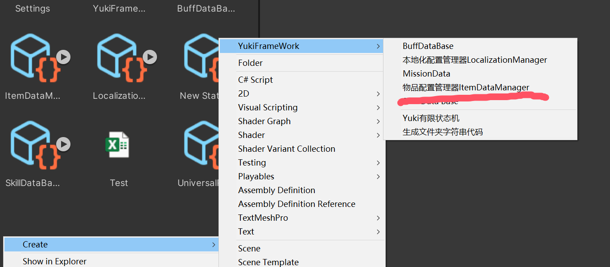
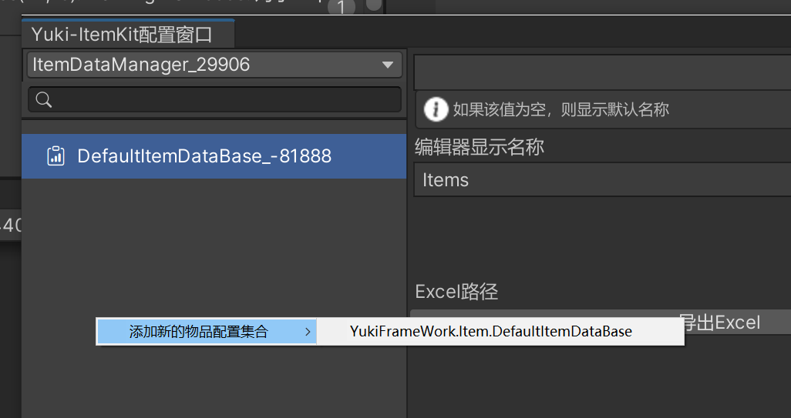
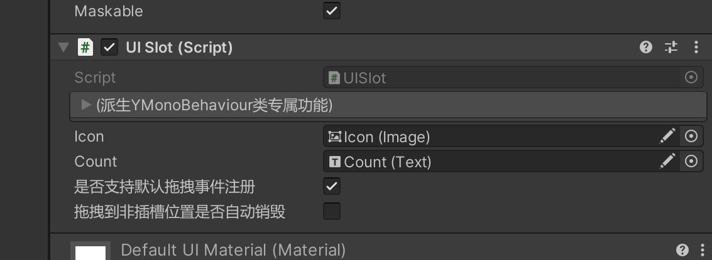

框架通用背包系统：
命名空间：using YukiFrameWork.Item;

在Assets下右键新建物品配置管理器:


可以在配置添加物品的类型：


当Assets下存在多个ItemDataManager，会共享类型

双击配置打开配表:


框架提供了默认的物品类型配置集合，通过在左侧创建:


完成后可以进行物品的配置工作。

自定义物品配置集合:

自定义物品类示例:继承IItem接口或者直接派生自Item都可以，示例如下:

``` csharp
[Serializable]
public class CustomItem : Item
{
    //这个是自定义的物品类
}

///为自定义的物品类添加自定义的ItemDataBase 则可以在配置窗口中配置。
public class CustomItemDataBase : ItemDataBase<CustomItem>
{
    
}
```

ItemKit的初始化：


``` csharp
public class TestScripts : MonoBehaviour
{
    private void Start()
    {
        //ItemKit默认使用框架XFABManager进行加载，需要在Init方法内传入模块名
        ItemKit.Init(projectName:"")

        //自定义加载方式如下:
        //自定义加载器继承IItemKitLoader接口，实现逻辑后进行ItemKit的初始化：
        ItemKit.Init(new ResourcesItemKitLoader());
     }
}

 public class ResourcesItemKitLoader : IItemKitLoader
    {
        public TItem Load<TItem>(string name) where TItem : ItemDataManager
        {
            return Resources.Load<TItem>(name);
        }

        public void LoadAsync<TItem>(string name, Action<TItem> onCompleted) where TItem : ItemDataManager
        {
            var item = Resources.LoadAsync<TItem>(name);
            item.completed += operation => {
                onCompleted?.Invoke(item.asset as TItem);
            };
        }

        public void UnLoad(ItemDataManager item)
        {
            Resources.UnloadAsset(item);
        }
    }

```

|ItemKit static API|ItemKit物品管理套件API说明|
|---|---|
|void Init(string projectName)|通过框架XFABManager进行加载的初始化加载器方法|
|void Init(IItemKitLoader loader)|自定义加载方法|
|void ClearAllSlogGroup()|将所有物品分组清空|
|bool DefaultSaveAndLoader { get; set; }|是否开启默认加载，默认开启。开启该属性后会执行内置的保存数据方法。|
|IReadOnlyDictionary<string, SlotGroup> SlotGroupDicts { get; }|获取只读的所有分组字典|
|SlotGroup CreateSlotGroup(string key)|创建一个分组|
|SlotGroup RemoveSlotGroup(string key)|移除一个分组|
|IReadOnlyDictionary<string, IItem> ItemDicts{ get; }|所有被成功加载的物品|
|void LoadItemDataManager(string name)|根据路径加载配置管理器|
|IEnumerator LoadItemDataManagerAsync(string name)|根据路径异步加载配置管理器|
|void LoadItemDataManager(ItemDataManager itemDataManager)|传递配置直接加载|
|void AddItem(IItem item)|单独添加某一个物品|
|bool RemoveItem(string Key)|单独移除某一个物品|
|SlotGroup GetSlotGroup(string key)|根据标识获取某一个物品分组|
|IItem GetItemByKey(string itemKey)|根据物品唯一标识获取物品数据|
|string Save()|保存所有的背包数据并返回Json字符串|
|void Load(string info,bool eventTrigger = true)|读取Json字符串数据以加载本地的背包数据，eventTrigger判断是否需要在读取后触发事件|
|void Load(bool eventTrigger = true)|当 DefaultSaveAndLoader 开启后，可以调用该重载加载|

对于物品套件的分组SlotGroup：

|SlotGroup API|物品分组的API|
|--|--|
|string Key { get; }|分组的标识(与ItemKit的字典同步)|
|IReadOnlyList< Slot > Slots { get; }|在这个分组下所有的物品插槽|
|bool IsEmpty { get; }|这个分组是否为空?|
|bool IsFull  { get; }|这个分组是否已经满了?|
|SlotGroup ForEach(Action< Slot > action)|遍历所有的插槽(链式)|
|SlotGroup ForEach(Action<int, Slot> action)|如上重载(链式)|
|SlotGroup RegisterOrderRefresh(Action order)|注册排序更新事件(链式)|
|SlotGroup UnRegisterOrderRefresh(Action order)|注销排序更新事件(链式)|
|SlotGroup CreateSlot(IItem item, int count)|创建新的插槽，并添加指定数量的物品(链式)|
|SlotGroup CreateSlotByKey(string itemKey, int count)|通过物品的唯一标识重载如上(链式)|
|SlotGroup CreateSlotsByCount(uint count,bool uiRefresh = false)|创建指定数量的空插槽(链式)|
|SlotGroup OrderBy< TKey >(Func<Slot,TKey> orders)|为物品排序(链式)|
|SlotGroup OrderByDescending< TKey >(Func<Slot, TKey> orders)|为物品倒序排序(链式)|
|SlotGroup RemoveSlot(int index,bool uiRefresh = false)|移除插槽本身(链式)|
|SlotGroup RemoveSlot(Slot slot,bool uiRefresh = false)|移除插槽本身(链式)|
|Slot FindSlotByKey(string itemKey)|通过物品的唯一标识找到这个物品对应的插槽|
|Slot FindEmptySlot()|在这个分组中找到空的插槽|
|Slot FindAddableSlot(string itemKey)|查找到可以继续添加物品的插槽|
|Slot FindAddableMaxStackableCountSlot(string itemKey)|查找可以添加的可堆叠式物品且有最大值限制的的插槽|
|ItemOperateResult StoreItem(string itemKey, int addCount = 1)|添加物品，会返回出多余的物品信息与数量|
|ItemOperateResult StoreItem(IItem item, int addCount = 1)|直接传递物品添加重载|
|ItemOperateResult InsertItem(int index,IItem item, int addCount = 1)|将物品直接插入指定下标的插槽(如果物品是相同的以插入结果为准)|
|ItemOperateResult InsertItem(int index, string itemKey, int addCount = 1)|通过物品唯一标识如上重载|
|bool RemoveItem(string itemKey, int removeCount = 1)|通过物品标识移除插槽中的这个物品|
|bool RemoveItem(IItem item, int removeCount = 1)|如上重载|
|bool ClearItemByIndex(int index)|直接通过下标清空对应插槽的物品|
|int FindSlotIndex(Slot slot)|根据插槽查找下标|
|void ClearItems()|清空所有插槽的物品(但保留插槽)|
|void ClearSlots()|清空所有的插槽重置为0|
|SlotGroup Condition(Func<IItem, bool> condition)|注册添加物品的条件(事件)|
|void SlotInitInvoke(UISlot slot)|触发插槽初始化的事件(一般由框架内部UISlot组件调用)|
|void SlotSelectInvoke(UISlot slot)|触发物品选择事件(一般由框架内部UISlot组件调用)|
|void SlotDeselectInvoke(UISlot slot)|触发物品取消选择事件(一般由框架内部UISlot组件调用)|
|void SlotPointerEnterInvoke(UISlot slot)|触发鼠标进入事件(一般由框架内部UISlot组件调用)|
|void SlotPointerExitInvoke(UISlot slot)|触发鼠标退出事件(一般由框架内部UISlot组件调用)|
|SlotGroup OnSlotInit(Action< UISlot > onSlotInit)|注册插槽初始化事件(链式)|
|SlotGroup OnSlotSelect(Action< UISlot > onSlotSelect)|注册插槽选择事件(链式)|
|SlotGroup OnSlotDeselect(Action< UISlot > onSlotDeslect)|注册插槽取消选择事件(链式)|
|SlotGroup OnSlotPointerEnter(Action< UISlot > onSlotPointerEnter)|注册鼠标进入插槽事件(链式)|
|SlotGroup OnSlotPointerExit(Action<UISlot> onSlotPointerEnter)|注册鼠标退出插槽事件(链式)|

|Slot API|插槽 API说明|
|---|---|
|IItem Item { get; set; }|物品数据|
|int ItemCount { get; set; }|物品数量|
|SlotGroup slotGroup { get; }|这个插槽所在分组|
|EasyEvent OnItemChanged|当物品发生改变时触发的事件，通常由框架默认调用。在不同的场景有时需要自己触发|

 
使用示例如下：
``` csharp
public class TestScripts : MonoBehaviour
{   
    private void Start()
    {
        //进行一次初始化
        ItemKit.Init(projectName:"");//传入模块名，或者使用自定义加载
        
        //这里传入配置的名称/路径
        ItemKit.LoadItemDataManager(nameof(ItemDataManager));
               
        //创建一个新的分组
        SlotGroup group = ItemKit.CreateSlotGroup("物品栏");

        //SlotGroup API:

        //得到分组的标识，也就是创建时输入的
        string key = group.Key;

        //创建新的插槽，参数设置物品，以及对应的数量
        group.CreateSlot(IItem:null,count:1); 

        //创建新的插槽，参数填入物品的Key标识，以及对应的数量
        group.CreateSlotByKey(itemKey:string.Empty,count:1)

        //创建对应数量的空插槽
        group.CreateSlotsByCount(count:10)

        //往现有插槽添加物品，设置物品的标识以及添加的数量，返回ItemOperateResult参数
        ItemOperateResult result = group.StoreItem(itemKey:"", addCount:1)

        //添加成功后会返回True
        Debug.Log("是否添加成功" + result.Succeed);
        //如果添加失败，或者物品溢出/超过上限，则result.RemainCount为多出的数量
        Debug.Log("剩余数量" + result.RemainCount);
        
        //设置添加条件，在UISlot中进行物品的置换时，会判断物品是否满足条件，满足才可置换。
        group.Condition(item => item.GetKey == "Iron");

        //设置与组关联的UISlot的生命周期，依次是初始化，键盘选定，键盘离开(键盘的有关事件需要挂载Selectable组件),鼠标进入，鼠标退出
        group.OnSlotInit(uislot => { })
                 .OnSlotSelect(uislot => { })
                 .OnSlotDeselect(uislot => { })
                 .OnSlotPointerEnter(uislot => { })
                 .OnSlotPointerExit(uislot => { });

        //根据物品的标识查找到对应的插槽
        Slot slot = group.FindSlotByKey(itemKey:"");

        //查找空插槽
        Slot emptySlot = group.FindEmptySlot();

        //查找物品可以被叠加的插槽
        Slot addableSlot = group.FindAddableSlot(itemKey:"");

        //查找物品可以被叠加但是有最大上限的插槽
        Slot addableMaxSlot = group.FindAddableMaxStackableCountSlot(itemKey:"");
     }
}

``` 

插槽类Slot API:

    //可以注册物品改变的回调
    - EasyEvent OnItemChanged = new EasyEvent();//OnItemChanged.RegisterEvent(() =>{ });

ItemKit与UI的交互

为插槽拖入UISlot组件，默认情况下需要设置好Icon以及Count，但如有需要可以自由定制 API介绍如下:

|UISlot API|API说明|
|--|--|
|IUISlotVisual Visual { get; set; }| IUISlot的视觉控制接口。在框架默认情况下，只支持Text与Image，当用户希望自由定制组件进行更新物品的UI时。可在UISlot下赋值|

|IUISlotVisual API|视觉接口API说明|
|--|--|
|void UpdateCount(int count)|更新物品数量|
|MaskableGraphic ItemCount { get; }|物品数量的组件|
|MaskableGraphic ItemIcon { get; }|物品图标的组件|
|void SetIcon(Sprite sprite)|设置精灵的方法|

``` csharp

//框架默认的使用方式:比如需要使用TMP时照着这样写即可

    public class DefaultUISlotVisual : IUISlotVisual
    {
        private Image iconImage;
        private Text countText;
        public DefaultUISlotVisual(Image image, Text text)
        {
            this.iconImage = image;
            this.countText = text;
        }
        public MaskableGraphic ItemCount => countText;

        public MaskableGraphic ItemIcon => iconImage;

        public void SetIcon(Sprite sprite)
        {
            iconImage.sprite = sprite;
        }

        public void UpdateCount(int count)
        {
            if (count == 0)
                this.countText.text = string.Empty;
            else this.countText.text = count.ToString();
        }

    }

```




|UISlot API|UISlot API说明|

//为面板拖入UISlotGroup组件，代表该面板(例如背包面板)属于一个分组


输入SlotGroup的标识，运行时会自动同步所有的物品到UI，但请注意生命周期，ItemKit的配置一定要最先触发。

UISlot生成的类型提供两个方式，一种是通过预制体生成，需要设置好UISlot生成的根节点，另一种可以直接使用现成的插槽。

对于分组的自动化创建，可以为任意对象挂载SlotGroupComponent脚本如下:


传入对应的标识，以及设置ItemKey的标识还有数量，可视化的生命周期绑定，运行时自动创建对应的分组并且通过ItemKit获得物品，但请注意生命周期，ItemKit的配置一定要最先触发。

对于物品的信息显示拓展:

框架提供UIItemTip组件，挂载在用户设定的信息面板中如下:


需要拖入三个组件，图标，物品名称以及介绍的文本组件，代码示例如下：


``` csharp
public class TestScripts : MonoBehaviour
{
    public UIItemTip tip;
    private void Start()
    {
         //.......

         SlotGroup group = ItemKit.CreateSlotGroup("物品栏");

         //通过与生命周期绑定，这样就可以实现对tip的显示隐藏
         group
            .OnSlotPointerEnter(uislot => tip.Show(uislot))
            .OnSlotPointerExit(uislot => tip.Hide());
    }
}
```


	