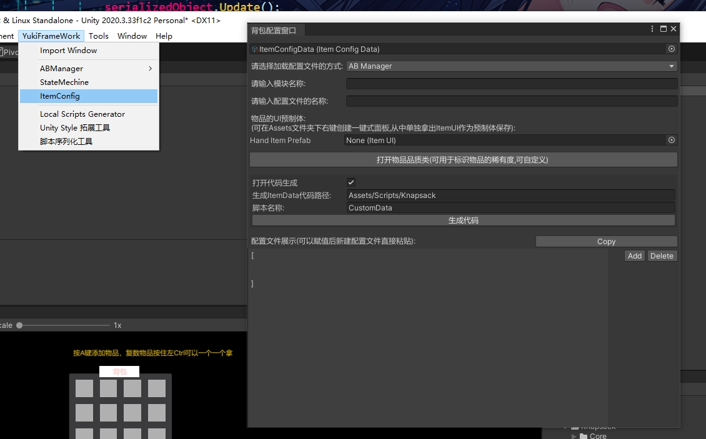

框架通用背包系统：
命名空间：using YukiFrameWork.Knaspack;
注意：背包系统的配置表为Json类型,使用此模块需要具备对json的基本了解以及LitJson的基本使用,

在Assets文件夹下右键可以一键创建插槽以及背包面板,如图所示可以打开背包的配置窗口:


此窗口下可以预览物品序列化为Json后的配表示例,可以直接复制。可以选择Resources以及框架自定ABManager作为加载的方式。当完成配置表的创建后要输入Json配置表所在的地址

使用一键式面板生成后从里面拿出标记好的ItemUI物品UI预制体,生成新预制体后拖入该配置窗口中。


 
使用示例如下：
```
public class TestScripts : MonoBehaviour
{
    //生成的配置工具
    public ItemConfigData configData;
    private void Start()
    {
        ///背包套件初始化方法,需要传入我们配置工具的数据,同时需要传入物品的加载器,这里的ItemDefaultParse是框架自带的默认加载器,重载Init方法不需要传入这个参数。
        ItemKit.Init(configData,new ItemDefaultParse())

     }
}

///默认的物品加载器,如果有特殊的逻辑比如ItemData类做派生重写需要别的操作进行序列化时需要写一个类继承这个IItemInfomationParse接口,重写解析该Json的具体操作
public class ItemDefaultParse : IItemInfomationParse
{      
    public ItemData ParseJsonToItem(JsonData json)
    {
        ItemData itemData = AssemblyHelper.DeserializeObject<ItemData>(json.ToJson());       
        return itemData;
    }
}
```
同时包含有面板类Inventory以及插槽类Slot。

该模块默认实现背包之间物品的对换，以及拿起物品跟随鼠标的功能。按住左Ctrl对复数物品进行拿取时只会一个一个拿。在鼠标不在任何UI面板上时丢弃物品,unitypackage包内有示例展示。

如果有特殊功能想自定义实现 可以继承InventoryManager类自定义,示例如下：
```
public class CustomInventoryManager : InventoryManager
{
     protected override void Awake()
    {
        base.Awake();
    }

    protected override void Update()
    {
        base.Update();
    }

    public override void PickUpItem(ItemData item, int amount)
    {
        base.PickUpItem(item, amount);
    }

    public override void RemoveItem()
    {
        base.RemoveItem();
    }
}
```


	