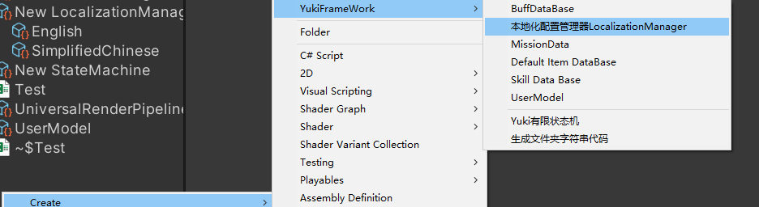
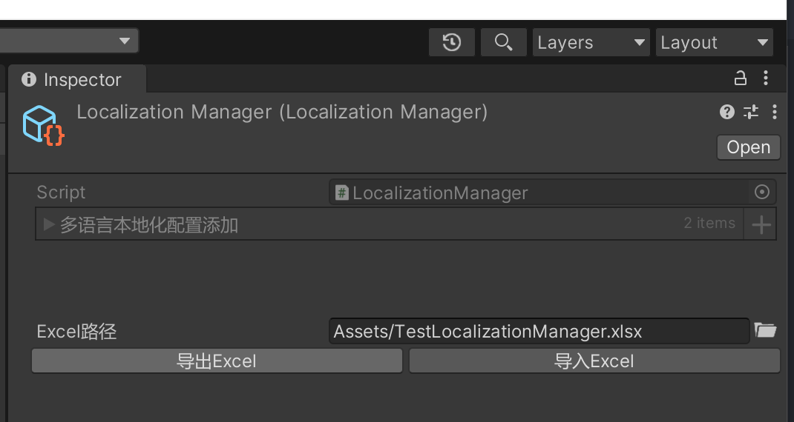
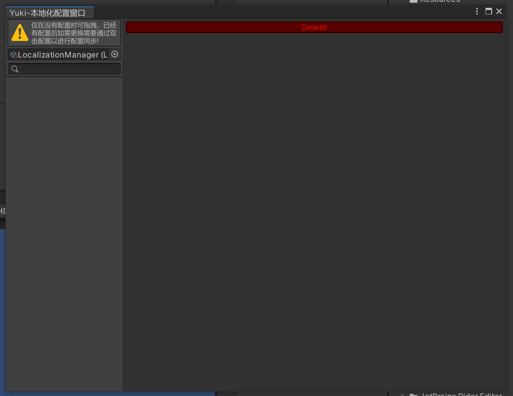
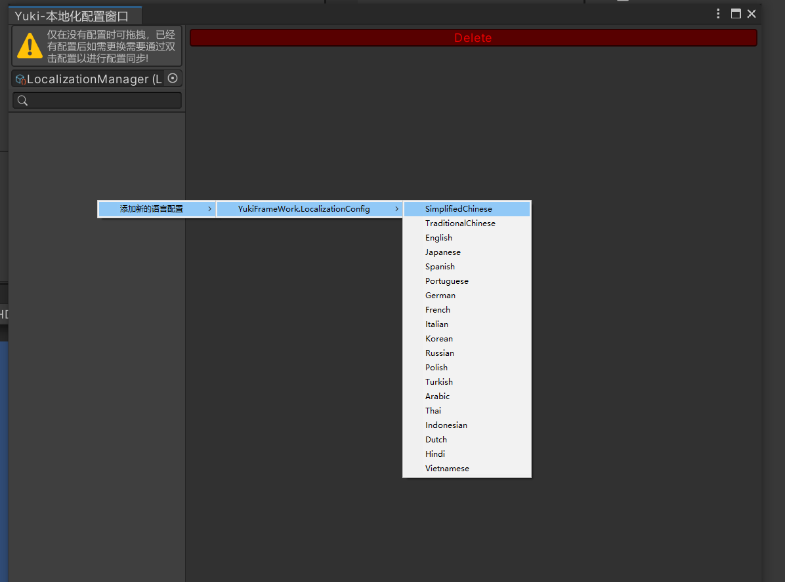
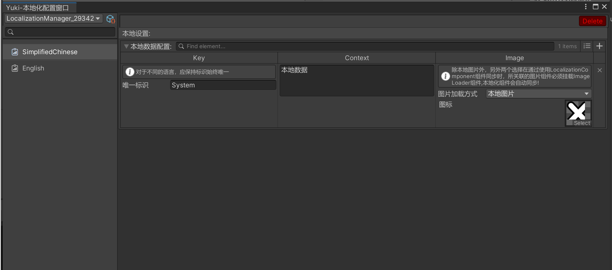
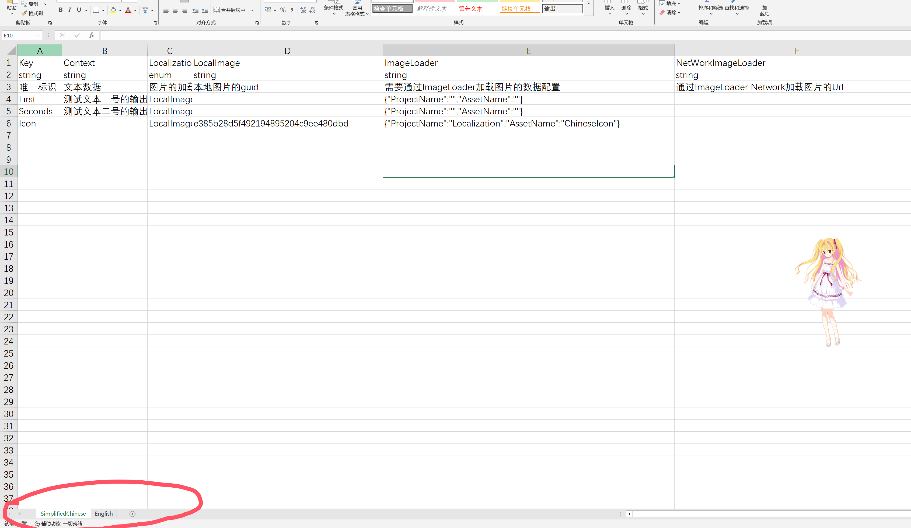
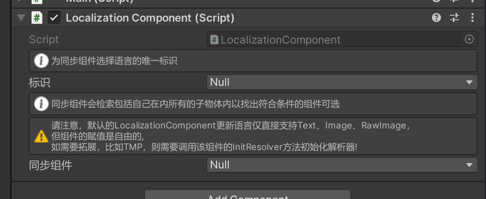

框架本地化套件LocalizationKit

使用如下:

在项目Assets文件夹下右键新建配置表：





在添加完语言后可对配置进行Excel导入导出操作

双击配置表打开本地化配置窗口:



左侧右键为配置创建语言的单独配置。




在配置中，不同的语言需要同步。必须保证标识是唯一且一致的。

可以在下方将已经配置好的数据导出Excel，也支持对已有数据的Excel文件转换为配置

Excel示例数据如下:


图中的数据包含了两种语言(红圈部分)不同的语言是不同的工作表。


运行时使用示例代码：

``` csharp
using YukiFrameWork;
using UnityEngine;
using System;
namespace YukiFrameWork.Example
{
	public class LocalizationTest : MonoBehaviour
	{
        /// <summary>
        /// 显示的文本信息
        /// </summary>
        private string info;
        private void Start()
        {
            ///本地化套件采用与其他工具一致通过XFABManager进行默认加载的方式，需要调用一次Init方法

            LocalizationKit.Init(projectName:"");

            ///注册切换语言时的事件回调，事件可以在初始化之前与之后注册，没有限制
            LocalizationKit.RegisterLanguageEvent(language =>
            {
                info = LocalizationKit.GetContent("First",language).Context;
            });

            ///启动时可以调用一次语言更新
            LocalizationKit.OnLanguageValueChanged();

            ///如果想直接获得某一个Data的信息(必须执行过一次初始化!):
            ILocalizationData localization = LocalizationKit.GetContent("First",LocalizationKit.LanguageType);

            ///得到文本信息
            Debug.Log(localization.Context);

            ///得到Data数据中的本地精灵
            Debug.Log(localization.Image.Icon);
        }
        private void OnGUI()
        {                                 
            if (GUILayout.Button(Language.SimplifiedChinese.ToString()))
            {
                ///切换当前的语言
                LocalizationKit.LanguageType = Language.SimplifiedChinese;
            }

            if (GUILayout.Button(Language.English.ToString()))
            {
                ///切换当前的语言
                LocalizationKit.LanguageType = Language.English;
            }

            if (GUILayout.Button(Language.Japanese.ToString()))
            {
                ///切换当前的语言
                LocalizationKit.LanguageType = Language.Japanese;
            }

            if (GUILayout.Button(Language.Korean.ToString()))
            {
                LocalizationKit.LanguageType = Language.Korean;
            }

            GUILayout.Label(info);

        }
    }
}
```

|LocalizationKit static API|本地化套件类静态API说明|
|---|---|
|void Init(string projectName,Language language = Language.SimplifiedChinese)|初始化方法,本地化套件使用框架自带XFABManager进行资源加载|
|void Init(ILocalizationLoader loader,Language language = Language.SimplifiedChinese)|初始化方法，用户自定义初始化器|
|void Init(string projectName,ILocalizationSerializer serializer, Language language = Language.SimplifiedChinese)|初始化方法，用户自定义初始化器,可自定义序列化器|
|void Init(ILocalizationLoader loader, ILocalizationSerializer serializer, Language language = Language.SimplifiedChinese)|初始化方法，用户自定义初始化器,可自定义序列化器|
|IUnRegister RegisterLanguageEvent(Action< Language > action)|注册当语言变更时的回调|
|void UnRegisterLanguageEvent(Action< Language > action)|注销当语言变更时的回调|
|bool IsContainsLanguage(Language language)|判断有没有指定语言的信息|
|void OnLanguageValueChanged()|发送当语言变更时的事件|
|void LoadLocalizationManagerConfig(LocalizationManager configManager)|添加配置(该API无需初始化加载器)|
|void LoadLocalizationManagerConfig(string path)|根据路径从加载器加载后添加配置|
|bool LanguageContains(Language language)|判断某一个语言是否至少具有一条数据|
|Language[] GetLanguages()|获取目前已经加载的所有语言|
|IEnumerator LoadLocalizationManagerConfigAsync(string path)|如上，但是异步|
|ILocalizationData GetContent(string key, Language language)|传递添加的管理器标识，语言数据唯一标识，语言类型获得本地化数据|
|ILocalizationData GetContent(string key)|通过内部的语言判断获取语言数据，如上|
|---|---|
|LocalizationKit static Property API|本地化套件类静态属性API说明|
|Language LanguageType { get; set; }|本地化当前的语言|
|ILocalizationSerializer Serializer { get; }|本地持久化语言序列化器|

|ILocalizationSerializer API|本地序列化器接口说明|
|--|--|
|Language DeSerialize()|反序列化|
|void Serialize(Language language)|序列化|

对于UI组件的兼容，应在Panel上挂载LocalizationComponent脚本,并自行进行配置


可以为组件设置同步的标识，以及设置该组件可能同步的组件(Text,Image)

这样当项目运行时，该组件将会同步，如果使用TextMeshPro等其他组件，可以使用LocalizationComponent的初始化解析器方法

```
public class LocalizationTest : MonoBehaviour
	{
        /// <summary>
        /// 显示的文本信息
        /// </summary>
        private string info;

        public LocalizationComponent localizationComponent
        private void Awake()
        {        
            ///初始化组件解析器
            localizationComponent.InitResolver(CustomResolver);
        }
       
        private void CustomResolver(MaskableGraphic component, ILocalizationData localizationData)
        {
            ///在这里实现具体的逻辑：

            //示例:
            TextMeshProUGUI textMesh = component as TextMeshProUGUI;
            textMesh.text = localizationData.Context;
        }
    }
}
```


