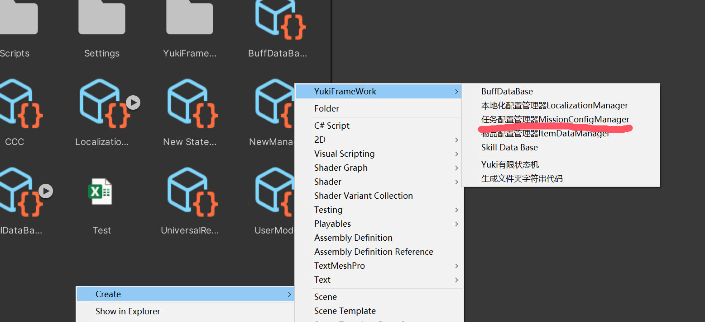
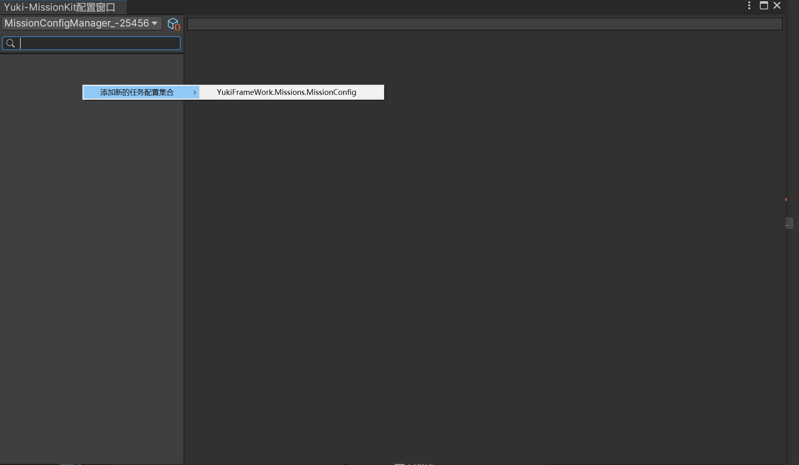

YukiFrameWork MissionKit 任务系统文档介绍:

Namespace: YukiFrameWork.Missions;

可以导入模块文件夹中的示例包查看任务示例。

在Assets文件夹目录下右键创建任务配置管理器:



在配置管理器上可以添加全局可用的参数。在这里的参数Runtime下获取是只读的。如设置金币获取数量，大于100金币后完成任务。可以在这里添加数值为100 Integer类型的参数。在Runtime下访问。

在配置管理器上可以添加全局可用的任务类型，在这里添加的类型可以在配表窗口上配置具体任务时设置类型。类型Assets下全MissionConfigManager通用。

双击配置:

框架提供了默认的任务配置。可以进行添加并进行配置

任务配置加载器接口:IMissionLoader

|Loader API|加载器需要实现的方法|
|--|--|
|MissionConfigManager Load(string path)|同步加载配置方法|
|void LoadAsync(string path,Action< MissionConfigManager > onCompleted)|异步加载配置方法|

框架已经实现了内置的加载器。也可以通过自定义加载器继承接口并实现。

|MissionKit MethodAPI|任务套件(管理器)API|
|--|--|
|void Init(string projectName)|初始化任务套件，需要传递模块名称，使用内置XFABManager插件进行加载资源|
|void Init(IMissionLoader loader)|初始化任务套件，传递自定义的加载器|
|void LoadMissionConfigManager(string path)|通过路径加载配置(泛型)，以实现的加载器为主|
|void LoadMissionConfigManager(MissionDataBase config)|直接传递配置|
|IEnumerator LoadMissionConfigManagerAsync(string path)|异步加载配置|
|void AddMissionData(IMissionData missionData)|手动添加一个新的任务数据，适合自己写任务数据逻辑时|
|bool RemoveMissionData(string key)|根据标识移除某一个任务数据|
|IMissionData GetMissionData(string key)|根据标识获取某一个任务|
|MissionGroup CreateMissionGroup(string groupKey)|传递一个唯一的标识，创建新的任务分组(任务本身以分组的形式管理)|
|MissionGroup GetMissionGroup(string groupKey)|获取指定的任务分组|
|bool RemoveMissionGroup(string groupKey)|移除指定的任务分组|
|void AddParam(string key, MissionParam param)|通过代码添加新的参数
|string SaveMissions()|保存所有的任务数据/状态/分组，转换为Json|
|void LoadMissions(bool eventTrigger = true)|通过内置的保存读取所有的任务数据 eventTrigger代表在读取后是否需要触发事件|
|void LoadMissions(string json,bool eventTrigger = true)|如果数据是保存在了外部，那么可以通过这个重载进行读取|
|bool DefaultSaveAndLoader { get; set; }|默认保存，默认为True，当该属性为True时，使用SaveMissions后，LoadMissions(非重载)有效|

任务对状态控制的条件接口：IMissionCondition

//示例如下:

``` csharp
using YukiFrameWork.Missions;

public class TestCondition : IMissionCondition 
{
    //任务基类本身
    public Mission Mission { get; set; }
    public void OnInit()
    {
        //条件的初始化方法
    }
    public bool Condition()
    {
        //这里就是判断的条件，当该方法返回True时，视为完成条件
        return true;
    }
}

```


|IMissionData Interface Properties API|任务数据接口属性API|
|--|--|
|string Key|任务的唯一标识(无论有多少个So配置，都必须保证每一个任务的标识唯一)|
|string Name|任务名称|
|string Description|任务介绍|
|Sprite Icon|任务图标|
|List< string > StartingCondition|任务的所有接受/启动条件类型，当任务基类调用StartMission方法开始任务时，会进行这里的条件判断。(字符串编辑器已优化。条件的添加至少需要具备上述示例中至少一个条件类)|
|List< string > CompletedCondition|完成任务的所有条件。规则如上|
|List< string > FailedCondition|任务失败的所有条件，规则如上，特殊:当没有失败条件时，任务永远都不会失败|
|string MissionType |任务的类型(编辑器优化)|

任务基类本身需要通过已有的分组MissionGroup进行创建

|MissionGroup API|分组的所有API|
|--|--|
|-- Property API|属性API|
|string GroupKey|任务的分组标识|
|IReadOnlyDictionary<string,Mission> Mission_Dicts|已经构建的所有任务基类|
|event Func<IMissionData,bool> addMissionCondition|添加任务的条件，默认是True|
|string[] AllMissionsKey|获取所有的任务标识|
|-- Method API|-- Method API|
|MissionGroup RegisterMissionRefresh(Action refresh)|注册任务的刷新事件,当为任务排序或者添加移除时触发|
|MissionGroup UnRegisterMissionRefresh(Action refresh)|注销任务的刷新事件|
|MissionGroup OrderBy< TKey >(Func<KeyValuePair<string,Mission>,TKey> orders)|任务按条件升序排序|
|MissionGroup OrderByDescending< TKey >(Func<KeyValuePair<string, Mission>, TKey> orders)|任务按条件降序排序|
|MissionGroup RegisterUIMissionInit(Action< UIMission > action)|注册任务UI刷新的事件，当任务UI刷新时触发。|
|MissionGroup UnRegisterUIMissionInit(Action< UIMission > action)|注销任务UI刷新的事件|
|MissionGroup CreateMission(IMissionData missionData,Action< Mission > onMissionInit = null)|传入数据，创建新的任务，可传递初始化的回调|
|Mission[] GetMissionsByType(string missionType)|根据任务类型获取指定任务集合|
|Mission GetMission(string missionKey)|通过标识获取指定任务|
|bool RemoveMission(string missionKey)|移除某一个任务|
|Mission[] GetMissions()|获取所有的任务|

|Mission API|任务基类API|
|--|--|
|--Property API|属性API|
|IMissionData MissionData|任务的数据|
|MissionGroup Group|任务所在的分组|
|MissionStatus Status|任务当前的状态|
|MissionParams Params|任务的参数集合|
|Container Container|任务基类可使用容器本体(容器本体的介绍)(https://gitee.com/NikaidoShinku/YukiFrameWork/blob/master/YukiFrameWork/Framework/Container.md)，在任务基类中只需要访问这个属性即可，不需要像引导文档中去通过架构加载容器。除此之外使用方式是一样的|
|EasyEvent(IMissionData) onMissionIdle|当任务调用ResetMission方法重置/第一次加载回待机状态时触发事件|
|EasyEvent(IMissionData) onMissionCompleted|任务完成时触发事件|
|EasyEvent(IMissionData) onMissionFailed|当任务失败时触发事件|
|EasyEvent(IMissionData) onMissionStarting|当任务成功开始时触发事件|
|EasyEvent(IMissionData) onMissionUpdate|当任务开始后持续触发的回调|
|EasyEvent(IMissionData) onMissionFixedUpdate|当任务开始后持续触发的回调|
|EasyEvent(IMissionData) onMissionLateUpdate|当任务开始后持续触发的回调|
|-- Method API|-- Method API|
|void StartMission()|开始任务|
|void ResetMission()|重置任务为待机|

任务状态MissionStatus:
Idle,Running,Completed,Failed

任务对于UI的同步 UIMissionGroup:

添加UIMissionGroup分组组件如图所示:


可通过编辑器输入分组标识也可以通过在代码中获取该组件调用GroupKey属性进行更改，设置好UIMission的生成。即可自动进行对任务在UI的同步

UIMission 为任务所搭配的UI添加任务的UI组件如图


任务的介绍/图标/名称均以事件的形式，以同时让Text与TextMeshProUGUI可使用。

可在这里注册不同的状态相对应的事件。