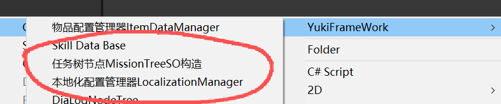
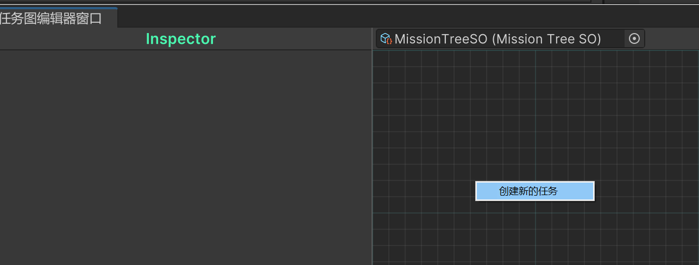
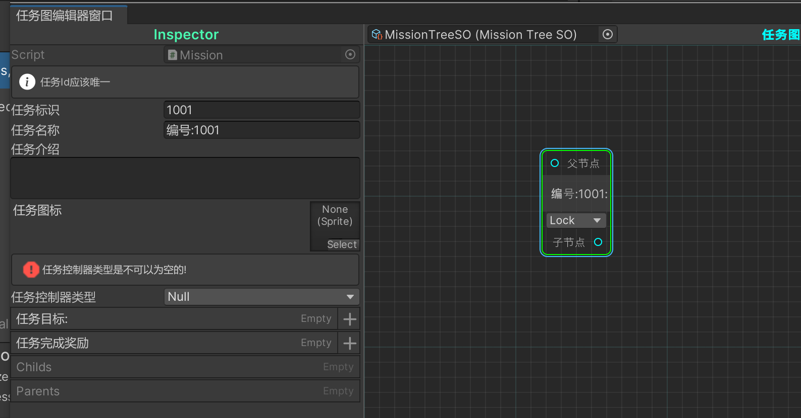
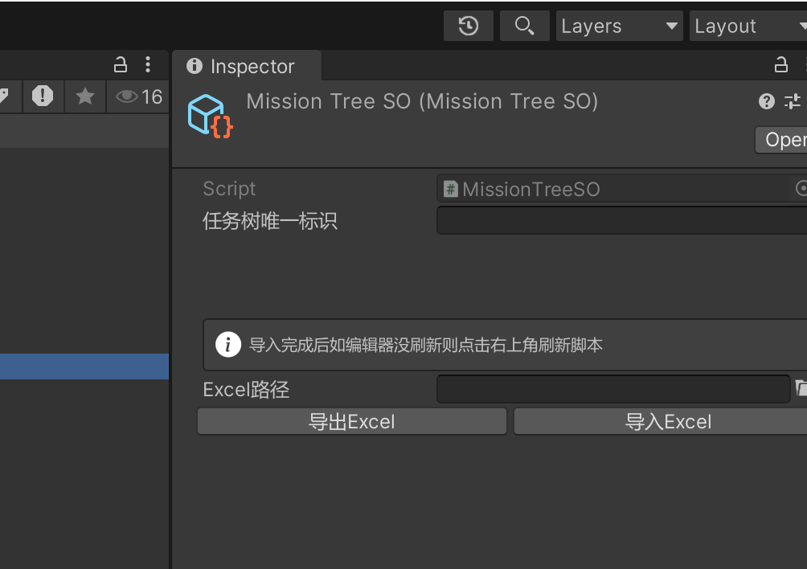
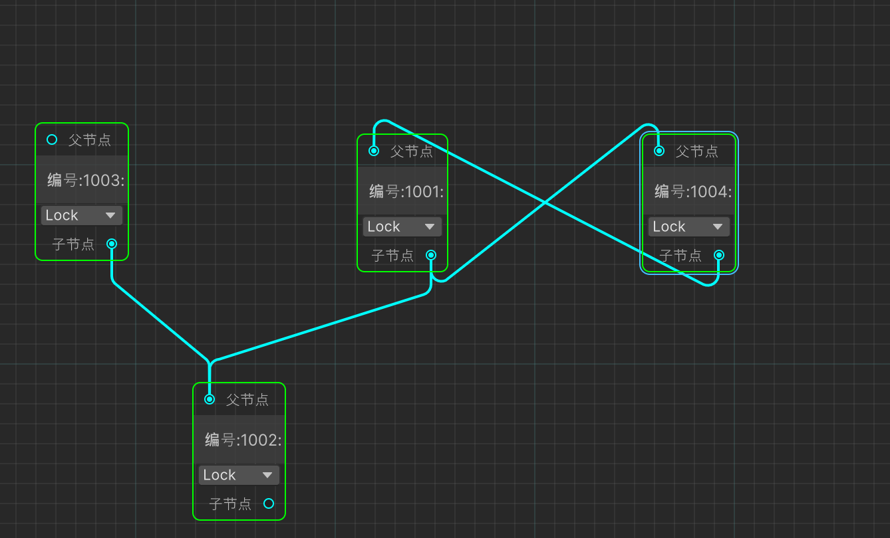

框架MissionTree 图结构任务树模块

using YukiFrameWork.Missions;

在Assets目录下右键创建任务树节点



在网格中右键新建任务:





对于任务节点，是以图的形式，任务的流程设计均由项目/用户自由定义，可向下兼容为树，也可以其他方式存在，规则复杂度如下:



任务本身的父子定义也均由用户决定。可解决几乎所有的任务需求。如不关联任务对同一任务的解锁，如任务之间的互相解锁。如支线需求等等。

任务本身具有五个状态:

    public enum MissionStatus
    {
        Lock,
        InActive,
        Running,
        Failed,
        Success
    }

|任务配置类Mission API|API说明|
|--|--|
|MissionStatus MissionStatus { get; set; }|任务运行时当前的状态|
|int MissionId { get ; set ; }|任务的Id|
|string MissionName  { get ; set ; }|任务名称|
|string Description { get; set;}|任务介绍|
|string MissionControllerType { get; }|任务的控制器类型|
|bool IsChild { get; }|任务是否是子任务(具备父任务)|
|Sprite Icon { get ; set ; }|任务图标|
|List(MissionParam) MissionTargetParams|任务的完成目标参数|
|List(MissionParam) MissionAwardParams|任务的奖励参数|

所有的任务都必须具备任务控制器类型如下:

``` csharp

    using YukiFrameWork.Missions;

    public class TestMissionController : MissionController
    {
        protected override bool IsCompleted()
        {
            return false;
        }

        protected override bool IsFailed()
        {
            return false;
        }

        protected override void OnCreate(params object[] param)
        {
            
        }

        protected override void OnMissionCompleted()
        {
            
        }

        protected override void OnMissionFailed()
        {
            
        }

        protected override void OnStart(params object[] param)
        {
            
        }
    }


```

在构建完类型后可为任务配置添加类型。

|MissionController API|任务控制器基类API说明|
|--|--|
|Mission Mission { get; }|控制器绑定的任务数据|
|IReadOnlyList(Mission) Parents { get; }|任务所有的父任务|
|IReadOnlyList(Mission) Childs { get; }|任务所有的父任务|
|MissionTreeSO MissionTreeSO { get; }|任务所绑定的图配置(克隆,不影响Editor)|
|MissionTree MissionTree { get; }|任务绑定的运行时任务树|
|bool IsChild { get; }|任务是否是子任务|
|Dictionary<string, MissionParam> MissionAwards|任务所有的奖励参数(运行时可自由动态添加)|
|Dictionary<string, MissionParam> MissionTargets { get; }|任务所有的目标参数(运行时可自由动态添加)|
|IReadOnlyList(MissionController) ChildControllers { get; }|任务所有的子任务控制器|
|IReadOnlyList(MissionController) ParentControllers { get; }|任务所有的父任务控制器|
|MissionStatus MissionStatus { get; }|任务的状态|
|event Action(Mission) onLock|任务锁定时触发|
|event Action(Mission) onReset|任务初始化时触发|
|event Action(Mission) onCompleted|任务完成时触发|
|event Action(Mission) onFailed|任务失败时触发|
|event Action(Mission,object[]) onStart|任务启动时触发|
|Method API||
|bool ParentContains(MissionController parent)|判断该任务是否为自身的父任务|
|void ForEachChildrens(Action(MissionController) each)|遍历自己所有的子任务控制器|
|void ForEachChildrens(Action(MissionController) each, Func(bool) condition)|可设定遍历的条件如上|
|void ForEachParents(Action(MissionController) each)|遍历自己所有的父任务控制器|
|void ForEachParents(Action(MissionController) each,Func(bool) condition)|可设定遍历的条件如上|
|MissionController FindChildMissionController(int missionId)|根据标识查找自身的子任务控制器|
|bool TryFindChildMissionController(int missionId, out MissionController missionController)|不会抛出异常的如上|
|MissionController FindParentMissionController(int missionId)|根据标识查找自身的父任务控制器|
|bool TryFindParentMissionController(int missionId, out MissionController missionController)|不会抛出异常的如上|
|生命周期 (需要实现的API)||
|void OnCreate(params object[] param)|当任务树被创建后触发所有任务控制器的创建|
|void OnLock()|当任务锁定后触发|
|void OnStart(params object[] param)|当任务开始触发|
|void OnMissionCompleted()|当任务完成后触发|
|void OnMissionFailed()|当任务失败后触发|
|bool IsCompleted()|判断任务完成的条件|
|bool IsFailed()|判断任务失败的条件||
|bool IsUnLock()|判断任务是否能被解锁|
|void OnUpdate() |当任务执行时持续调用|
|void OnLateUpdate()|如上|
|void OnFixedUpdate()|如上|
|void OnReset()|当任务解锁/重置回待机时触发|
|void Dispose()|当任务控制器被释放时触发|

启动任务树示例如下:

``` csharp

    using YukiFrameWork.Missions;

    public class TestScripts : MonoBehaviour
    {
       
        public MissionTreeSO missionTreeSO;

        void Start()
        {
            MissionTree missionTree = MissionTree.Create(missionTreeSO,param:);//param可传递参数
            
            //解锁任务
            missionTree.UnLockMission(1001);

            //传递任务Id启动任务
            bool success = missionTree.StartMission(1001,out string failedTip,param:);//param可传递参数

            if(!success)
            {
                Debug.LogError(failedTip);
            }

            //重置任务
            missionTree.ResetMission(1001);

            //锁定任务
            missionTree.UnLockMission(1001);

            //启动所有的任务
            missionTree.StartMissions();//重载可传递Func回调判断启动条件 重置与解锁形式一样。

            
        }
        
    }

```

|MissionTree API|运行时任务树API说明|
|--|--|
|static API|静态APi说明|
|void Init(string projectName)|初始化加载器(默认XFABManager)|
|void Init(IMissionLoader missionLoader)|根据自定义的加载器初始化|
|string PersistenceMissionData { get; }|任务树的持久化数据|
|bool IsPersistence { get; }|是否处于持久化获取数据中,当该属性为True时,MissionTree任何对任务的解锁启动重置都不会生效|
|MissionTree Create(MissionTreeSO missionTreeSO,params object[] param)|创建任务树|
|MissionTree Create(string nameOrPath, params object[] param)|通过加载器创建任务树|
|YieldTask(MissionTree) CreateAsync(string nameOrPath, params object[] param)|异步创建任务树|
|MissionTree GetMissionTree(string key)|根据标识获取任务树|
|bool TryGetMissionTree(string key, out MissionTree missionTree)|不会抛出异常，如上|
|void LoadPersistenceMissionTrees(string persistence)|加载行为树持久化数据|
|bool ReleaseMissionTree(string key)|释放指定标识的任务树|
|Property API|---|
|string Key { get; }|任务树标识|
|bool IsMarkIdle { get; set; }|这个任务树是否正在被使用(框架对象池控制)|
|MissionTreeSO MissionTreeSO { get; }|该行为树依赖的so配置,数据为克隆数据，任何修改都不会作用于Editor环境下的本配置|
|MissionController FindMissionController(int missionId)|根据标识查找任务控制器|
|MissionController FindMissionController(Mission mission)|如上重载|
|bool TryFindMissionController(int missionId, out MissionController missionController)|不会抛出异常如上|
|bool TryFindMissionController(Mission mission, out MissionController missionController)|不会抛出异常如上|
|void ForEach(Action(MissionController) each)|遍历所有任务控制器|
|void StartMissions()|启动所有任务|
|void UnLockMissions()|解锁所有任务|
|void ResetMissions()|重置所有任务|
|void LockMissions()|锁定所有任务|
|void UnLockMissions(Func(bool) condition)|解锁所有任务(设置条件)|
|void StartMissions(Func(bool) condition)|启动所有任务(设置条件)|
|void ResetMissions(Func(bool) condition))|重置所有任务(设置条件)|
|void LockMissions(Func(bool) condition)|锁定所有任务(设置条件)|
|bool UnLockMission(int missionId, out string failedTip)|根据标识解锁任务|
|bool UnLockMission(Mission mission, out string failedTip)|重载|
|bool UnLockMission(Mission mission)|重载|
|bool UnLockMission(int missionId|重载|
|bool LockMission(int missionId, out string failedTip)|根据标识锁定任务|
|bool LockMission(Mission mission, out string failedTip)|重载|
|bool LockMission(Mission mission)|重载|
|bool LockMission(int missionId|重载|
|bool StartMission(int missionId, out string failedTip)|根据标识启动任务|
|bool StartMission(Mission mission, out string failedTip)|重载|
|bool StartMission(Mission mission)|重载|
|bool StartMission(int missionId|重载|
|bool ResetMission(int missionId, out string failedTip)|根据标识重置任务|
|bool ResetMission(Mission mission, out string failedTip)|重载|
|bool ResetMission(Mission mission)|重载|
|bool ResetMission(int missionId|重载|

