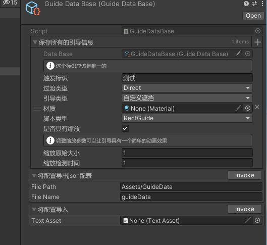
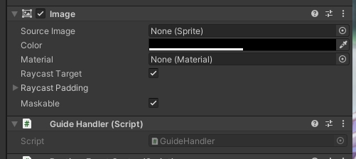

通用性引导系统：

命名空间: using YukiFrameWork.Pilot

在Assets文件夹下右键Create/YukiFrameWork/GuideDataBase创建一套配置如图所示



引导系统设计简单，不同的so配置之间的触发id相同没有影响，只需要确保该配置下的触发id是唯一的即可。

可选择过渡类型

|Transition API|说明|
|---|----|
|Direct|直接将中心设于目标|
|Slow|通过平滑移动过渡到目标位置|

可设置引导类型 框架提供默认的圆形遮罩引导与矩形遮罩引导，可选择自定义遮罩引导，自定义需要做两个事情，在配置中为材质赋值。

其二：自制引导执行基类。

示例如下:

``` csharp

    public class CustomGuide : GuideBase
    {
        ///绘制重写方法
        protected override void OnGuide(RectTransform target,GuideInfo info)
        {
            
        }

        ///可重写的缩放执行方法
        protected override void ScaleExecute(float timer)
        {
            
        }
    }

```

|GuideBase Property API|引导基类说明|
|----|----|
|float width|遮挡长度|
|float height|遮挡宽度|
|Material material|投入使用的材质|
|RectTransform target|引导目标|
|bool IsCompleted|是否已经完成|
|Vector3 Center|遮挡中心|

完成自定义引导类后，在配置中选择相应的类型即可。

为对象添加GuideHandler组件


Image是自带的组件，不可删除，设置好遮挡的颜色以及透明度即可。但请注意，这个Image必须保证是全屏幕覆盖

使用示例如下:

``` csharp
    public class TestScripts : MonoBehaviour
    {
        public GuideDataBase dataBase;
        public RectTransform target;
        void Start()
        {
            GuideHandler handler = GetComponent<GuideHandler>();

            //完成对中枢的初始化
            handler.Init(dataBase,GameObject.Find("Canvas").GetComponent<Canvas>());

            //执行
            handler.OnExecute("传入配置的识别标识",target);
        }
    }
```

|GuideHandler API|引导中枢说明|
|--|--|
|void Init(GuideDataBase dataBase,Canvas root)|初始化|
|bool OnExecute(string eventKey, RectTransform target, bool IsInterruption = false)|执行方法|
|bool IsCurrentCompleted|如果当前有引导，判断是否完成|
|RectTransform CurrentTarget|当前引导的目标|
|Vector3 CurrentCenter|当前引导的镂空中心位置|