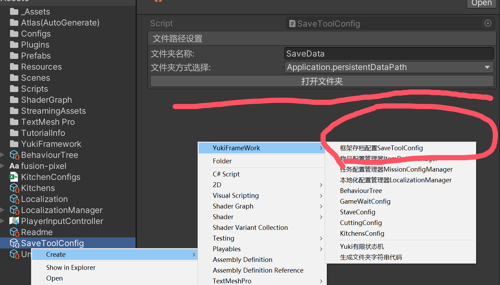

存档工具(SaveTool)使用说明:

在Assets目录下右键创建YukiFrameWork/框架存档配置SaveToolConfig



可选的保存位置:

|Save Folder|保存文件夹|
|--|--|
|persistentDataPath||
|dataPath||
|streamingAssetsPath||
|temporaryCachePath||
|Custom|可自定义文件路径|

``` csharp

using YukiFrameWork.Extension

namespace YukiFrameWork
{	
    ///需要保存的数据类
    [Serializable]
    public class CustomData
    {
        public string name;
        public int index;

        public override string ToString()
        {
            return $"名称:{name} ---- 下标:{index}";
        }
    }
    
    [RuntimeInitializeOnArchitecture(typeof(PointGame),true)]
    public class Player : ViewController
    {      
        public SaveToolConfig config;
        private void Start()
        { 
            SaveTool.Init(config);
            //删除所有的存档信息
            SaveTool.DeleteAllSaveInfo();

            //创建一个存档信息。传递0作为该信息的存档id
            SaveInfo info = SaveTool.CreateSaveInfo(0);

            ///保存为Json文件 
            SaveTool.SaveObjectToJson(new CustomData { name = "lsx" ,index = 3},info);
            ///保存为Xml文件
            SaveTool.SaveObjectToXml(new CustomData { name = "pst" ,index = 7},info);
      
            ///通过Json文件读取数据
            CustomData data1 = SaveTool.LoadObjectFromJson<CustomData>(info);         
            ///通过xml文件读取数据
            CustomData data3 = SaveTool.LoadObjectFromXml<CustomData>(info);          
        }
    }
}

```


|SaveTool static API|存档工具API说明|
|--|--|
|void Init(SaveToolConfig saveToolConfig)|存档工具的初始化方法，需要手动调用传递一个在Assets文件夹下创建的存档配置|
|List< SaveInfo > GetAllSaveInfos< T >(Func<SaveInfo,T> order,bool isDescending = false)|可自定义比较顺序的获取所有的存档信息|
|List< SaveInfo > GetAllSaveInfoByUpdateTime()|根据创建时间排序组合后获取所有的存档信息|
|SaveInfo CreateSaveInfo(int saveId)|根据传递的标识创建一个存档信息|
|SaveInfo GetSaveInfo(int saveID)|通过id获取一个存档信息|
|SaveInfo GetSaveInfo(SaveInfo SaveInfo)|获取相同id的有效存档信息类|
|void DeleteSaveInfo(int saveID)|删除指定id的存档信息|
|void DeleteAllSaveInfo()|删除所有的存档信息|
|void DeleteAll()|删除包括缓存对象在内所有的存档信息|
|void RemoveCache(int saveID, string fileName)|删除指定存档信息下指定的读档缓存对象(需要传入包括后缀的文件名称)|
|void RemoveCache(int saveID)|删除指定存档信息下所有的缓存对象|
|---|Saving|
|void SaveObjectToJson(object saveObject, int saveID = 0)|保存为Json,需要传递存档的信息id 文件名必须为类名可用|
|void SaveObjectToJson(object saveObject, SaveInfo info)|如上重载|
|void SaveObjectToJson(object saveObject, string fileName,int saveID = 0)|保存为Json，需要传递文件名称(不需要填后缀)|
|void SaveObjectToJson(object saveObject, string fileName, SaveInfo info)|如上重载|
|void SaveObjectToXml(object saveObject, int saveID = 0)|保存为Xml 需要传递存档的信息id 文件名必须为类名可用|
|void SaveObjectToXml(object saveObject, SaveInfo info)|如上重载|
|void SaveObjectToXml(object saveObject, string fileName, SaveInfo info)|保存为Xml 需要传递存档的信息id 需要传递文件名称(不需要填后缀)|
|void SaveObjectToXml(object saveObject, string fileName,int saveID = 0)|如上重载|
|---|Loading|
|T SaveObjectToJson(int saveID = 0)|通过Json读取,需要传递存档的信息id 文件名必须为类名可用|
|T SaveObjectToJson(SaveInfo info)|如上重载|
|T SaveObjectToJson(string fileName,int saveID = 0)|通过Json读取，需要传递文件名称(不需要填后缀)|
|T SaveObjectToJson(string fileName, SaveInfo info)|如上重载|
|T SaveObjectToXml(int saveID = 0)|通过Xml读取 需要传递存档的信息id 文件名必须为类名可用|
|T SaveObjectToXml(SaveInfo info)|如上重载|
|T SaveObjectToXml(string fileName, SaveInfo info)|通过Xml读取 需要传递存档的信息id 需要传递文件名称(不需要填后缀)|
|T SaveObjectToXml(string fileName,int saveID = 0)|如上重载|