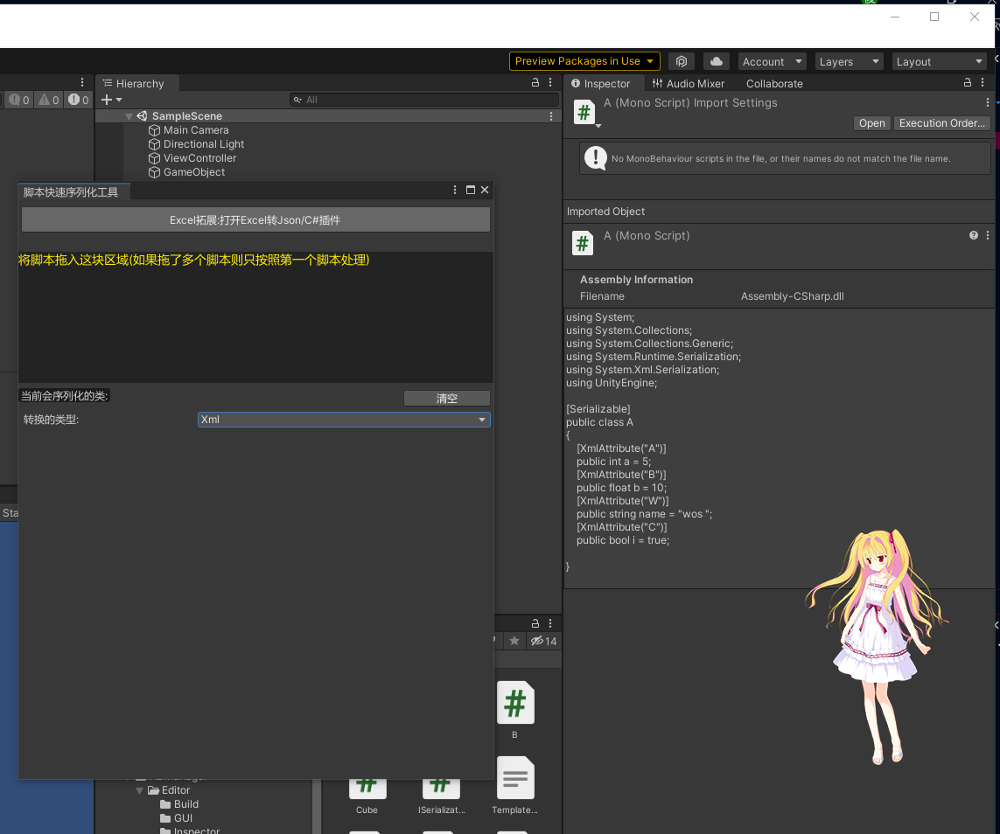
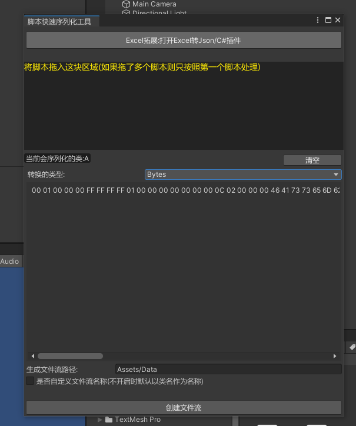
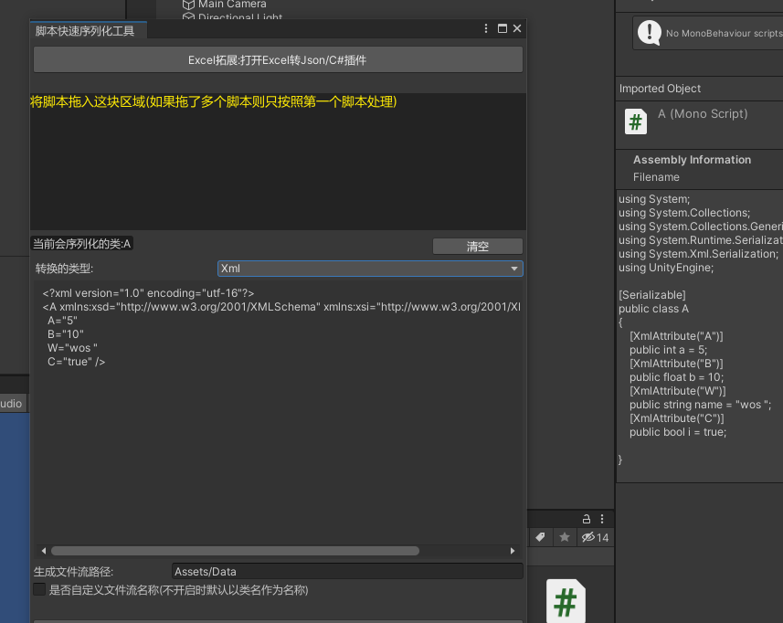
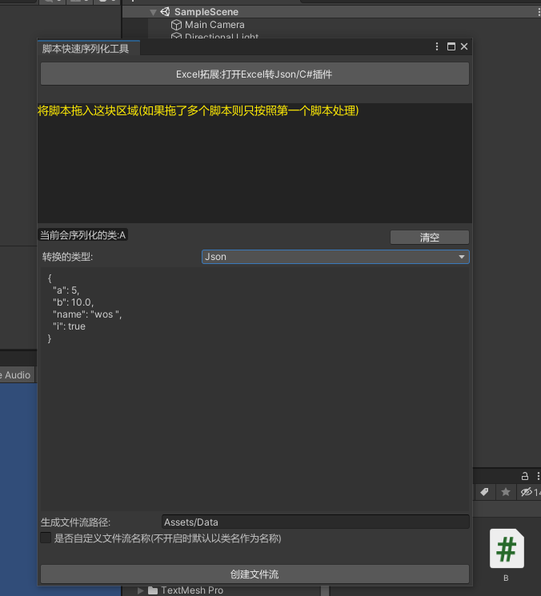
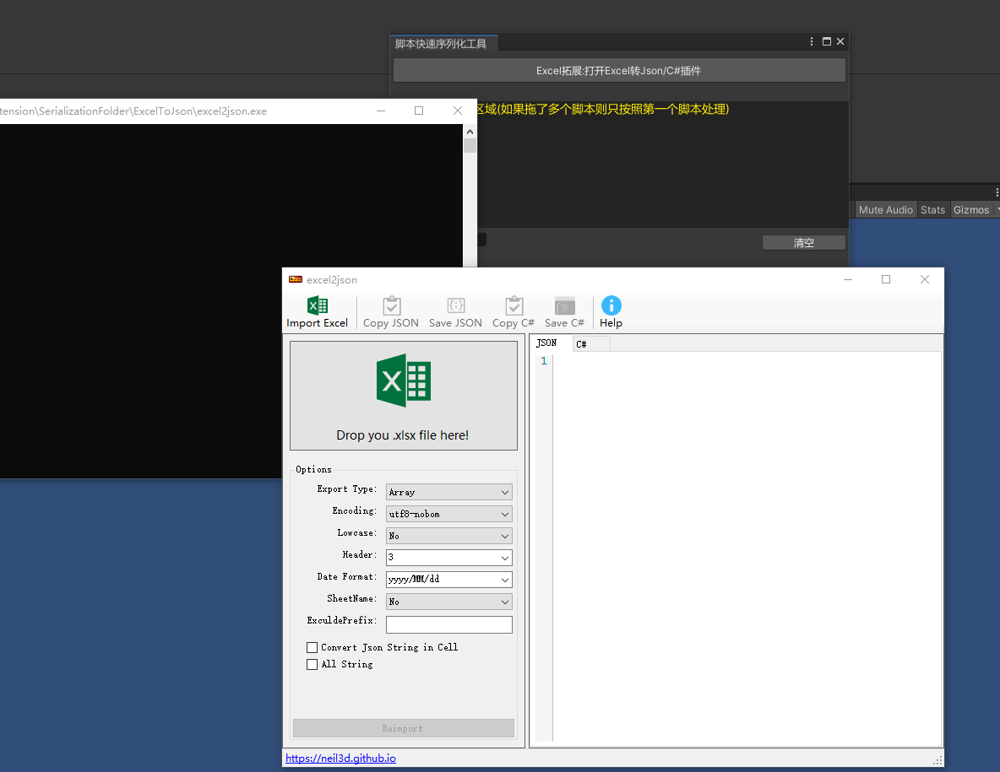

框架序列化工具使用示例:

在ImportWindow导入序列化工具后,打开编辑器如图所示:



在显示区域中拖入脚本文件(注意:类名要与文件一致并且这个类是不派生自UnityEngine.Object的)

序列化预览:







Excel拓展:这里集成的是一个Excel转Json/C#的工具,使用该工具，Excel表最基本规则为保持第一行为名称,第二行为类型,第三行开始做数据配置



反序列化集成API:


```

using YukiFrameWork.Extension

namespace YukiFrameWork
{
	[Serializable]
	public class A
	{
		public int data = 10;
	}
	public class TestScripts
	{
		A a = new A();

		//Json序列化:		
		string jsonText = AssemblyHelper.SerializedObject(value: a);

		//Xml序列化:
		string xmlText = AssemblyHelper.XmlSerializedObject(value: a);

		bytes序列化:
		byte[] bytes = AssemblyHelper.ByteSerializeObject(value: a);

		Json反序列化:
		A a1 = AssemblyHelper.DeserializeObject<A>(jsonText);

		Xml反序列化:
		A a2 =  AssemblyHelper.XmlDeserializeObject(xmlText);

		Bytes反序列化
		A a3 =  AssemblyHelper.ByteDeserializeObject<A>(bytes);
	

	}
}

```


	