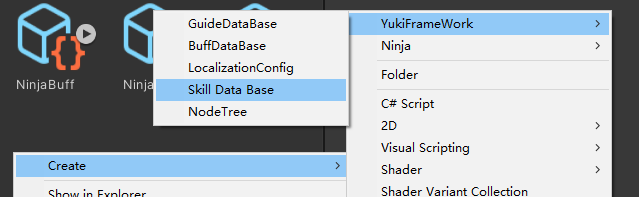
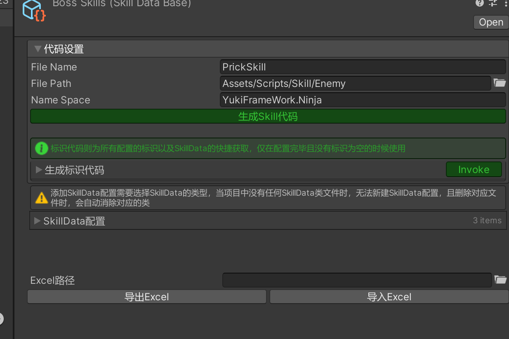
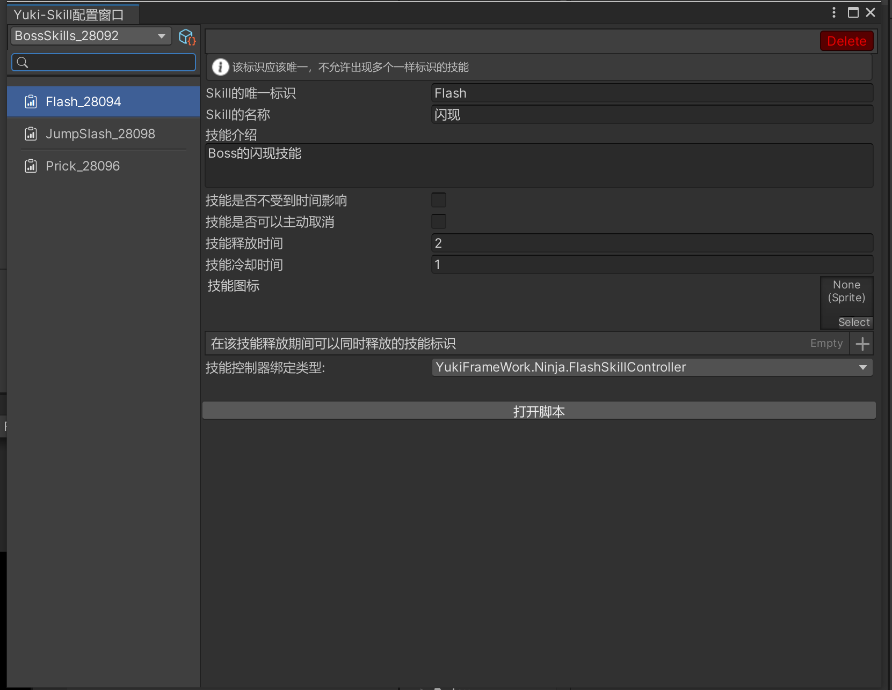
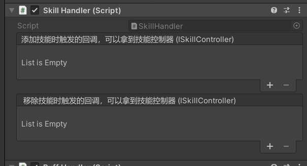

YukiFrameWork技能系统：仅作为纯粹程序逻辑交互的技能系统。

using YukiFrameWork.Skill;

在Assets文件夹下右键创建新的技能配置




通过代码设置生成对应的代码后点击下方的创建新的技能按钮添加一个新的技能即可。例如创建一个技能InvisibleSkill：

``` csharp

using YukiFrameWork.Skill;

public class InvisibleSkill : SkillData
{
    //框架的技能配表仅提供通用性的数据，可自行添加自己需要的配置。
    public int damage;//技能伤害
    public float speed;//技能速度
}
```

创建完成后，双击配置打开配表窗口如下:


左侧菜单右键新建配置即可。

|SkillData Property API|技能配表说明|
|---|---|
|string SkillKey|技能的唯一标识|
|string SkillName|技能的名称|
|string Description|技能介绍|
|Sprite Icon|技能图标|
|bool IsInfiniteTime|技能是否无限时间(没有释放时间的，不受到释放时间影响)|
|bool ActiveCancellation|技能是否可以主动取消释放|
|float RealeaseTime|技能释放时间(当没有开启无限时间时)|
|float CoolDownTime|技能冷却时间|
|bool SkillInterruption|技能是否可以在释放时中途打断|
|string[] SimultaneousSkillKeys|可以同时释放的技能标识|

完成配表后需要有一个专门对这个技能配置搭配的控制器类:
``` csharp

using YukiFrameWork.Skill;

//需要为配表标记该特性，以绑定控制器
[BindSkillController(typeof(InvisibleSkillController))]
public class InvisibleSkill : SkillData
{
    //框架的技能配表仅提供通用性的数据，可自行添加自己需要的配置。
    public int damage;//技能伤害
    public float speed;//技能速度
}

//控制器属于IController层，SkillController基类继承AbstractController，可使用自动化架构特性
[RuntimeInitializeOnArchitecture(typeof(World))]
public class InvisibleSkillController : SkillController
{
    public override void OnAwake()
    {
        //当技能被创建并添加时触发
    }

    public override void OnDestroy()
    {
        //当技能被移除时触发
    }
}

```

|SkillController Property API|技能控制器属性API说明|
|--|--|
|ISkillExecutor Player|释放技能的对象，ISkillExecutor为技能释放者接口|
|SkillHandler Handler |技能的运行周期类(控制中枢)|
|Action(float) onCooling|当技能正在冷却时持续触发的回调|
|Action(float) onReleasing|当技能正在释放中持续触发的回调|
|Action onCoolingComplete|当技能冷却结束时触发的回调|
|Action onReleaseComplete|当技能释放结束时触发的回调|
|ISkillData SkillData|技能配表|
|bool IsSkillRelease|技能是否正在释放|
|float ReleasingTime|技能已经释放的时间|
|float ReleasingProgress|当前技能释放进度(0-1)|
|bool IsSkillCoolDown|是否冷却完成?|
|float CoolDownTime|已经冷却的时间|
|float CoolDownProgress|冷却进度(0,1)|

|SkillController Method API|技能控制器生命周期方法API说明|
|---|---|
|bool IsCanRelease()|是否可以释放技能，当返回False时，技能无法释放|
|bool IsComplete()|判断技能是否释放完成，默认是返回True的，代表可以直接结束。当技能不受到释放时间影响时，需要自己重写逻辑|
|void OnAwake()|当技能首次添加创建的时候调用|
|void OnRelease(params object[] param)|当技能释放的时候调用一次|
|void OnReleaseComplete()|当技能释放完成时调用|
|void OnInterruption()|当技能被打断触发|
|void OnUpdate()|仅技能释放时持续触发|
|void OnFixedUpdate()|仅技能释放时持续触发|
|void OnLateUpdate()|仅技能释放时持续触发|
|void OnCooling()|当技能冷却时持续触发|
|void OnCoolingComplete()|当技能冷却结束时触发|
|void OnDestroy()|当技能销毁触发|

|ISkillExecutor API|技能释放者接口API|
|SkillHandler Handler|技能中枢属性|
|bool IsCanRelease()|全局的是否可以释放技能API，当执行者的IsCanRelease为False时，什么技能都无法释放|


完成控制器与配表搭建后，为游戏对象添加SkillHandler组件


对Skill进行全局的初始化:

使用架构示例示范:
[如对架构不了解可点击跳转](https://gitee.com/NikaidoShinku/YukiFrameWork/blob/master/YukiFrameWork/Framework/2.Architecture.md)

``` csharp
//获取SkillKit进行对技能的全局初始化
public class World : Architecture<World>
{
    public override void OnInit()
    {
        //初始化，这里的配置需要与框架内置XFABManager插件保持一致，或自行传入技能加载器。如下
        SkillKit.Init(projectName:"");

        //自定义加载器:SkillKit.Init(new CustomLoader());

        //加载配置:SkillKit.LoadSkillDataBase(path:"");//根据加载方式决定的路径传入
    }

    public class CustomLoader : ISkillLoader
    {
        public SkillDataBase Load(string path)
        {
            return Resources.Load<SkillDataBase>(path);
        }

        public void LoadAsync(string path, Action<SkillDataBase> onCompleted)
        {
            var operation = Resources.LoadAsync<SkillDataBase>(path);

            operation.completed += v => onCompleted?.Invoke(operation.asset as SkillDataBase);
        }
    }
}
```

|SkillKit API|技能套件全局API|
|-|-|
|void Init()|初始化方法|
|void LoadSkillDataBase|加载so配表方法|
|void AddSkill(ISkillData skill)|单独添加某一个技能配置|
|void BindController(string SkillKey)|绑定控制器方法(泛型)，如果没有绑定特性则需要调用这个方法|
|ISkillData GetSkillDataByKey(string skillKey)|通过标识得到某一个技能配置|
|IEnumerator LoadSkillDataBaseAsync(string path)|异步加载so配表|

//为玩家脚本添加ISkillExecutor接口，标识为技能释放者

``` csharp

using YukiFrameWork.Skill;

public class Player : ViewController,ISkillExecutor
{
    private SkillHandler handler;
    public SkillHandler Handler => handler;

    public bool IsCanRelease()
    {
        return true;
    }

    void Awake()
    {
        handler = GetComponent<SkillHandler>();
        //添加技能
        handler.AddSkills(this,"Invisible");
        //释放技能
        handler.ReleaseSkill("Invisible")
    }

    void Start()
    {
        
    }
}
```

|SkillHandler Method API|技能释放周期中枢 API|
|-|-|
|UnityEvent(ISkillController) onAddSkillEvent|当技能添加时触发|
|UnityEvent(ISkillController) onRemoveSkillEvent|当技能移除时触发|
|void AddSkills(ISkillExecutor player,params string[] skillKeys)|添加多个技能|
|ISkillController AddSkill(ISkillExecutor player, ISkillData skill)|添加指定的技能，返回对应的技能控制器|
|ISkillController GetSkillController(string skillKey)|通过标识获得某一个已经添加的技能|
|ReleaseSkillStatus ReleaseSkill(string skillKey, params object[] param)|释放技能，可传递参数，返回技能的释放结果|
|void RemoveSkill(string skillKey)|移除某一个技能|
|void RemoveAllSkills()|移除所有的技能|
|void ResetSkillCoolingTime(string skillKey)|重置指定技能的冷却时间|
|void ResetSkillReleasingTime(string skillKey)|重置指定技能的释放时间|
|void CancelSkill(string skillKey)|取消某一个技能的释放|
|void InterruptionAllSkills()|打断所有技能的释放|
|bool IsReleasingSkill|该角色是否正在释放技能|
|void InterruptionSkill(string skillKey)|打断指定技能的释放|
|ISkillController[] GetAllSkillControllers()|获取所有的技能控制器|