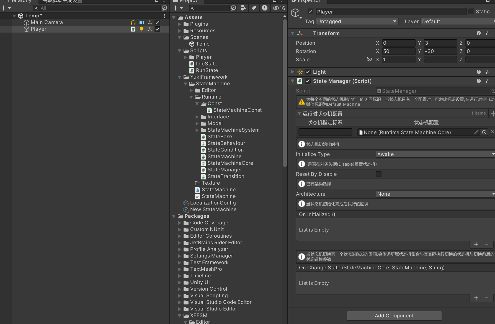
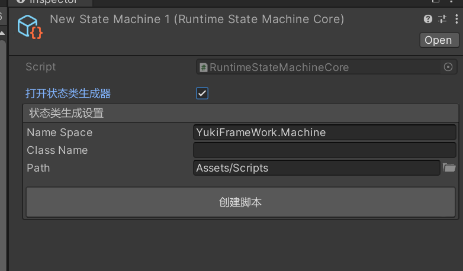
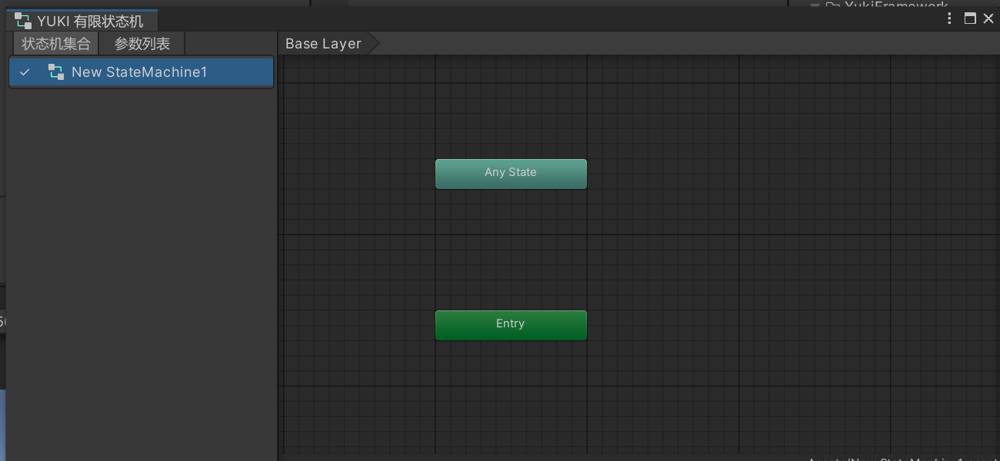
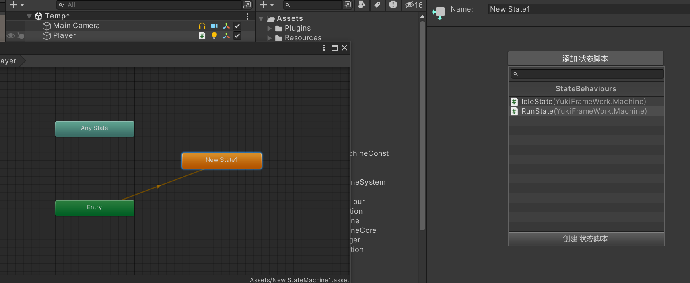
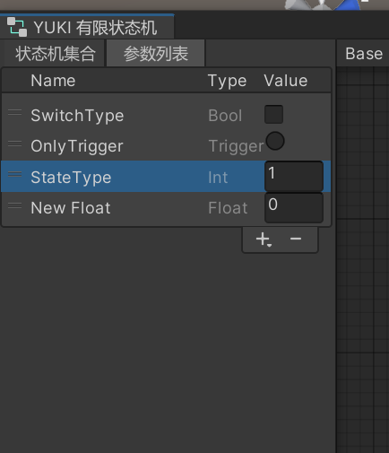
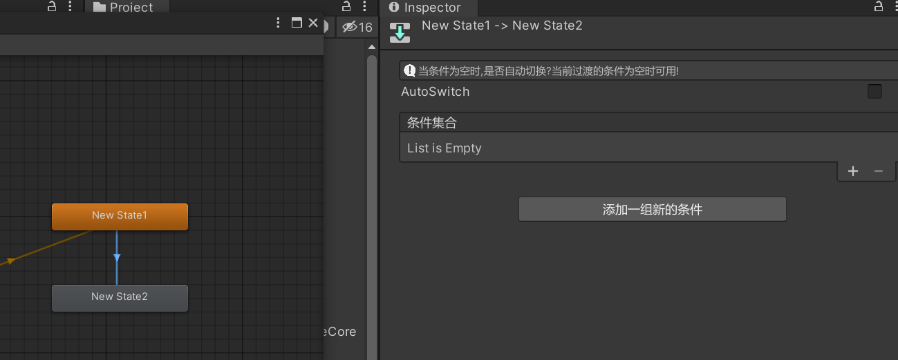

YukiFrameWork 定制流程状态机: 可以使用该状态机完成对状态的控制。以及流程逻辑的设计。

命名空间: using YukiFrameWork.Machine;

在场景中新建对象，并为对象挂载StateManager脚本如下:



如图所示，需要为StateManager组件添加RuntimeStateMachineCore状态机配置文件

在Assets文件夹下，右键Create/YukiFrameWork/Yuki有限状态机新建一个状态机配置如下:

 双击该配置打开状态机窗口：



左侧状态机集合会显示当前的状态机配置，在Runtime中，选中带有StateManager组件的对象，当对象拥有复数状态机配置时，会一并在这里显示。

在状态窗口中右键新建状态如图所示:



状态非常简单，只有名称与对应的添加状态脚本功能，在这里可以创建或者添加状态脚本，也可以在上方图中配置的Inspector中进行创建(那个代码生成器更精确)：

在左侧的窗口中打开参数列表，示例如图:



为两个状态之间添加过渡!




对于过渡的条件判断，当一组集合全部满足时，状态会进行过渡，也可以添加多个条件组，当有复数条件组时，有一个组满足条件则都会正常过渡。

状态脚本设计:StateBehaviour 状态类都需要继承这个基类如下: StateBahviour是与框架架构所关联，属于Controller层级！

``` csharp

using YukiFrameWork.Machine;

public class IdleState : StateBehaviour
{
    //ToDo
}

```

|StateBehaviourAPI|状态执行基类API说明|
|---|---|
|Property API|属性API|
|StateMachine StateMachine { get; }|获取该状态所在的状态机|
|Transform transform { get; }|获取该状态所关联的游戏对象的Transform|
|StateBase CurrentStateInfo { get; }|这个状态的信息(基类本身)|
|Type Type { get; }|这个状态类的真实类型(缓存GetType用)|
|StateBase LastState { get; }|仅当状态进入时有值|
|StateBase NextState { get; }|仅当状态退出时有值|
|--|--|
|Mathod API|方法API|
|void OnInit()|当状态初始化(与组件的初始化时机选择挂钩)|
|void OnEnter()|当状态进入|
|void OnExit()|当状态退出|
|void Update()|当状态更新|
|void FixedUpdate|当状态间隔更新|
|void LateUpdate|当状态晚于更新|
|对下列StateMachineCore类中参数API拓展封装|--- 如void SetFloat(string name)|

对于配置RuntimeStateMachineCore类，在运行时会被转换为StateMachineCore类。作为状态机集合本体类使用。保存这个配置下所有的状态机

|StateMachineCore API|状态机集合本体API说明|
|---|---|
|Property API|属性API|
|bool IsActive { get; }|这个状态机集合本体是否激活|
|StateManager StateManager { get; }|这个集合所在的StateManager|
|Action onStateMachineStarted|当这个本体启动时触发的回调|
|---|---|
|Method API|方法API说明|
|void Start()|启动运行状态机集合|
|StateBase GetCurrentStateInfo()|获取当前正在运行的状态信息(这个方法下会精确到子状态机的状态信息)|
|StateBase GetCurrentMachineStateInfo(string name)|获取指定状态机下的运行状态信息|
|void Cancel()|关闭这个状态机集合|
|StateParameterData GetStateParameterData(string parameterName)|根据名称获取到指定的参数信息|
|StateMachine GetRuntimeMachine(string machineName)|根据状态机名称获取到指定的状态机。默认层的状态机名称为:"Base Layer"|
|---|---|
|Parameter API|参数设置API|
|void SetBool(string name, bool value)|--|
|void SetBool(int nameToHash,bool value)|--|
|void SetFloat(string name,float value)|--|
|void SetFloat(int nameToHash,float value)|--|
|void SetInt(string name,int value)|--|
|void SetInt(int nameToHash,int value)|--|
|void SetTrigger(string name)|--|
|void SetTrigger(int nameToHash)|--|
|void ResetTrigger(string name)|重置Trigger|
|void ResetTrigger(int nameToHash)|如上|
|bool GetBool(string name)|--|
|bool GetBool(int nameToHash)|--|
|float GetFloat(string name)|--|
|float GetFloat(int nameToHash)|--|
|int GetInt(string name)|--|
|int GetInt(int nameToHash)|--|
|bool GetTrigger(string name)|--|
|bool GetTrigger(int nameToHash)|--|

Tip：对于上述参数API 名称会被转换为Hash，可用StateManager.HashToString进行转换。

在StateMachineCore会保存所有的状态机(默认层以及所有的子状态机)StateMachine类

|StateMachine API|状态机API说明|
|--|--|
|Property API|属性API说明|
|StateMachine Parent { get; }|如果是子状态机，则会有与之关联的父状态机。BaseLayer层的状态机Parent恒定为空|
|StateMachineCore StateMachineCore { get; }|状态机集合本体|
|StateBase GetState(string name)|根据状态名称查找到指定的状态基类|
|StateMachine GetChildMachine(string machineName)|查找这个状态机下指定的子状态机|
|StateBase CurrentState { get; }|当前这个状态机的运行状态|
|StateMachine CurrentChildMachine { get; }|如果状态被标记为状态机，则该值不为空|
|StateBase DefaultState { get; }|这个状态机的默认状态|
|StateBase GetCurrentStateInfo()|当CurrentState不是子状态机，则等同于CurrentState属性，否则精确定位到子状态机的具体状态|
|StateTransition CurrentTransition { get; }|当前这个状态机成功切换状态的条件过渡|

对于挂载组件StateManager，API如下:

|StateManager API|状态机管理组件API|
|--|--|
|UnityEvent onInitialized|当状态机初始化完成后调用|
|UnityEvent<StateMachineCore,StateMachine, string>|当状态机切换状态后调用.会传递状态机集合类与状态机类以及切换状态的名称|
|StateMachineCore DefaultStateMachineCore { get; }|当状态机配置仅存一个时，运行时获取到这个默认的状态机集合|
|bool IsInitialized { get; }|状态机管理器是否已经初始化完成|
|StateBase GetCurrentStateInfo(string layerName)|根据唯一标识获取状态机集合本体后查找当前运行状态信息|
|StateMachineCore GetRuntimeMachineCore(string layerName)|根据唯一标识获取指定的运行时状态机集合|
|void ForEach(Action< StateMachineCore > each)|遍历所有的状态机集合(StateManager实现IEnumerable方法，可直接foreach)|
|---|---|
|static Method API|状态机管理器静态API|
|int StringToHash(string event_name)|将名称转换为哈希值|
|StateManager StartMachine(string machineName,RuntimeStateMachineCore stateMachineCore,Type archectureType = default)|启动一个不进行StateManager组件挂载的状态机并返回|
|StateManager GetGlobalStateManager(string machineName)|获取一个通过StartMachine方法启动的状态机管理器|
|bool RemoveMachine(string machineName)|根据StartMachine方法创建的状态机名称进行对全局状态机的移除|
|--|StateManager也可进行参数的设置|
|void SetBool(StateMachineCore stateMachineCore,int nameToHash,bool value)|--|
|void SetFloat(StateMachineCore stateMachineCore,string name,float value)|--|
|void SetFloat(StateMachineCore stateMachineCore,int nameToHash,float value)|--|
|void SetInt(StateMachineCore stateMachineCore,string name,int value)|--|
|void SetInt(StateMachineCore stateMachineCore,int nameToHash,int value)|--|
|void SetTrigger(StateMachineCore stateMachineCore,string name)|--|
|void SetTrigger(StateMachineCore stateMachineCore,int nameToHash)|--|
|void ResetTrigger(StateMachineCore stateMachineCore,string name)|重置Trigger|
|void ResetTrigger(StateMachineCore stateMachineCore,int nameToHash)|如上|
|bool GetBool(StateMachineCore stateMachineCore,string name)|--|
|bool GetBool(StateMachineCore stateMachineCore,int nameToHash)|--|
|float GetFloat(StateMachineCore stateMachineCore,string name)|--|
|float GetFloat(StateMachineCore stateMachineCore,int nameToHash)|--|
|int GetInt(StateMachineCore stateMachineCore,string name)|--|
|int GetInt(StateMachineCore stateMachineCore,int nameToHash)|--|
|bool GetTrigger(StateMachineCore stateMachineCore,string name)|--|
|bool GetTrigger(StateMachineCore stateMachineCore,int nameToHash)|--|

