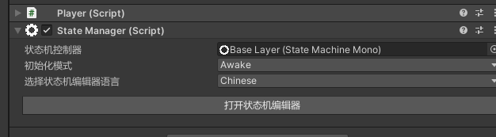
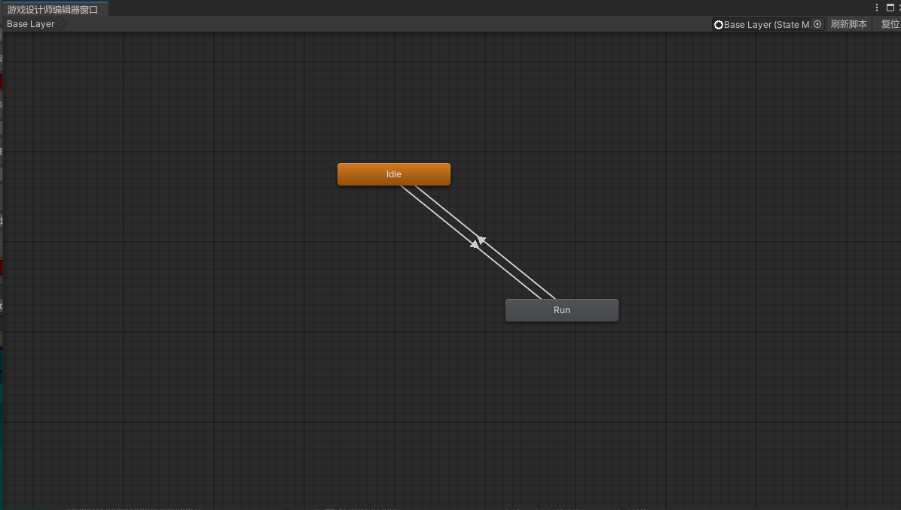
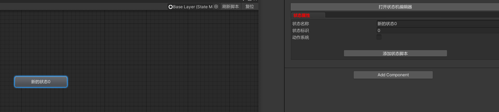
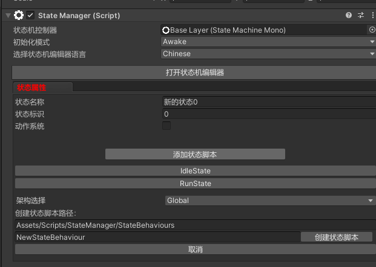
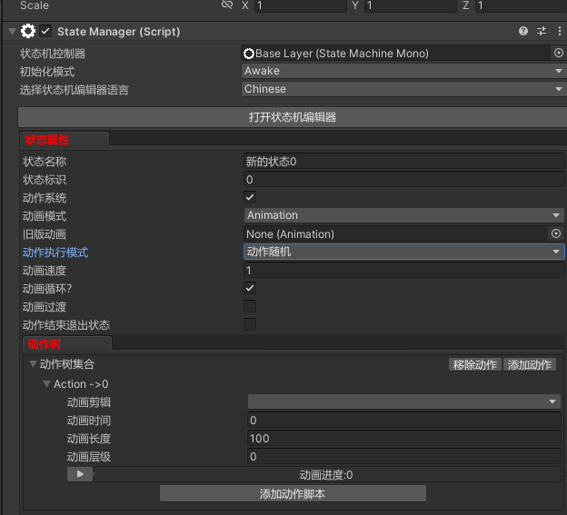
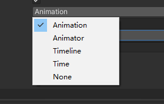
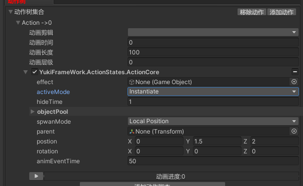
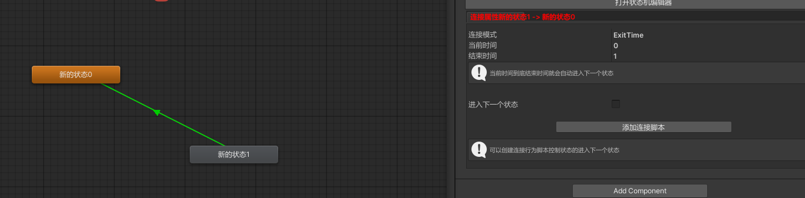

专为动作游戏设计打造的动作状态机且包含纯逻辑状态机所有的功能：StateManager

鸣谢: GameDesigner双端框架作者：冷月 特殊定制状态机。

命名空间: using YukiFrameWork.ActionStates;

为对象添加StateManager组件:



打开状态机编辑器，自由创建状态，示例如图所示：



状态介绍:

打开挂载对象的Inspector面板，选中任意一个状态如图所示:



点击添加状态脚本如下所示:



可以自行创建脚本以及添加现有脚本，架构选择对应框架的架构本体，包括状态类在内，下方所介绍的过渡类以及动作类都具有此功能，归属IController层。

打开动作系统：





可以选择如上组件设置，动作执行模式有:动作随机，动作控制，动作顺序，当只有一个动作时，三者没有任何区别。

可添加动作脚本，框架自带默认的脚本ActionCore作为动作技能特效释放脚本可使用如图所示：



|StateBehaviour Override Method API|生命周期说明|
|---|---|
|OnInit()|状态初始化方法，这个调用由StateManager决定|
|OnEnter()|状态进入方法|
|OnUpdate()|状态每帧更新|
|OnFixedUpdate()|状态间隔更新|
|OnLateUpdate()|状态晚于更新|
|OnExit()|状态退出方法|
|OnStop()|当停止动作 : 当动作不使用动画循环时, 动画时间到达100%后调用状态|
|OnActionExit()|当动作处于循环模式时, 子动作动画每次结束都会调用一次|
|OnDestroy()|当脚本组件(非Mono)被销毁时调用|

|StateBehaviour Method API|说明|
|--|--|
|状态切换说明|使用这三个API是不需要过渡线的|
|EnterState(int stateID, int actionId = 0)|进入下一个状态, 如果状态正在播放就不做任何处理, 如果想让动作立即播放可以使用 OnEnterNextState 方法|
|OnEnterNextState(int stateID, int actionId = 0)|当进入下一个状态, 你也可以立即进入当前播放的状态, 如果不想进入当前播放的状态, 使用EnterState方法|
|ChangeState(int stateId, int actionId = 0, bool force = false)|切换状态，可以强制进行状态的切换|

|StateBehaviour Property API|说明|
|---|---|
|Transform transform|当前状态机挂载在物体的父转换对象|
|Type Type|拿到这个状态类的完全类型|
|State state|得到这个状态类所绑定的状态|

|State Method API|状态数据常用API说明|
|---|---|
|说明|除编辑器添加脚本以外，支持动态添加|
|T AddComponent<T>(T component) where T : BehaviourBase|添加组件|
|T GetComponent<T>(T component) where T : BehaviourBase|获取组件|

``` csharp

//脚本示例:

using YukiFrameWork.ActionStates;
using UnityEngine;
namespace YukiFrameWork.Example
{
	[RuntimeInitializeOnArchitecture(typeof(Global),true)]
	public class IdleState : StateBehaviour
	{
		private Player player;
		public override void OnInit()
		{			
			player = transform.GetComponent<Player>();
			Debug.Log("当状态初始化");
		}
		public override void OnEnter()
		{
			Debug.Log("当进入状态");
		}		
        public override void OnExit()
		{
			Debug.Log("当退出状态");
		}
		public override void OnStop()
		{
			Debug.Log("当停止动作 : 当动作不使用动画循环时, 动画时间到达100%后调用状态");;
		}
		public override void OnActionExit()
		{
			Debug.Log("当动作处于循环模式时, 子动作动画每次结束都会调用一次");
		}

        public override void OnDestroy()
        {
            base.OnDestroy();
        }

    }
}

```

过渡介绍:



过渡可选择代码控制与退出时间(Exit Time)控制，如果为Time，则到达指定时间后自动过渡到下一个状态。

可添加过渡连线的脚本。操作方式如上所示

|TransitionBehaviour Override Method API|生命周期说明|
|---|---|
|更新说明|需要将isEnterNextState返回True，则判定为需要过渡|
|OnUpdate(ref bool isEnterNextState)|过渡每帧更新|
|OnFixedUpdate(ref bool isEnterNextState)|过渡间隔更新|
|OnLateUpdate(ref bool isEnterNextState)|过渡晚于更新|

|TransitionBehaviour Property API|生命周期说明|
|---|---|
|Transition Transition|过渡的数据|

|Transition Property API|过渡数据常用API说明|
|---|---|
|State CurrState|当前状态|
|State NextState|下一个状态|

``` csharp
using YukiFrameWork.ActionStates;
using UnityEngine;
public class RunToIdle : TransitionBehaviour
{
	
       public override void OnInit()
       {
            base.OnInit();
		    
       }

       public override void OnUpdate(ref bool isEnterNextState)
       {
		
       }
   }
```

动作介绍：

|ActionBehaviour Override Method API|生命周期说明|
|---|---|
|补充|StateAction为动作状态数据|
|OnEnter(StateAction action)|当进入状态|
|OnUpdate(StateAction action|当状态更新|
|OnFixedUpdate(StateAction action)|当状态间隔更新|
|OnLateUpdate(StateAction action)|当动作晚于更新|
|OnExit(StateAction action)|当退出状态|
|OnStop(StateAction action)|当停止动作 : 当动作不使用动画循环时, 动画时间到达100%后调用|

框架内置ActionCoreBase:

|ActionCoreBase(ActionCore技能特效组件也派生于该脚本)|动作行为---用户添加的组件介绍|
|---|---|
|Override API|说明|
|OnAnimationEvent(StateAction action)|当动画事件触发执行|

自定义示例:

``` csharp 
 public class CustomActionCore : ActionBehaviour
 {
     public override void OnEnter(StateAction action)
     {
         base.OnEnter(action);
     }

     public override void OnExit(StateAction action)
     {
         base.OnExit(action);
     }

     public override void OnUpdate(StateAction action)
     {
         base.OnUpdate(action);
     }

     public override void OnDestroy()
     {
         base.OnDestroy();
     }

     public override void OnStop(StateAction action)
     {
         base.OnStop(action);
     }
 }
```


