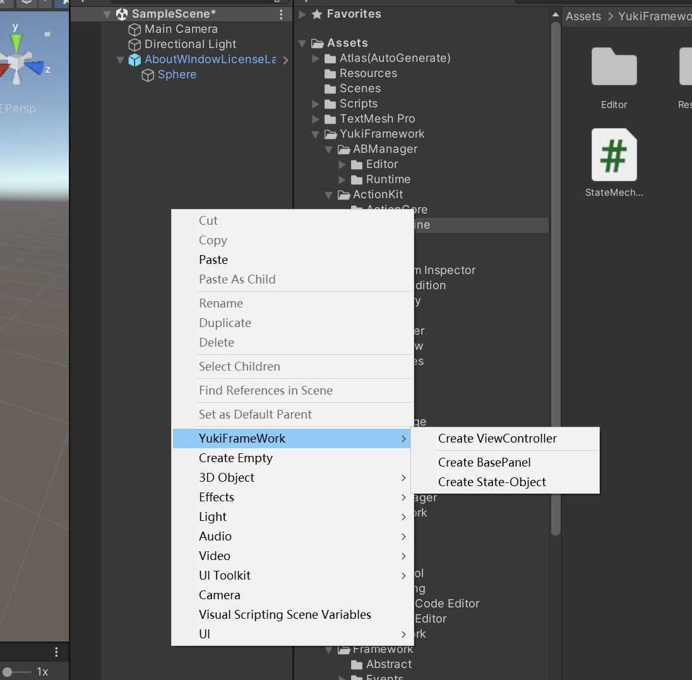
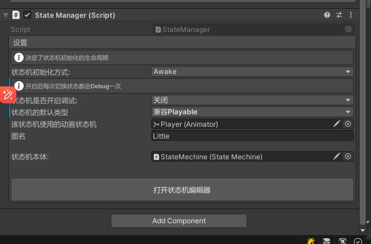
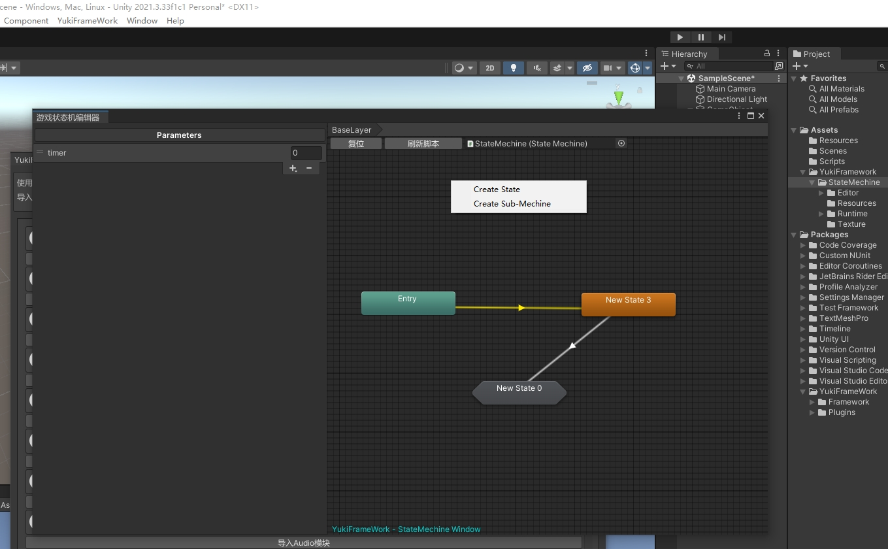
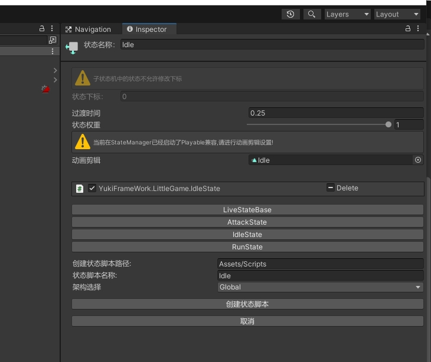
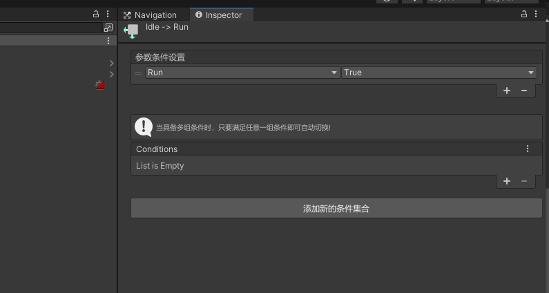

状态机模块：using YukiFrameWork.States;

编辑器设置如图所示:







状态机支持创建子状态机，子状态机的下标会与在BaseLayer的进入状态保持一致，而后子状态机嵌套下标仍一致，所有的状态命名都应该保持唯一!
创建状态脚本之后可以在这里进行添加，脚本基类StateBehaviour,

只要是继承StateBehaviour的脚本都会在编辑器显示并支持添加。


过渡条件选择类型：Int,Float,Bool 状态支持在不连线的情况下强制进行切换,条件过渡支持多组条件同时响应，当有一组条件满足则过渡

条件API:
``` csharp
        //通过下标切换，该API会对在BaseLayer的状态进行强制切换，无论当前处于哪一个子状态机都会强制切换，每当BasyLayer中的状态条件满足或者被强制切换时，所有当前被执行的子状态机都会退出
        - void OnChangeState(int index);

        //通过名称切换，该API会首先查找当前运行的状态层级中是否存在指定的状态，如果找不到，则判断当前运行的状态是否是子状态机父节点，如果是则查找该子状态机中有没有指定的状态
        - void OnChangeState(string name);
    
        - void OnTransitionEnter(float velocity,bool completed);//进入状态时的过渡，晚于OnEnter

        - void OnTransitionExit(float velocity,bool completed);//退出状态时的过渡、晚于OnExit 

        ///过渡连线的参数设置以及获取，满足条件切换状态

        - void SetInt(string name, int v);
        - int GetInt(string name) 

        - void SetFloat(string name, float v);
        - float GetFloat(string name);

        - void SetBool(string name, bool v);
        - bool GetBool(string name);

        - void SetTrigger(string name);
        - void ResetTrigger(string name);

生命周期API:

        - OnInit();//状态初始化方法，在StateManager中选择初始化的时机

        - OnEnter();

        - OnUpdate(); 

        - OnFixedUpdate();

        - OnExit();
```        
进入状态时可传入回调退出时会自动调用，脚本使用方式如下：

``` csharp
    [SerializedState]
    [RuntimeInitializeOnArchitecture(typeof(PointGame),true)]//状态机属于IController层级，可以使用该特性标记架构的自动化
    public class IdleState : StateBehaviour
    {
        public override void OnInit()
        {
            //生命周期初始化方法
        }  
    }
```
序列化特性：SerializedState 给状态类标记该特性后可以在inspector面板序列化public的字段以及数据,包括基本的数组跟列表：
```
    
```
标记序列化后隐藏公开字段:HideField(标记于字段即可) 注意:对于数组以及列表的序列化，必须要在编译时进行初始化，例如 int[] number = new int[10];