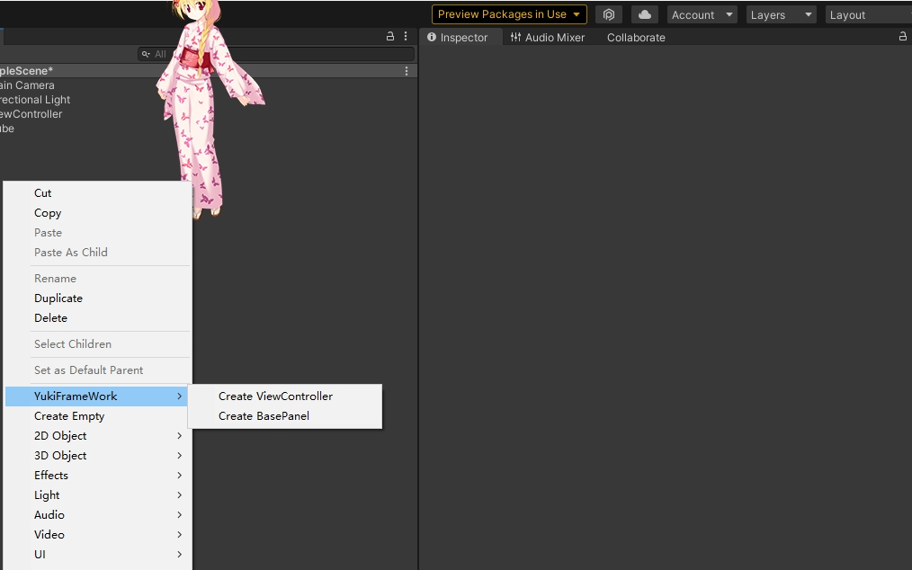

UI模块：using YukiFrameWork.UI;

创建BasePanel的操作如图所示:




注意:一键创建面板的撤销功能仅在2021以上可用!

UI面板类集成了字段绑定功能,详情移动到[ViewController字段绑定](https://gitee.com/NikaidoShinku/YukiFrameWork/blob/master/YukiFrameWork/Framework/ViewController绑定字段.md)查看

面板拥有OnEnter，OnPause，OnResume，OnExit生命周期，实现面板的流程控制

面板拥有UIAutoMation特性,标记该特性后的派生自UnityEngine.Component字段(属性)均在通过UIKit打开面板之后会自动注入(注意：必须是该面板的子物体组件或者自身组件)

API：[UIAutoMation]   [UIAutoMation("name")] // 当标记GameObject的名称后会直接检索对应的物体组件，如果没有找到则返回空
```
using UnityEngine.UI;
public partial class MainPanel : BasePanel
{
     [UIAutoMation]
     private Button btn;

     public override void Init()
     {
         base.Init();       
         Debug.Log(btn);
     }

     public override void OnEnter()
     {
         base.OnEnter();         
     }

     public override void OnPause()
     {
         base.OnPause();
     }

     public override void OnResume()
     {
         base.OnResume();
     }

     public override void OnExit()
     {
         base.OnExit();
     }
}
在编辑器下手动设置面板的层级，框架提供的UI层级如下：
//UI的层级等级划分
    public enum UILevel
    {
        //背景层
        BG = 0,
        //底层
        Buttom,
        //普通层
        Common,
        //动画层
        Animation,
        //弹出层
        Pop,
        //常驻数据层
        Const,
        //前置层
        Forward,
        //系统层
        System,
        //最顶层
        Top
    }
```
由UIKit统一管理
```
public class TestScripts : MonoBehaviour
{
    private void Start()
    {
        //UI套件初始化方式 注意：UI套件是由框架的ABManager资源管理模块进行加载，在进行UIkit的初始化之前必须要对模块资源进行准备，详情打开文档4--资源管理套件
        //默认画布名称为Canvas,当自行设定绑定的画布时需要传入该画布的名称,这个决定了最后UI面板是不是统一在这个画布下管理
        UIKit.Init(projectName:"UIModule",canvasName:"Canvas"); 
        
        //下方面板的弹出API传入的参数均为面板名称       

        //同步打开面板()
        UIKit.OpenPanel<MainPanel>("MainPanel");

        //异步打开面板(如果使用Resources则不需要填写路径后缀名)
        UIKit.OpenPanelAsync<MainPanel>("MainPanel",panel => {});

        //弹出对应层级堆栈上最前置的面板
        UIKit.ClosePanel(UILevel.Common);

        //获得某一个已经被加载到场景的面板(需要通过层级进行获取,只要在层级之内已经被加载出来的都可以获取得到)
        var panel = UIKit.GetPanel<MainPanel>(UILevel.Common);

        //获得某一个面板(如果是已经加载过的面板那么直接获得，如果这个面板从没加载过那么会加载出来并将其处于关闭状态)
        var panel = UIKit.GetPanel<MainPanel>("MainPanel");

        //在我们退出游戏时要释放所有加载过的面板(在关闭运行时会自动释放)
        UIKit.Release();

        //自定义加载接口：IUIConfigLoader
        Tip:如果想自定义UIKit的加载方式则创建自定义加载类并继承IUIConfigLoader如下 在调用Init方法时传入即可：UIKit.Init(new CustomUILoaderConfig());
    }

    public class CustomUILoaderConfig : IUIConfigLoader
    {
        public T Load<T>(string name) where T : BasePanel
        {
            return Resources.Load<T>(name);
        }

        public void LoadAsync<T>(string name, Action<T> onCompleted) where T : BasePanel
        {
            var result = Resources.LoadAsync<T>(name);

            result.completed += opertaion =>
            {
                if (opertaion.isDone)
                    onCompleted?.Invoke(result.asset as T);
            };
        }

        
    }
}
```

