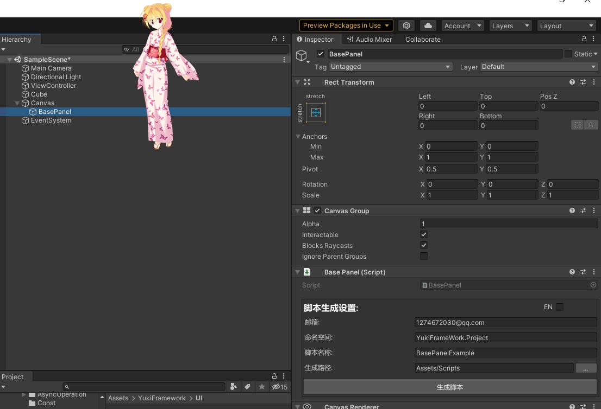
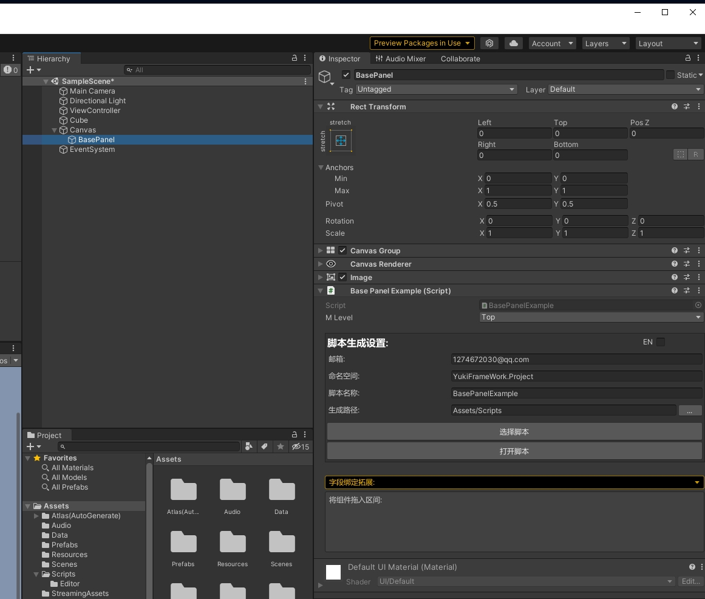
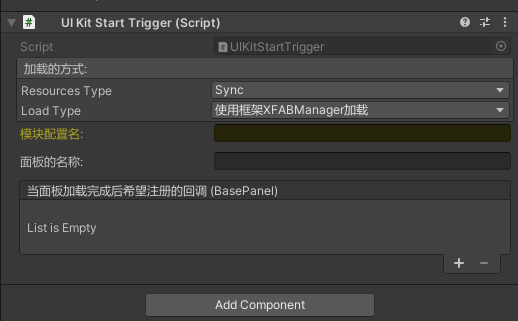

UI模块：using YukiFrameWork.UI;

BasePanel的操作如图所示:

场景视图下右键YukiFrameWork/Add Framework UIRoot添加框架的画布组件

添加组件BasePanel




UI面板类集成了字段绑定功能,详情移动到[ViewController字段绑定](https://gitee.com/NikaidoShinku/YukiFrameWork/blob/master/YukiFrameWork/Framework/ViewController绑定字段.md)查看

|UIKit static API|UIKit全局API说明|
|---|---|
|void Init(string projectName)|UI模块初始化方法,模块使用框架资源管理插件ABManager加载|
|void Init(IUIConfigLoader loader)|UI模块初始化方法,传入自定义的UI加载模块|
|T ShowPanel< T >(params object[] param) where T : BasePanel, IPanel|打开临时面板，此处打开的面板必须是位于UIRoot下PrefabRoot层级下面的面板，而非动态加载面板|
|T HidePanel< T >() where T : BasePanel, IPanel|关闭临时面板,此处关闭的面板必须是位于UIRoot下PrefabRoot层级下面的面板，而非动态加载面板|
|void SetCanvasReferenceResolution(float x, float y)|设置画布分辨率|
|void SetCanvasReferenceResolution(Vector2 resolution)|如上重载|
|T OpenPanel< T >(string name = "", params object[] param) where T : BasePanel|打开面板(传递以加载器加载方式的名称(路径))|
|T OpenPanel< T > (string name,UILevel level,params object[] param) where T : BasePanel|打开面板并可以动态设置层级(不会修改原生预制体资源)|
|T OpenPanel< T >(T panel, params object[] param) where T : BasePanel|外部传递Prefab进行面板加载|
|void OpenPanelAsync< T >(string name,Action< T > onCompleted, params object[] param) where T : BasePanel|回调式异步打开面板(与OpenPanel相同，拥有动态修改层级的重载)|
|UILoadAssetRequest OpenPanelAsync< T >(string name = "", params object[] param) where T : BasePanel|可返回指令的异步打开面板(与OpenPanel相同，拥有动态修改层级的重载)|
|void ClosePanel(string name)|传递名称(路径)关闭指定的面板 如果面板类型为Multiple且场景中打开了多个，会一次性全部关闭|
|void ClosePanel< T >() where T : class, IPanel|关闭相应类型的面板,如果面板类型为Multiple且场景中打开了多个，会一次性全部关闭|
|void ClosePanel(IPanel panel)|指定关闭的面板,适合在面板类型为Multiple时使用，这样不会出现一次性全部关闭的情况|
|void ClosePanelByLevel(UILevel level)|关闭指定层级下所有已打开的面板|
|T GetPanel< T >(UILevel level) where T : BasePanel|通过层级获取已经加载的缓存面板(返回第一个找到的面板) 注意:无法通过该API查找到不缓存的面板|
|T GetPanel< T >(string name = "") where T : BasePanel|强行获取面板(面板如果在场景中不存在则会创建一个,创建的面板如果是缓存面板会先进行关闭)|
|void UnLoadPanel< T >() where T : BasePanel|卸载已经加载的指定面板类型|
|T[] GetPanels< T >(UILevel level) where T : BasePanel|通过层级获取已经加载的该类型所有的缓存面板(适合在面板类型为Multiple时使用)|
|bool IsPanelActive< T >(UILevel level,PanelOpenType openType = PanelOpenType.Single) where T : BasePanel|判断面板是否已经激活并且开启(仅限缓存面板) Tip:该API处的openType用法在于判断对多个面板时的返回,当面板为Multiple且此处APi传递的是Single，只要类型为Multiple的面板有一个打开则该API返回True|
|bool IsPanelActive< T >(PanelOpenType openType = PanelOpenType.Single) where T : BasePanel|全层级判断面板是否已经激活并且开启(仅限缓存面板)|
|void Release()|UIKit释放|
|T FindPanelByType< T >(UILevel level) where T : BasePanel|通过层级查找到指定类型的面板实例|
|T FindPanelByType< T >() where T : BasePanel|检索所有的层级，获得第一个找到的指定的面板|
|T[] FindPanelsByType< T >(UILevel level) where T : BasePanel|通过层级查找到多个指定类型的面板实例|
|RectTransform GetPanelLevel(UILevel level)|获取层级的Transform|

UKit辅助API ---> UIManager

UIKit本身提供对外进行直接操作的API流程，在UIManager实体类中可以获取对应的UIRoot底层组件 UIManager为Singleton，使用方式为:UIManager.Instance.transform等

|UIManager Singleton API|UIManager API说明|
|--|--|
|Canvas Canvas { get; }|获取UIRoot预制画布|
|RectTransform transform { get; }|获取UIRoot的Transform|
|CanvasScaler CanvasScaler { get; }|获取UIRoot的CanvasScaler|
|GraphicRaycaster GraphicRaycaster { get; }|获取UIRoot的GraphicRaycaster|
|EventSystem EventSystem { get; }|获取UIRoot实际使用的EventSystem|
|void UpdateScreenAspect()|可根据当前分辨率进行更新CanvasScaler画布比例方法(已注册进Update自动更新)|
|IPanel GetPanelCore(string name)|获取加载的面板预制体|

面板拥有OnEnter，OnPause，OnResume，OnExit生命周期，实现面板的流程控制

导入UI模块后，在导入路径的Resources文件夹下可以找到框架提供的画布UIRoot


|BasePanel Property API|面板属性API|
|--|--|
|CanvasGroup CanvasGroup { get; set; }|这个面板的CanvasGroup|
|UILevel Level { get; }|当前面板的层级|
|bool IsPanelCache { get; }|是否是缓存面板|
|bool IsPaused { get; }|面板是否被暂停|
|bool IsActive { get; }|面板是否是打开的|
|IUIAnimation Animation{ get; }|面板可绑定的动画模式|

具体示例如下:
``` csharp
using UnityEngine.UI;
public partial class MainPanel : BasePanel
{     
     private Button btn;

     /// 面板预初始化方法。执行在OnInit方法之前。当使用OpenPanel打开面板且是该面板第一次加载时，传递的参数会同步到该方法中!
     public override void OnPreInit(params object[] param)
     {
        
     }

     public override void OnInit()
     {
         base.OnInit();       
         Debug.Log(btn);
     }

     public override void OnEnter(params object[] param)//OnEnter的进入可以获得从外部传入的参数
     {
         base.OnEnter(param);         
     }

     public override void OnPause()
     {
         base.OnPause();
     }

     public override void OnResume()
     {
         base.OnResume();
     }

     public override void OnExit()
     {
         base.OnExit();
     }
}
在编辑器下手动设置面板的层级(也可以在UIKit的OpenPanel的方法中动态修改)，框架提供的UI层级如下：
//UI的层级等级划分
``` csharp
    public enum UILevel
    {
        //背景层
        BG = 0,
        //底层
        Buttom,
        //普通层
        Common,
        //动画层
        Animation,
        //弹出层
        Pop,
        //常驻数据层
        Const,
        //前置层
        Forward,
        //系统层
        System,
        //最顶层
        Top
    }

在编辑器下手动设置面板的创建类型，是单一面板还是可叠加面板。
注:当面板设置为Multiple时，可以同时打开多个，且全部属于栈顶，当这多个面板全部被关闭时才会恢复上一个面板

    public enum PanelOpenType
	{	
		Single,
		Multiple
	}
```
由UIKit统一管理
``` csharp
public class TestScripts : MonoBehaviour
{
    private void Start()
    {
        //UI套件初始化方式 注意：UI套件是由框架的ABManager资源管理模块进行加载，在进行UIkit的初始化之前必须要对模块资源进行准备，详情查看框架资源管理方案XFABManager
        UIKit.Init(projectName:"UIModule"); 
        
        //下方面板的弹出API传入的参数均为面板名称       

        //同步打开面板()
        var mainPanel = UIKit.OpenPanel<MainPanel>("MainPanel");

        //异步打开面板(如果使用Resources则不需要填写路径后缀名)
        UIKit.OpenPanelAsync<MainPanel>("MainPanel",panel => {});

        //弹出对应类型的面板,如果刚好这个面板置顶且同类型的面板完全弹出，则在弹出后如果堆栈内还有面板会执行下一个面板的恢复方法。
        UIKit.ClosePanel<MainPanel>();

        //效果如上，但根据名称关闭面板
        UIKit.ClosePanel(nameof(MainPanel));
       
        //直接传入面板关闭
        UIKit.ClosePanel(BasePanel:mainPanel);

        //获得某一个已经被加载到场景的面板(需要通过层级进行获取,只要在层级之内已经被加载出来的都可以获取得到，有多个一样的只返回第一个创建的面板)
        var panel = UIKit.GetPanel<MainPanel>(UILevel.Common);

        //当面板的PanelOpenType设置为Multiple时且已经缓存了多个面板，则可以全部获取到
        MainPanel[] panels = GetPanels<MainPanel>(UILevel.Common);

        //获得某一个面板(如果是已经加载过的面板那么直接获得，如果这个面板从没加载过且是缓存面板那么会加载出来并将其处于关闭状态)
        var panel = UIKit.GetPanel<MainPanel>("MainPanel");

        //实时获取面板当前的状态:是否激活、是否处于暂停: 
        API:  panel.IsActive   panel.IsPaused。

        //在我们退出游戏时要释放所有加载过的面板(在关闭运行时会自动释放)
        UIKit.Release();

        //自定义加载接口：IUIConfigLoader
        Tip:如果想自定义UIKit的加载方式则创建自定义加载类并继承IUIConfigLoader如下 在调用Init方法时传入即可：UIKit.Init(new CustomUILoaderConfig());
    }

    public class CustomUILoaderConfig : IUIConfigLoader
    {
        public T Load<T>(string name) where T : BasePanel
        {
            return Resources.Load<T>(name);
        }

        public void LoadAsync<T>(string name, Action<T> onCompleted) where T : BasePanel
        {
            var result = Resources.LoadAsync<T>(name);

            result.completed += opertaion =>
            {
                if (opertaion.isDone)
                    onCompleted?.Invoke(result.asset as T);
            };
        }   

        ///自定义面板资源的释放
        public void UnLoad(BasePanel item)
        {
            Resources.UnloadAsset(item);
        }
    }
}
```

对于UI的打开关闭，框架支持为面板添加动画模式接口IUIAnimation

|IUIAnimation API|UI动画接口API|
|--|--|
|BasePanel Panel { get; set; }|这个模式所绑定的面板|
|void OnInit()|当面板被赋值时的初始化|
|void OnEnter(params object[] param)|执行动画执行前调用一次|
|bool OnEnterAnimation()|进入动画必须实现的方法，当返回True视为完成|
|bool OnExitAnimation()|退出动画必须实现的方法，当返回True视为完成|
|void OnExit()||


UIKit的编辑器拓展 UIKitStartTrigger：



该组件与UIKit是相互独立的，即使没有对UIKit进行初始化也可以通过该组件进行面板的生成打开，直到代码使用UIKit后才需要初始化。

加载方式也是独立的，固定选择框架的XFABManager加载或者Resources加载,如图所示可在编辑器注册加载后的回调

|UIKitStartTrigger API|API说明|
|--|--|
|bool IsCompleted { get; }|是否加载完成|
|UnityEvent< BasePanel > onPanelCallBack|完成后的回调|


