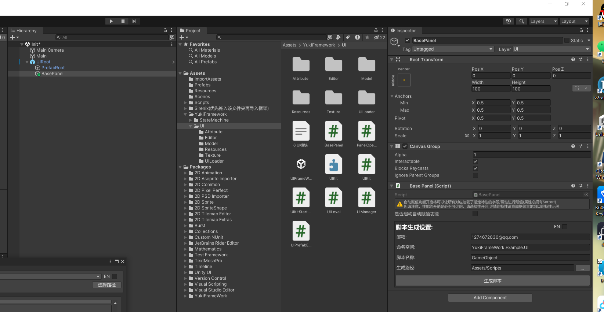
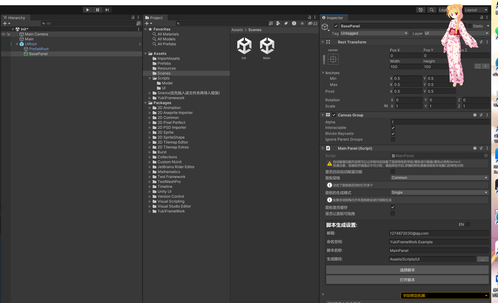

UI模块：using YukiFrameWork.UI;

BasePanel的操作如图所示:

场景视图下右键YukiFrameWork/Add Framework UIRoot添加框架的画布组件

添加组件BasePanel




UI面板类集成了字段绑定功能,详情移动到[ViewController字段绑定](https://gitee.com/NikaidoShinku/YukiFrameWork/blob/master/YukiFrameWork/Framework/ViewController绑定字段.md)查看

面板拥有OnEnter，OnPause，OnResume，OnExit生命周期，实现面板的流程控制

导入UI模块后，在导入路径的Resources文件夹下可以找到框架提供的画布UIRoot

``` csharp
using UnityEngine.UI;
public partial class MainPanel : BasePanel
{     
     private Button btn;

     /// 面板预初始化方法。执行在OnInit方法之前。当使用OpenPanel打开面板且是该面板第一次加载时，传递的参数会同步到该方法中!
     public override void OnPreInit()
     {
        
     }

     public override void OnInit()
     {
         base.OnInit();       
         Debug.Log(btn);
     }

     public override void OnEnter(params object[] param)//OnEnter的进入可以获得从外部传入的参数
     {
         base.OnEnter(param);         
     }

     public override void OnPause()
     {
         base.OnPause();
     }

     public override void OnResume()
     {
         base.OnResume();
     }

     public override void OnExit()
     {
         base.OnExit();
     }
}
在编辑器下手动设置面板的层级(也可以在UIKit的OpenPanel的方法中动态修改)，框架提供的UI层级如下：
//UI的层级等级划分
``` csharp
    public enum UILevel
    {
        //背景层
        BG = 0,
        //底层
        Buttom,
        //普通层
        Common,
        //动画层
        Animation,
        //弹出层
        Pop,
        //常驻数据层
        Const,
        //前置层
        Forward,
        //系统层
        System,
        //最顶层
        Top
    }

在编辑器下手动设置面板的创建类型，是单一面板还是可叠加面板。
注:当面板设置为Multiple时，可以同时打开多个，且全部属于栈顶，当这多个面板全部被关闭时才会恢复上一个面板

    public enum PanelOpenType
	{	
		Single,
		Multiple
	}
```
由UIKit统一管理
``` csharp
public class TestScripts : MonoBehaviour
{
    private void Start()
    {
        //UI套件初始化方式 注意：UI套件是由框架的ABManager资源管理模块进行加载，在进行UIkit的初始化之前必须要对模块资源进行准备，详情查看框架资源管理方案XFABManager
        UIKit.Init(projectName:"UIModule"); 
        
        //下方面板的弹出API传入的参数均为面板名称       

        //同步打开面板()
        var mainPanel = UIKit.OpenPanel<MainPanel>("MainPanel");

        //异步打开面板(如果使用Resources则不需要填写路径后缀名)
        UIKit.OpenPanelAsync<MainPanel>("MainPanel",panel => {});

        //弹出对应类型的面板,如果刚好这个面板置顶且同类型的面板完全弹出，则在弹出后如果堆栈内还有面板会执行下一个面板的恢复方法。
        UIKit.ClosePanel<MainPanel>();

        //效果如上，但根据名称关闭面板
        UIKit.ClosePanel(nameof(MainPanel));
       
        //直接传入面板关闭
        UIKit.ClosePanel(BasePanel:mainPanel);

        //获得某一个已经被加载到场景的面板(需要通过层级进行获取,只要在层级之内已经被加载出来的都可以获取得到，有多个一样的只返回第一个创建的面板)
        var panel = UIKit.GetPanel<MainPanel>(UILevel.Common);

        //当面板的PanelOpenType设置为Multiple时且已经缓存了多个面板，则可以全部获取到
        MainPanel[] panels = GetPanels<MainPanel>(UILevel.Common);

        //获得某一个面板(如果是已经加载过的面板那么直接获得，如果这个面板从没加载过且是缓存面板那么会加载出来并将其处于关闭状态)
        var panel = UIKit.GetPanel<MainPanel>("MainPanel");

        //实时获取面板当前的状态:是否激活、是否处于暂停: 
        API:  panel.IsActive   panel.IsPaused。

        //在我们退出游戏时要释放所有加载过的面板(在关闭运行时会自动释放)
        UIKit.Release();

        //自定义加载接口：IUIConfigLoader
        Tip:如果想自定义UIKit的加载方式则创建自定义加载类并继承IUIConfigLoader如下 在调用Init方法时传入即可：UIKit.Init(new CustomUILoaderConfig());
    }

    public class CustomUILoaderConfig : IUIConfigLoader
    {
        public T Load<T>(string name) where T : BasePanel
        {
            return Resources.Load<T>(name);
        }

        public void LoadAsync<T>(string name, Action<T> onCompleted) where T : BasePanel
        {
            var result = Resources.LoadAsync<T>(name);

            result.completed += opertaion =>
            {
                if (opertaion.isDone)
                    onCompleted?.Invoke(result.asset as T);
            };
        }   

        ///自定义面板资源的释放
        public void UnLoad(BasePanel item)
        {
            Resources.UnloadAsset(item);
        }
    }
}
```

UIKit static API:

    - static UIPrefabExector Exector{ get; } //UIKit临时预制体执行者，拖入位于文件夹中的UIRoot，在其下方有一个PrefabRoot对象，在该对象下面自行编辑面板即可。在这里的面板直接作为启动项使用。可控运行时自动隐藏。

    ```

    可以通过UIKit.Exector.ShowPanel控制临时面板的开关，在这里的面板位于所有层级后，最底层，作为临时面板或者某些加载面板的临时操作可用，直接性控制面板的Active

    //UIKit.Exector.ShowPanel<MainPanel>();

    ```

    - void Init(string projectName);//传递XFABManager的配置名进行初始化

    - void Init(IUIConfigLoader loader)//传递自定义的面板加载器进行初始化

    - void SetCanvasReferenceResolution(float x, float y)//设置画布的分辨率

    - void SetCanvasReferenceResolution(Vector2 resolution)//重载方法

    - T OpenPanel<T>(string name,params object[] param) where T : BasePanel//根据名称/路径打开面板

    - T OpenPanel<T>(string name,UILevel level,params object[] param) where T : BasePanel//可动态修改层级的重载

    - T OpenPanel<T>(T panel,params object[] param) where T : BasePanel//直接传递面板的预制体进行克隆创建面板

    - T OpenPanel<T>(T panel,UILevel level,params object[] param) where T : BasePanel//可动态修改层级的重载

    - void UnLoadPanel<T>() where T : BasePanel//可释放指定的面板
    
    - void OpenPanelAsync<T>(string name,Action<T> onCompleted,params object[] param) where T : BasePanel//异步打开面板，需要传入回调

    - UILoadAssetRequest OpenPanelAsync<T>(string name,params object[] param) where T : BasePanel//有返回值的异步打开面板

    ```

    //使用方式:
    {
        UILoadAssetRequest request = UIKit.OpenPanelAsync<MainPanel>(nameof(MainPanel));
        yield return request;
        Debug.Log(request.Panel)
    }

    ```

    - void OpenPanelAsync<T>(string name,UILevel level, Action<T> onCompleted) where T : BasePanel//可动态修改层级的重载

    - UILoadAssetRequest OpenPanelAsync<T>(string name,UILevel level) where T : BasePanel//可动态修改层级的重载

    - void ClosePanel(string name)//根据名称关闭面板,这里的名称应该是gameObject.name的名称/使用OpenPanel打开的路径/名称,如果面板类型为Multiple且场景中打开了多个，会一次性全部关闭

    - void ClosePanel<T>() where T : class, IPanel//根据类型关闭面板,如果面板类型为Multiple且场景中打开了多个，会一次性全部关闭

    - void ClosePanel(IPanel panel)//关闭指定传入的面板

    T GetPanel<T>(UILevel level) where T : BasePanel//通过层级查找到某个已经缓存的面板(无论开关)，如果是Multiple面板，则返回第一个缓存的面板

    T[] GetPanels<T>(UILevel level) where T : BasePanel//得到多个同类型的面板(适合用于Multiple面板)


UIKit的编辑器拓展 UIKitStartTrigger：


该组件与UIKit是相互独立的，即使没有对UIKit进行初始化也可以通过该组件进行面板的生成打开，直到代码使用UIKit后才需要初始化。

加载方式也是独立的，固定选择框架的XFABManager加载或者Resources加载,如图所示可在编辑器注册加载后的回调

UIKitStartTrigger的API：

    //判断该启动器是否完成加载
    - bool IsCompleted { get; private set; }
    
    //可在代码里手动注册的完成回调
    - UnityEvent<BasePanel> onPanelCallBack;


