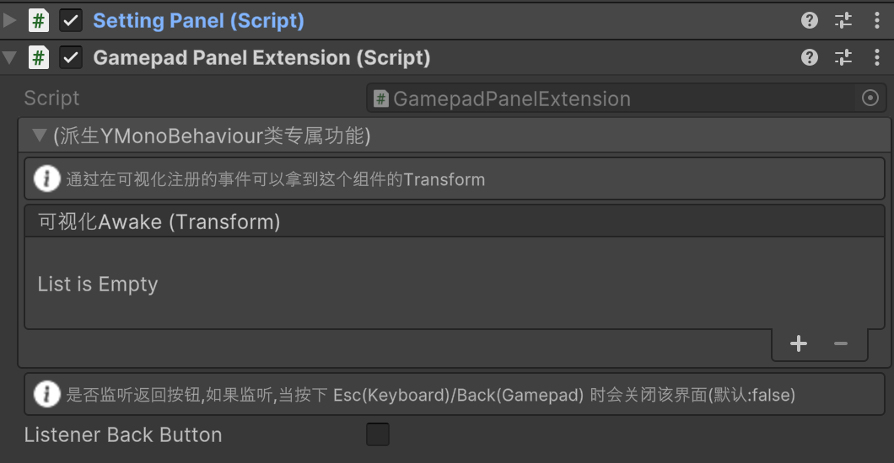
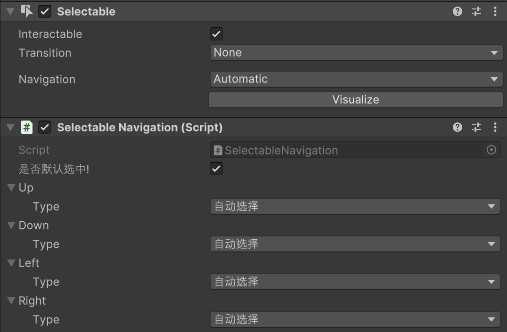
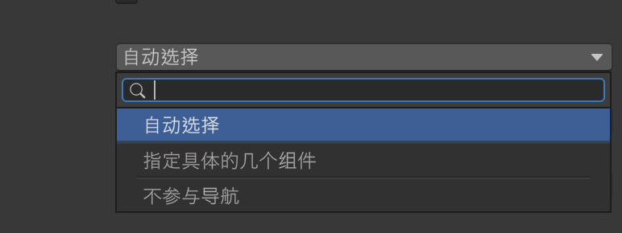
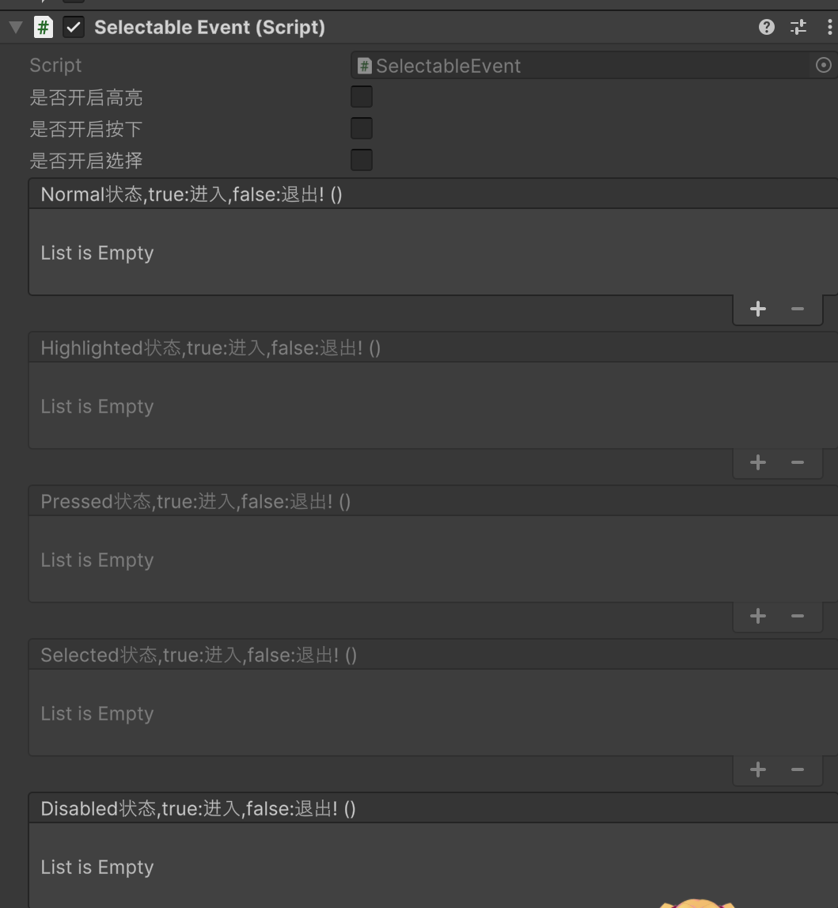

YukiFrameWork UINavigation UIKit拓展导航模块

using YukiFrameWork.UI;

注意:导入该模块之前，必须要导入Unity 新输入系统InputSystem、框架UIKit、与框架的InputSystemExtension拓展模块

首先为拥有BasePanel组件的对象添加GamepadPanelExtension组件如下:

为面板下方可选被导航的对象添加SelectableNavigation组件如下:

这个组件会强制添加Selectable组件。在SelectableNavigation下修改导航四个方向的设置:

对于导航的事件：提供了SelectableEvent组件可挂载如下:

在这里注册事件后，会自动触发

|SelectableNavigation API|选择器导航API说明|
|---|----|
|static Property API|静态属性|
|SelectableNavigation CurrentSelectedNavigation { get; set; }|当前选择的导航器|
|---|---|
|Property API|属性说明|
|NavigationOption Up{ get; }|上导航|
|NavigationOption Down{ get; }|下导航|
|NavigationOption Left{ get; }|左导航|
|NavigationOption Right{ get; }|右导航|

|SelectableEvent API|选择事件注册说明|
|--|--|
|UnityEvent onNormal|Normal状态,true:进入,false:退出|
|UnityEvent onHighlighted|Highlighted状态,true:进入,false:退出!|
|UnityEvent onPressed|Pressed状态,true:进入,false:退出!|
|UnityEvent onSelected|Selected状态,true:进入,false:退出!|
|UnityEvent onDisabled|Disabled状态,true:进入,false:退出!|
|--|--|
|Property API|属性API|
|bool EnableHighlighted { get; set;}|是否开启高亮事件处理|
|bool EnablePressed { get; set; }|是否开启按下事件处理|
|bool EnableSelected { get; set; }|是否开启选择事件处理|
|bool Disabled { get; }|是否关闭|
|bool Pressed { get; }|是否按下|
|bool Selected { get; }|是否选择|
|bool Highlighted { get; }|是否高亮|
|bool Normal { get; }|是否默认|

额外拓展:

当有鼠标进入时自动选中组件/退出时取消选中组件的需求时，为对象挂载AutoSelectionOnMouseEnter组件即可

当使用DropDown时 挂载DropdownLocation可以自动定位到当前值位置。